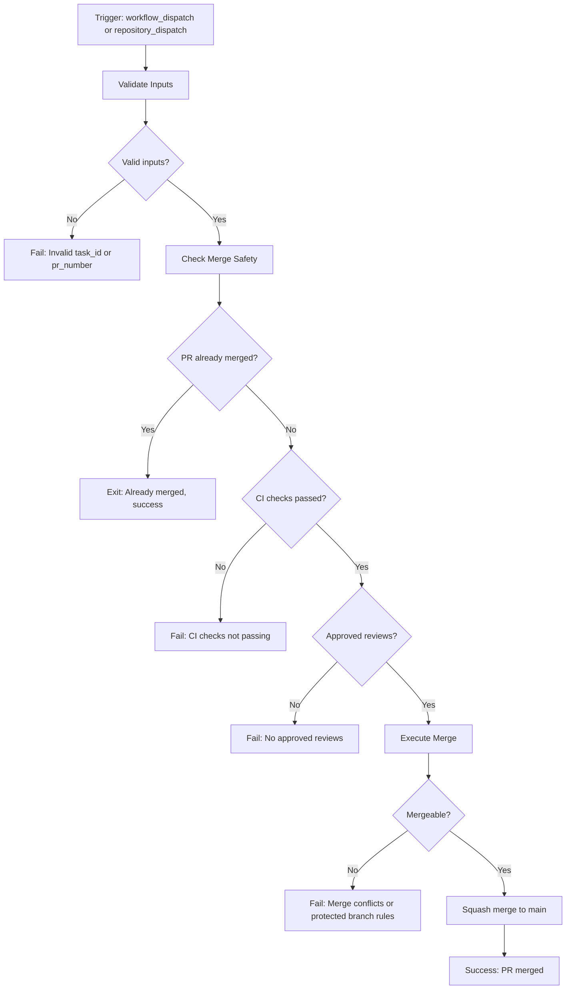

# Auto-Merge PRs When Task Marked Done

Last Updated: 2026-03-16
Status: Active
Workflow: `.github/workflows/auto-merge-on-task-done.yml`

## Overview

The Auto-Merge system automatically merges GitHub pull requests to `main` when associated roadmap tasks are marked as "done". It enforces safety gates (CI passing, reviews approved) before executing the merge, ensuring code quality while reducing manual merge operations.

**Key Features:**
- ✅ Automated PR merging based on task completion
- 🔒 Safety gates: CI status + review approval validation
- 🔄 Idempotent (handles re-triggers gracefully)
- 📊 Task-to-PR mapping via JSON configuration
- 🎯 Squash merge for clean commit history

---

## Quick Start

### 1. Link a Task to a PR

Add an entry to `.github/roadmap.json`:

```json
{
  "tasks": [
    {
      "id": "027",
      "title": "Your feature description",
      "pr_number": 123,
      "status": "in_progress",
      "assigned_to": "developer@example.com"
    }
  ]
}
```

### 2. Trigger the Workflow

**Manual Trigger (for testing):**

```bash
gh workflow run auto-merge-on-task-done.yml \
  -f task_id=027 \
  -f pr_number=123
```

**Automated Trigger (via API):**

```bash
curl -X POST \
  -H "Authorization: token $GITHUB_TOKEN" \
  -H "Accept: application/vnd.github.v3+json" \
  https://api.github.com/repos/OWNER/REPO/dispatches \
  -d '{"event_type":"task_done","client_payload":{"task_id":"027","pr_number":123}}'
```

### 3. Verify the Merge

Check the GitHub Actions tab for workflow status. If all safety checks pass, the PR will be merged automatically.

---

## Configuration

### Roadmap Schema

**File:** `.github/roadmap.json`

```json
{
  "$schema": "https://json-schema.org/draft/2020-12/schema",
  "description": "Task-to-PR mapping configuration for auto-merge workflow",
  "tasks": [
    {
      "id": "string",           // Required: Unique task identifier
      "title": "string",         // Required: Task description
      "pr_number": number,       // Required: GitHub PR number to merge
      "status": "string",        // Required: Task status (in_progress, done, blocked, etc.)
      "assigned_to": "string"    // Optional: Assignee email
    }
  ]
}
```

**Field Descriptions:**

| Field | Type | Required | Description |
|-------|------|----------|-------------|
| `id` | string | ✅ Yes | Unique task identifier (e.g., "027") |
| `title` | string | ✅ Yes | Human-readable task description |
| `pr_number` | number | ✅ Yes | GitHub pull request number to merge |
| `status` | string | ✅ Yes | Current task status (in_progress, done, blocked, etc.) |
| `assigned_to` | string | ⬜ No | Developer email or username |

**Example:**

```json
{
  "tasks": [
    {
      "id": "027",
      "title": "Auto-merge PRs when task moved to done",
      "pr_number": 123,
      "status": "in_progress",
      "assigned_to": "user@example.com"
    },
    {
      "id": "026",
      "title": "Implement rate limiting for API endpoints",
      "pr_number": 122,
      "status": "done",
      "assigned_to": "dev@example.com"
    }
  ]
}
```

### Workflow Inputs

**Manual Trigger (`workflow_dispatch`):**

| Input | Type | Required | Description |
|-------|------|----------|-------------|
| `task_id` | string | ✅ Yes | Task ID from roadmap (e.g., "027") |
| `pr_number` | number | ✅ Yes | Pull request number to merge |

**Automated Trigger (`repository_dispatch`):**

```json
{
  "event_type": "task_done",
  "client_payload": {
    "task_id": "027",
    "pr_number": 123
  }
}
```

---

## Safety Gates

The auto-merge workflow enforces two critical safety gates before merging any PR:

### 1. CI Status Validation

**What it checks:**
- ✅ All status checks have passed (`state === 'success'`)
- ✅ All GitHub check-runs have completed successfully
- ❌ No failed, cancelled, or pending checks

**How it works:**

```javascript
// Checks both legacy status API and modern check-runs API
const { data: combinedStatus } = await github.rest.repos.getCombinedStatusForRef({ ref });
const { data: checkRuns } = await github.rest.checks.listForRef({ ref });

// Must pass BOTH checks:
// 1. combinedStatus.state === 'success'
// 2. All checkRuns have conclusion === 'success'
```

**Common Failure Reasons:**
- Build failed (compilation errors, test failures)
- Linting errors detected
- Code coverage below threshold
- E2E tests failed
- External checks still pending (third-party integrations)

**Resolution:**
1. Check workflow logs for specific failures
2. Fix the failing tests/checks locally
3. Push the fix to the PR branch
4. Wait for CI to re-run and pass
5. Re-trigger the auto-merge workflow

### 2. Review Approval Validation

**What it checks:**
- ✅ At least one APPROVED review exists
- ❌ No CHANGES_REQUESTED reviews blocking the merge
- 📝 Uses latest review state per reviewer (chronologically ordered)

**How it works:**

```javascript
// Get all reviews and extract latest state per reviewer
const latestReviewsByUser = {};
for (const review of reviews) {
  latestReviewsByUser[review.user.login] = review.state;
}

// Must satisfy:
// 1. At least one APPROVED review
// 2. No CHANGES_REQUESTED reviews
```

**Review States:**
| State | Description | Blocks Merge? |
|-------|-------------|---------------|
| `APPROVED` | Reviewer approved the changes | No ✅ |
| `CHANGES_REQUESTED` | Reviewer requested changes | Yes ❌ |
| `COMMENTED` | Reviewer left comments only | No ✅ |
| `DISMISSED` | Review was dismissed | Ignored |

**Common Failure Reasons:**
- No reviews submitted yet
- Reviewer requested changes
- Approved review was dismissed
- New commits pushed after approval (some repos require re-approval)

**Resolution:**
1. Request review from team members
2. Address reviewer feedback if changes were requested
3. Wait for APPROVED review
4. Re-trigger the auto-merge workflow

---

## How It Works

### Workflow Execution Flow



### Step-by-Step Process

1. **Input Validation**
   - Verifies `task_id` and `pr_number` are provided and valid
   - Fails fast if inputs are missing or malformed

2. **Safety Checks** (`.github/scripts/check-merge-safety.js`)
   - Fetches PR details from GitHub API
   - Checks if PR is already merged (idempotency)
   - Validates CI status (both legacy status checks and modern check-runs)
   - Validates review approvals (at least one APPROVED, no CHANGES_REQUESTED)
   - Returns `{ safe: true }` or `{ safe: false, reason: 'error message' }`

3. **Merge Execution** (`.github/scripts/execute-merge.js`)
   - Polls `mergeable` field (may be `null` initially, retries up to 5 times)
   - Verifies PR is mergeable (no conflicts, protected branch rules satisfied)
   - Executes squash merge with auto-generated commit message
   - Handles errors (404, 405, 409) with actionable error messages

4. **Summary**
   - Generates GitHub Actions summary with workflow status
   - Logs success/failure with task ID and PR number

### Commit Message Format

**Title:**
```
Auto-merge: <PR title>
```

**Body:**
```
Merged via auto-merge workflow (task completed)

PR: #<pr_number>
```

**Example:**
```
Auto-merge: Implement rate limiting for API endpoints

Merged via auto-merge workflow (task completed)

PR: #122
```

---

## Edge Cases & Error Handling

### 1. PR Already Merged

**Scenario:** Workflow triggered on a PR that was already merged manually or by a previous run.

**Behavior:**
- ✅ Workflow succeeds with message: "PR is already merged, skipping merge execution"
- No errors or failures
- Idempotent (safe to re-run)

**Handling:**
```javascript
if (pr.state === 'closed' && pr.merged) {
  core.info('✅ PR is already merged, skipping');
  return { success: true, alreadyMerged: true };
}
```

### 2. Mergeable Field is Null

**Scenario:** GitHub's `mergeable` field is `null` when first fetched (API delay).

**Behavior:**
- ⏳ Workflow polls up to 5 times with 1-second delays
- ✅ Proceeds if `mergeable` becomes `true`
- ❌ Fails if still `null` after 5 attempts

**Handling:**
```javascript
let pollAttempts = 0;
while (pr.mergeable === null && pollAttempts < 5) {
  await new Promise(resolve => setTimeout(resolve, 1000));
  pr = await github.rest.pulls.get({ ... });
  pollAttempts++;
}
```

**Resolution:**
- Usually resolves within 1-2 retries
- If persistent, wait a few minutes and re-trigger

### 3. Merge Conflicts

**Scenario:** PR has merge conflicts with the base branch.

**Behavior:**
- ❌ Workflow fails with error: "PR is not mergeable. Resolve conflicts manually."
- Provides actionable error message

**Error Message:**
```
❌ PR #123 is not mergeable. Possible reasons:
  - Merge conflicts exist (resolve conflicts manually)
  - Protected branch rules not satisfied
  - Base branch has been updated (rebase may be needed)
```

**Resolution:**
1. Checkout PR branch locally
2. Rebase or merge base branch: `git pull origin main`
3. Resolve conflicts manually
4. Push resolved changes
5. Wait for CI to pass
6. Re-trigger auto-merge workflow

### 4. Protected Branch Rules Not Met

**Scenario:** Repository has protected branch rules (required reviews, status checks, etc.) that aren't satisfied.

**Behavior:**
- ❌ Workflow fails with HTTP 405 error
- Provides detailed error message

**Error Message:**
```
❌ PR #123 cannot be merged (HTTP 405). Possible reasons:
  - PR is not in a mergeable state
  - Protected branch rules are not satisfied
  - Required status checks have not passed
  - Required reviews are missing
```

**Resolution:**
1. Check repository settings → Branches → Branch protection rules for `main`
2. Ensure all required checks are passing
3. Ensure required number of reviews are approved
4. Wait for any pending checks to complete
5. Re-trigger auto-merge workflow

### 5. Multiple Tasks Linked to Same PR

**Scenario:** Two or more tasks reference the same PR number.

**Behavior:**
- ✅ First task completion triggers merge successfully
- ✅ Subsequent task completions exit gracefully (idempotency)
- No duplicate merge attempts or errors

**Handling:**
- Safety check detects PR is already merged
- Returns success without attempting duplicate merge

**Example:**
```json
{
  "tasks": [
    {
      "id": "027",
      "pr_number": 123,
      "status": "done"
    },
    {
      "id": "028",
      "pr_number": 123,  // Same PR as task 027
      "status": "done"
    }
  ]
}
```

**Result:**
- Task 027 triggers merge → PR #123 merged ✅
- Task 028 triggers merge → PR #123 already merged, skip ✅

### 6. Invalid Task ID or PR Number

**Scenario:** Workflow triggered with non-existent task ID or invalid PR number.

**Behavior:**
- ❌ Input validation fails immediately
- ❌ Safety check fails with HTTP 404 error

**Error Messages:**
```
❌ Task ID is required
❌ Valid PR number is required
❌ PR #123 not found (invalid PR number or no access)
```

**Resolution:**
1. Verify task ID exists in `.github/roadmap.json`
2. Verify PR number is correct and accessible
3. Check repository access permissions
4. Re-trigger with correct inputs

### 7. SHA Mismatch During Merge

**Scenario:** Someone pushes new commits to the PR while the merge is in progress.

**Behavior:**
- ❌ Workflow fails with HTTP 409 error
- Provides clear error message

**Error Message:**
```
❌ Merge conflict detected (HTTP 409). The PR head SHA has changed.
Someone may have pushed new commits while the merge was in progress.
```

**Resolution:**
1. Wait for new CI checks to complete
2. Re-trigger auto-merge workflow
3. Merge will proceed with updated SHA

---

## Troubleshooting

### Common Issues

#### Issue: "CI checks not passing"

**Symptoms:**
```
❌ CI checks failed: Combined status is 'failure'
Failed statuses: build: failure, lint: error
```

**Causes:**
- Build failures (compilation errors)
- Test failures
- Linting errors
- Code coverage below threshold

**Solutions:**
1. Check PR's "Checks" tab for detailed failure logs
2. Fix failing tests/checks locally
3. Push fixes to PR branch
4. Wait for CI to re-run and pass
5. Re-trigger auto-merge workflow

**Debugging:**
```bash
# View workflow run logs
gh run view <run-id> --log

# View PR check status
gh pr checks <pr-number>

# View specific check logs
gh pr checks <pr-number> --watch
```

---

#### Issue: "No approved reviews found"

**Symptoms:**
```
❌ No approved reviews found. At least one approval is required before merging.
```

**Causes:**
- No reviews submitted yet
- Reviews are in COMMENTED or CHANGES_REQUESTED state
- Approved review was dismissed

**Solutions:**
1. Request review from team members: `gh pr review <pr-number> --request @username`
2. Wait for reviewer to approve
3. Re-trigger auto-merge workflow

**Debugging:**
```bash
# View PR review status
gh pr view <pr-number> --json reviews

# Request review
gh pr review <pr-number> --request @reviewer1,@reviewer2
```

---

#### Issue: "Changes requested by reviewers"

**Symptoms:**
```
❌ 1 reviewer(s) requested changes. Address feedback before merging.
```

**Causes:**
- Reviewer explicitly requested changes
- Feedback not addressed yet

**Solutions:**
1. Read reviewer feedback in PR conversation
2. Address requested changes in code
3. Push fixes to PR branch
4. Request re-review from reviewer
5. Wait for APPROVED review
6. Re-trigger auto-merge workflow

**Debugging:**
```bash
# View review comments
gh pr view <pr-number> --comments

# Request re-review after addressing feedback
gh pr review <pr-number> --request @reviewer
```

---

#### Issue: "PR is not mergeable (conflicts)"

**Symptoms:**
```
❌ PR #123 is not mergeable. Possible reasons:
  - Merge conflicts exist (resolve conflicts manually)
```

**Causes:**
- Base branch (`main`) has diverged from PR branch
- Conflicting changes in same files

**Solutions:**
1. Checkout PR branch: `git checkout feature-branch`
2. Pull latest main: `git pull origin main`
3. Resolve conflicts manually
4. Stage and commit: `git add . && git commit -m "Resolve merge conflicts"`
5. Push: `git push origin feature-branch`
6. Wait for CI to pass
7. Re-trigger auto-merge workflow

**Debugging:**
```bash
# Check PR mergeable state
gh pr view <pr-number> --json mergeable

# View merge conflicts
git checkout <pr-branch>
git pull origin main
# Fix conflicts in editor
git add .
git commit -m "Resolve conflicts"
git push
```

---

#### Issue: "Mergeable state unknown after 5 attempts"

**Symptoms:**
```
❌ Unable to determine mergeable state for PR #123 after 5 attempts.
GitHub API may be delayed. Try again in a few moments.
```

**Causes:**
- GitHub API delay (mergeable field computation is slow)
- Large PR with many files
- Repository under heavy load

**Solutions:**
1. Wait 1-2 minutes
2. Re-trigger auto-merge workflow
3. Usually resolves on second attempt

**Debugging:**
```bash
# Check GitHub API status
curl https://www.githubstatus.com/api/v2/status.json

# Manually check PR mergeable state
gh pr view <pr-number> --json mergeable,mergeStateStatus
```

---

#### Issue: "Workflow not triggering"

**Symptoms:**
- Workflow doesn't appear in GitHub Actions tab after trigger
- No workflow run created

**Causes:**
- Workflow file syntax error
- Incorrect trigger event type
- Missing required permissions

**Solutions:**
1. Validate workflow YAML syntax:
   ```bash
   yamllint .github/workflows/auto-merge-on-task-done.yml
   ```
2. Check workflow file is on default branch (main/master)
3. Verify GitHub Actions is enabled in repository settings
4. Check workflow permissions in repository settings → Actions → General

**Debugging:**
```bash
# List workflows
gh workflow list

# View workflow details
gh workflow view auto-merge-on-task-done.yml

# Check for YAML syntax errors
yamllint .github/workflows/auto-merge-on-task-done.yml
```

---

### Debug Mode

Enable debug logging for detailed workflow execution:

**Enable:**
1. Go to repository Settings → Secrets and variables → Actions
2. Add repository variable: `ACTIONS_STEP_DEBUG = true`
3. Re-run workflow

**View Debug Logs:**
```bash
gh run view <run-id> --log
```

**Disable:**
1. Remove `ACTIONS_STEP_DEBUG` variable from repository settings

---

## Testing

### Manual Testing (Local)

**Test Safety Checks Script:**

```bash
# Display help
node .github/scripts/check-merge-safety.js --help

# Note: Actual execution requires GitHub Actions context
# Use workflow_dispatch for testing instead
```

**Test Merge Execution Script:**

```bash
# Display help
node .github/scripts/execute-merge.js --help

# Note: Actual execution requires GitHub Actions context
# Use workflow_dispatch for testing instead
```

### Integration Testing (GitHub Actions)

**Test Happy Path (all gates pass):**

```bash
# 1. Create test branch with passing CI and approved review
gh pr create --title "Test PR for auto-merge" --body "Test" --base main --head test-branch

# 2. Get PR number from output (e.g., #123)

# 3. Approve the PR
gh pr review 123 --approve

# 4. Wait for CI to pass
gh pr checks 123 --watch

# 5. Trigger auto-merge workflow
gh workflow run auto-merge-on-task-done.yml -f task_id=TEST -f pr_number=123

# 6. Monitor workflow
gh run watch
```

**Test CI Gate Failure:**

```bash
# 1. Create test PR with failing CI
gh pr create --title "Test PR with failing CI" --body "Test" --base main --head failing-branch

# 2. Trigger auto-merge workflow (should fail)
gh workflow run auto-merge-on-task-done.yml -f task_id=TEST -f pr_number=<pr-number>

# 3. Verify workflow fails with "CI checks not passing" error
gh run view --log
```

**Test Review Gate Failure:**

```bash
# 1. Create test PR with passing CI but no reviews
gh pr create --title "Test PR with no reviews" --body "Test" --base main --head no-review-branch

# 2. Wait for CI to pass
gh pr checks <pr-number> --watch

# 3. Trigger auto-merge workflow (should fail)
gh workflow run auto-merge-on-task-done.yml -f task_id=TEST -f pr_number=<pr-number>

# 4. Verify workflow fails with "No approved reviews found" error
gh run view --log
```

**Test Idempotency (already merged PR):**

```bash
# 1. Manually merge a test PR
gh pr merge 123 --squash

# 2. Trigger auto-merge workflow on already-merged PR
gh workflow run auto-merge-on-task-done.yml -f task_id=TEST -f pr_number=123

# 3. Verify workflow succeeds with "already merged, skipping" message
gh run view --log
```

---

## Security Considerations

### Permissions

**Workflow Permissions:**
```yaml
permissions:
  contents: write       # Required to merge PRs
  pull-requests: write  # Required to access PR API
```

**Principle of Least Privilege:**
- Workflow only requests minimum required permissions
- No `repo` or `admin` scopes needed
- Uses built-in `GITHUB_TOKEN` (scoped to repository)

### Authentication

**GITHUB_TOKEN (Default):**
- Automatically provided by GitHub Actions
- Scoped to current repository only
- Expires after workflow completes
- **Limitation:** Merged PRs will NOT trigger other workflows

**Personal Access Token (PAT) - Optional:**
- Use if downstream workflows need to trigger after merge
- Store as repository secret: `PAT_TOKEN`
- Update workflow to use: `github-token: ${{ secrets.PAT_TOKEN }}`
- **Warning:** PAT has broader permissions—use with caution

### Protected Branches

**Recommended Settings (for `main` branch):**
- ✅ Require pull request reviews before merging (1+ approvals)
- ✅ Require status checks to pass before merging
- ✅ Require conversation resolution before merging
- ✅ Do not allow bypassing the above settings
- ⬜ Require deployments to succeed before merging (optional)

**Why This Matters:**
- Auto-merge workflow respects protected branch rules
- Cannot bypass required reviews or status checks
- Provides additional safety layer beyond workflow logic

---

## Performance & Limits

### Execution Time

**Typical Workflow Duration:**
- Input validation: ~1-2 seconds
- Safety checks: ~3-5 seconds
- Merge execution: ~2-4 seconds
- **Total:** ~5-10 seconds for happy path

**Polling Delays:**
- Mergeable state polling: up to 5 seconds (5 retries × 1 second)
- CI status checks: real-time (no polling)
- Review approvals: real-time (no polling)

### Concurrency

**Concurrency Control:**
```yaml
concurrency:
  group: auto-merge-${{ github.event.inputs.pr_number }}
  cancel-in-progress: false
```

**Behavior:**
- Multiple workflows for same PR are queued (not cancelled)
- First workflow merges PR
- Subsequent workflows exit gracefully (idempotency)

### Rate Limits

**GitHub Actions:**
- Public repos: Unlimited workflow runs
- Private repos: Depends on plan (2,000-50,000 minutes/month)

**GitHub API:**
- Workflow uses built-in `GITHUB_TOKEN`
- Rate limit: 1,000 requests/hour per repository
- Auto-merge workflow uses ~5-10 API calls per run
- **Capacity:** ~100-200 auto-merges per hour (well within limits)

---

## Future Enhancements

### Planned Features

- [ ] Multi-branch support (not just `main`)
- [ ] Slack/Discord notifications on merge success/failure
- [ ] Auto-delete branch after merge
- [ ] Auto-update task status in external project management tools
- [ ] Custom merge commit message templates
- [ ] Merge queue support for high-traffic repositories
- [ ] Dry-run mode for testing without actual merge
- [ ] Rollback automation on deployment failures

### Contributing

To propose enhancements or report issues:

1. Create a GitHub issue with `[AUTO_MERGE]` prefix
2. Describe the use case and expected behavior
3. Reference this documentation in the issue

---

## Reference

### File Locations

| File | Purpose |
|------|---------|
| `.github/workflows/auto-merge-on-task-done.yml` | Main workflow file |
| `.github/scripts/check-merge-safety.js` | CI status and review validation logic |
| `.github/scripts/execute-merge.js` | Merge execution with idempotency |
| `.github/roadmap.json` | Task-to-PR mapping configuration |
| `docs/AUTO_MERGE.md` | This documentation file |

### External Resources

- [GitHub Actions Documentation](https://docs.github.com/en/actions)
- [GitHub REST API: Pulls](https://docs.github.com/en/rest/pulls)
- [GitHub REST API: Checks](https://docs.github.com/en/rest/checks)
- [GitHub CLI Manual](https://cli.github.com/manual/)
- [Protected Branches](https://docs.github.com/en/repositories/configuring-branches-and-merges-in-your-repository/managing-protected-branches)

### Support

For issues or questions:
- Check [Troubleshooting](#troubleshooting) section above
- Review workflow logs: `gh run view <run-id> --log`
- Search existing GitHub issues
- Create new issue with `[AUTO_MERGE]` prefix

---

**Last Updated:** 2026-03-16
**Workflow Version:** 1.0.0
**Maintainer:** Development Team
