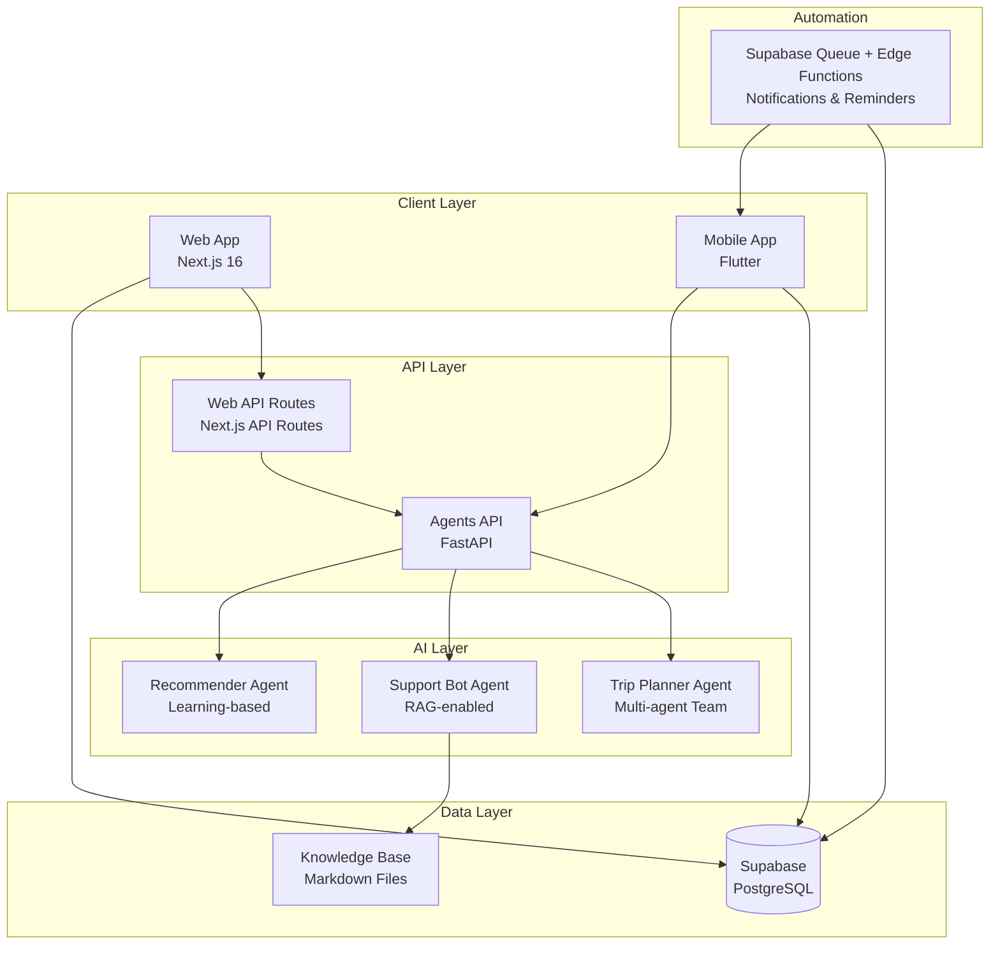
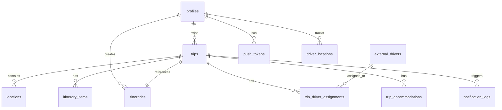
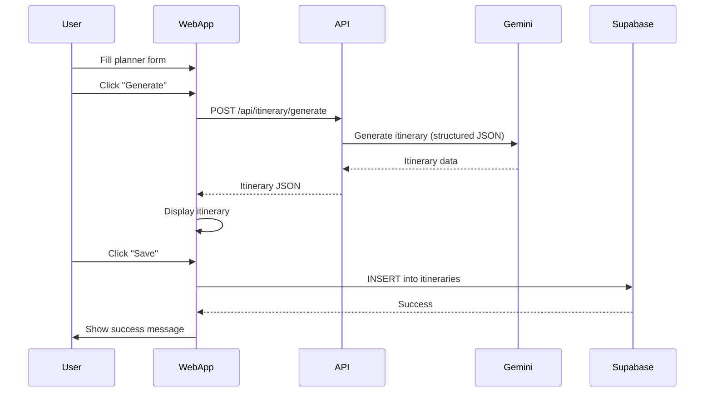
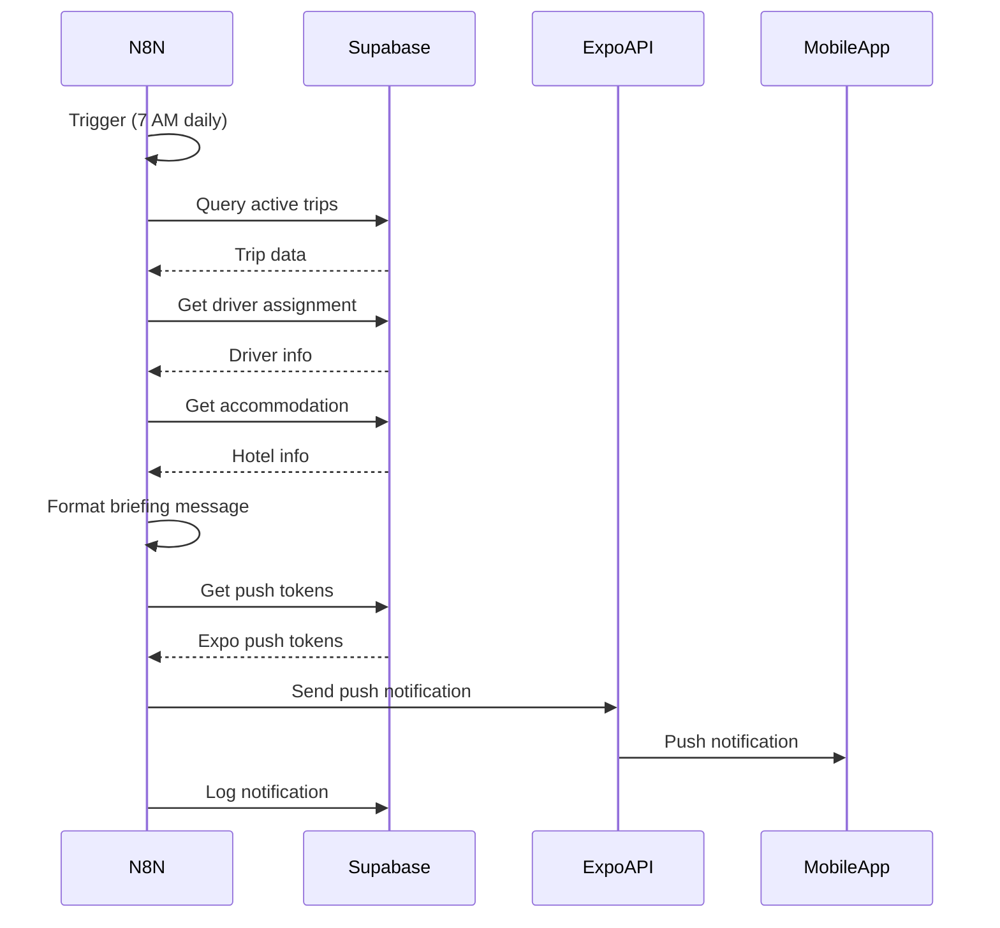
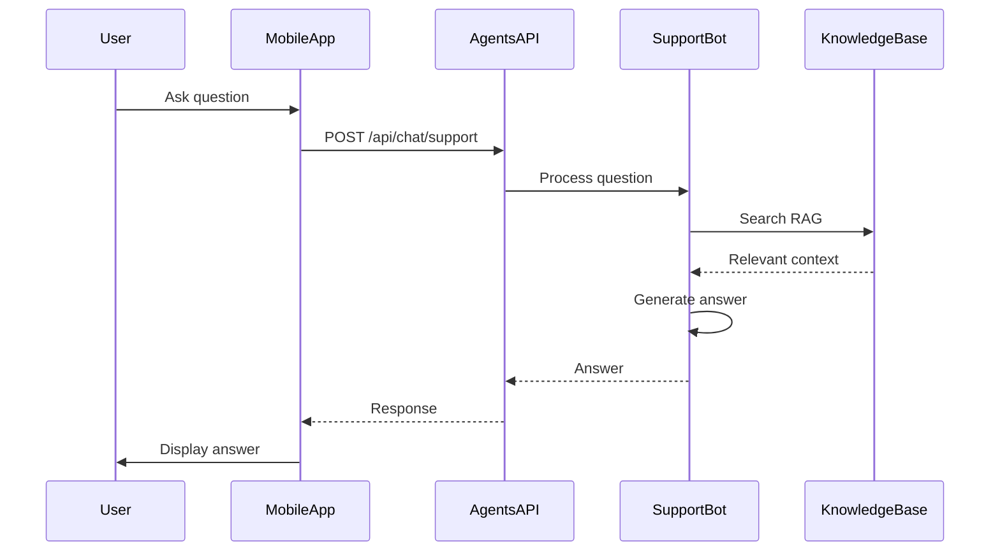

# Agent Antigravity Repository Overview

> **Last Updated:** February 12, 2026  
> **Focus:** Deep dive into Travel Suite project

> [!NOTE]
> This repo is a multi-project workspace. Some older documentation originally referenced React Native + n8n for Travel Suite.
> As of 2026-02-12, **Travel Suite mobile is Flutter** and **Travel Suite automation is handled via Supabase (Edge Functions + queue tables)**.
> n8n is still present in the repo for *other projects* (e.g. AI Newsletter), not as a Travel Suite runtime dependency.

## Executive Summary

**Agent_Antigravity** is a multi-project AI agent workspace containing several independent applications and production services. The repository serves as a unified development environment for building and deploying AI-powered applications, with a primary focus on **Travel Suite** - a comprehensive travel planning and management platform.

### Repository Structure

```
Agent_Antigravity/
├── projects/              # Project-specific implementations
│   ├── travel-suite/      # Full-stack travel platform (PRIMARY FOCUS)
│   ├── ai-newsletter/     # Cost-optimized AI newsletter pipeline
│   └── milesmarketplace/  # Marketplace project (structure only)
├── servers/               # Production MCP servers
│   └── n8n-mcp/          # n8n Model Context Protocol server
├── skills/                # Shared AI agent skills library
└── docs/                  # Repository-wide documentation
```

### Main Projects Overview

1. **Travel Suite** (`projects/travel-suite/`) - Multi-platform travel platform with web, mobile, and AI agent components
2. **AI Newsletter** (`projects/ai-newsletter/`) - Cost-optimized newsletter automation using Python and n8n
3. **n8n-MCP Server** (`servers/n8n-mcp/`) - Production MCP server for n8n workflow integration

---

## Travel Suite Deep Dive

Travel Suite is a comprehensive travel planning and management platform consisting of three main applications that work together:

1. **Web Application** - Next.js-based trip planner and admin dashboard
2. **Mobile Application** - Flutter app for clients and drivers
3. **Agents API** - FastAPI backend with multi-agent AI assistance

### Architecture Overview



**Key Integration Points:**
- Web and Mobile apps share the same Supabase database
- Web app uses Next.js API routes for itinerary generation (Google Gemini)
- Mobile app can call Agents API for AI assistance
- Supabase queue + Edge Functions automate notifications and reminders (Travel Suite runtime)
- All apps use Supabase Auth for authentication

---

## Web Application (`apps/web/`)

### Technology Stack

- **Framework:** Next.js 16.1.6 (App Router)
- **React:** 19.2.3
- **TypeScript:** 5.x
- **Styling:** Tailwind CSS 4, shadcn/ui components
- **Database:** Supabase (PostgreSQL) via `@supabase/ssr`
- **Maps:** MapLibre GL
- **PDF:** `@react-pdf/renderer`
- **AI:** Google Generative AI (Gemini Flash) for itinerary generation
- **Testing:** Playwright (E2E tests)

### Application Structure

```
src/
├── app/                    # Next.js App Router pages
│   ├── admin/             # Admin dashboard (drivers, trips management)
│   ├── api/               # API routes (itinerary, notifications, weather, etc.)
│   ├── auth/              # Authentication pages and callbacks
│   ├── planner/           # Trip planner interface
│   ├── trips/             # User's saved trips
│   └── share/             # Shared itinerary viewer
├── components/            # React components
│   ├── layout/            # NavHeader
│   ├── map/               # Map components (ItineraryMap)
│   ├── pdf/               # PDF generation components
│   └── ui/                # shadcn/ui components
└── lib/                   # Utilities and helpers
    ├── supabase/          # Supabase client setup (server/client)
    ├── external/          # External API integrations (currency, weather, WhatsApp)
    └── notifications.ts   # Push notification utilities
```

### Key Pages & Features

#### 1. Home Page (`/`)
- Landing page with hero section and feature cards
- Brand: "GoBuddy Adventures"
- CTA to start planning

#### 2. Trip Planner (`/planner`)
**File:** `src/app/planner/page.tsx`

**Features:**
- Form inputs: destination, duration (1-14 days), budget level, interests
- Budget options: Budget-Friendly, Moderate, Luxury, Ultra-High End
- Interest tags: Art & Culture, Food & Dining, Nature, Shopping, History, Family
- Generates itinerary via `/api/itinerary/generate` endpoint
- Displays itinerary with:
  - Interactive map (Leaflet) showing all activity locations
  - Day-by-day breakdown with activities, times, locations
  - Weather widget for destination
  - Currency converter widget
  - Image fetching for locations (via `/api/images`)
- Actions: Save itinerary, Share itinerary, Download PDF

**Data Flow:**
1. User fills form → clicks "Generate Dream Itinerary"
2. POST to `/api/itinerary/generate` with prompt and days
3. API route calls Google Gemini Flash with structured JSON schema
4. Response parsed and displayed
5. Images fetched in parallel for each location
6. User can save to database or share via token

#### 3. My Trips (`/trips`)
**File:** `src/app/trips/page.tsx`

**Features:**
- Lists all user's saved itineraries from `itineraries` table
- Server-side rendered (uses `createClient` from `lib/supabase/server`)
- Redirects to `/auth` if not authenticated
- Displays trip cards with:
  - Trip title, destination, duration
  - Summary, budget badge
  - Creation date
- Click to view full trip details (`/trips/[id]`)

#### 4. Admin Dashboard (`/admin`)
**File:** `src/app/admin/page.tsx`

**Features:**
- Dashboard statistics:
  - Active Drivers count
  - Total Clients count
  - Active Trips count
  - Pending Notifications count
- Quick actions:
  - Add New Driver (`/admin/drivers`)
  - Manage Trips (`/admin/trips`)
  - Send Notifications (`/admin/notifications`)
- Uses client-side Supabase queries

#### 5. Shared Itinerary Viewer (`/share/[token]`)
**File:** `src/app/share/[token]/page.tsx`

- Allows sharing itineraries via token
- Public access (no auth required)
- Reads shared itinerary data

### API Routes

#### `/api/itinerary/generate` (POST)
**File:** `src/app/api/itinerary/generate/route.ts`

**Purpose:** Generate AI-powered travel itinerary

**Request Body:**
```typescript
{
  prompt: string;  // e.g., "Create a Moderate 3-day itinerary for Paris focusing on Art & Culture"
  days: number;   // 1-14
}
```

**Process:**
1. Validates input with Zod schema
2. Constructs prompt for Gemini Flash
3. Uses structured output schema (JSON Schema) to ensure consistent format
4. Returns itinerary with:
   - `trip_title`, `destination`, `summary`
   - `days[]` with `day_number`, `theme`, `activities[]`
   - Each activity has: `time`, `title`, `description`, `location`, `coordinates`

**Response:**
```typescript
{
  trip_title: string;
  destination: string;
  summary: string;
  days: Array<{
    day_number: number;
    theme: string;
    activities: Array<{
      time: string;
      title: string;
      description: string;
      location: string;
      coordinates: { lat: number; lng: number };
    }>;
  }>;
}
```

#### `/api/images` (GET)
**File:** `src/app/api/images/route.ts`

- Fetches images for locations (likely uses Wikimedia or Unsplash)
- Query parameter: `query` (location name)
- Returns image URL

#### `/api/weather` (GET)
**File:** `src/app/api/weather/route.ts`

- Fetches weather data for destination
- Uses external weather API (see `lib/external/weather.ts`)

#### `/api/currency` (GET)
**File:** `src/app/api/currency/route.ts`

- Currency conversion utilities
- Uses external API (see `lib/external/currency.ts`)

#### `/api/notifications/send` (POST)
**File:** `src/app/api/notifications/send/route.ts`

- Sends push notifications
- Integrates with Expo Push Notification service

### Authentication Flow

**Files:**
- `src/lib/supabase/server.ts` - Server-side client (for SSR)
- `src/lib/supabase/client.ts` - Client-side browser client
- `src/lib/supabase/middleware.ts` - Session refresh middleware
- `middleware.ts` - Next.js middleware wrapper

**Flow:**
1. User visits protected route
2. Middleware checks session via `updateSession()`
3. If no session, redirects to `/auth`
4. Auth page handles Supabase Auth (OAuth or email/password)
5. Callback route (`/auth/callback`) processes auth response
6. Session stored in cookies (handled by `@supabase/ssr`)

### Components

#### Map Components
- **ItineraryMap** (`components/map/ItineraryMap.tsx`)
  - Uses Leaflet/react-leaflet
  - Displays markers for all activities
  - Shows activity locations with popups

#### PDF Components
- **ItineraryDocument** (`components/pdf/ItineraryDocument.tsx`)
  - Uses `@react-pdf/renderer`
  - Generates styled PDF with:
    - Header with trip title and destination
    - Summary section
    - Day-by-day breakdown with activities
    - Styled with GoBuddy brand colors

#### UI Components
- shadcn/ui components in `components/ui/`
- Includes: Button, Card, Input, Badge, Dialog, etc.
- Styled with Tailwind CSS

### Data Fetching Patterns

1. **Server Components** (default):
   - Use `createClient()` from `lib/supabase/server`
   - Direct database queries in component
   - Example: `/trips` page

2. **Client Components** (`"use client"`):
   - Use `createClient()` from `lib/supabase/client`
   - `useEffect` hooks for data fetching
   - Example: Admin dashboard, planner page

3. **API Routes**:
   - Server-side only
   - Can use server Supabase client
   - Example: `/api/itinerary/generate`

### Testing

**E2E Tests:** `e2e/tests/`
- `auth.spec.ts` - Authentication flows
- `trips.spec.ts` - Trip management
- `admin.spec.ts` - Admin functionality

**Run:** `npm run test:e2e`

---

## Mobile Application (`apps/mobile/`)

### Technology Stack

- **Framework:** Expo ~54 with Expo Router
- **React Native:** 0.81.5
- **React:** 19.1.0
- **TypeScript:** 5.9.2
- **Database:** Supabase client (`@supabase/supabase-js`)
- **Navigation:** Expo Router (file-based routing)
- **Notifications:** `expo-notifications`
- **Storage:** `expo-secure-store` (for tokens)

### Application Structure

```
app/                       # Expo Router pages (file-based routing)
├── _layout.tsx           # Root layout with auth guard
├── index.tsx             # Role selection (Client/Driver)
├── auth/
│   └── login.tsx         # Authentication screen
├── client/               # Client app screens
│   ├── index.tsx        # Client trips list
│   └── trip/[id].tsx    # Trip details
└── driver/               # Driver app screens
    └── index.tsx         # Driver dashboard

src/
├── components/
│   └── NotificationHandler.tsx  # Handles push notifications
├── lib/
│   ├── supabase.ts      # Supabase client setup
│   └── notifications.ts # Notification utilities
└── constants/
    └── Colors.ts        # App color scheme
```

### Navigation Flow

```mermaid
graph LR
    Start[index.tsx<br/>Role Selection] -->|Client| Client[client/index.tsx<br/>My Trips]
    Start -->|Driver| Driver[driver/index.tsx<br/>Driver Dashboard]
    Start -->|Not Auth| Login[auth/login.tsx<br/>Login]
    Client --> TripDetail[client/trip/[id].tsx<br/>Trip Details]
    Login -->|Success| Client
```

### Key Screens

#### 1. Role Selection (`/`)
**File:** `app/index.tsx`

- First screen users see
- Two options:
  - **Client** - View trips, track driver, receive notifications
  - **Driver** - Manage shifts, share location
- Admin access note: "Use Web Dashboard"

#### 2. Authentication (`/auth/login`)
**File:** `app/auth/login.tsx`

**Features:**
- Email/password login form
- Supabase Auth integration
- Secure token storage
- Redirects to `/client` on success

#### 3. Client App (`/client`)
**File:** `app/client/index.tsx`

**Features:**
- Lists user's trips from `trips` table
- Displays:
  - Trip status badge (confirmed, in_progress, pending, completed, cancelled)
  - Trip title, destination
  - Start/end dates
  - Duration badge
- Pull-to-refresh support
- Empty state with call-to-action
- Sign out button in header

**Data Fetching:**
```typescript
const { data } = await supabase
  .from("trips")
  .select(`
    id,
    status,
    start_date,
    end_date,
    itinerary:itineraries (
      trip_title,
      destination,
      duration_days
    )
  `)
  .eq("client_id", user.id)
  .order("start_date", { ascending: false });
```

#### 4. Trip Details (`/client/trip/[id]`)
**File:** `app/client/trip/[id].tsx`

- Detailed view of a single trip
- Shows full itinerary
- Driver information (if assigned)
- Accommodation details
- Real-time driver location (if available)

#### 5. Driver Dashboard (`/driver`)
**File:** `app/driver/index.tsx`

- Driver-specific interface
- View assigned trips
- Share location functionality
- Trip management tools

### Authentication & Session Management

**File:** `app/_layout.tsx`

**Flow:**
1. Root layout checks session on mount
2. Listens to auth state changes
3. Redirects logic:
   - No session + not in auth group → allow access to index (role selection)
   - Session + in auth group → redirect to `/client`
   - No session + accessing protected route → redirect to login (commented out, allows index)

**Session Check:**
```typescript
useEffect(() => {
  supabase.auth.getSession().then(({ data: { session } }) => {
    setSession(session);
    setLoading(false);
  });

  const { data: { subscription } } = supabase.auth.onAuthStateChange((_event, session) => {
    setSession(session);
  });

  return () => subscription.unsubscribe();
}, []);
```

### Push Notifications

**File:** `src/components/NotificationHandler.tsx`

**Features:**
- Registers device for push notifications
- Stores `expo_push_token` in database (`push_tokens` table)
- Listens for incoming notifications
- Handles notification display

**Integration:**
- Used in root layout: `<NotificationHandler userId={session?.user?.id ?? null} />`
- Receives notifications from n8n workflows
- Notifications triggered by:
  - Daily trip briefings
  - Trip reminders
  - Pickup reminders
  - Review requests

### Client vs Driver Apps

The mobile app supports two distinct user roles:

1. **Client App** (`/client/*`)
   - View booked trips
   - See trip details and itinerary
   - Track driver location (real-time)
   - Receive notifications about trips
   - View accommodation details

2. **Driver App** (`/driver/*`)
   - View assigned trips
   - Share location with clients
   - Manage trip assignments
   - Receive driver-specific notifications

Both apps share the same authentication system but have different data access patterns and UI.

### Styling

- Uses React Native StyleSheet
- Color constants in `src/constants/Colors.ts`
- Consistent design system:
  - Primary: `#00d084` (emerald green)
  - Secondary: `#124ea2` (blue)
  - Background: Light gray
  - Cards: White with subtle shadows

---

## Agents API (`apps/agents/`)

### Technology Stack

- **Framework:** FastAPI
- **Python:** 3.12+
- **AI Framework:** Agno (multi-agent system)
- **Models:** OpenAI GPT-4o, GPT-4o-mini
- **Tools:** DuckDuckGo search
- **Knowledge Base:** Markdown files (RAG-enabled)
- **Testing:** pytest

### Application Structure

```
agents/
├── trip_planner.py       # Multi-agent trip planning team
├── support_bot.py        # RAG-enabled customer support
└── recommender.py        # Learning-based destination recommender

api/
├── routes.py             # FastAPI route handlers
└── dependencies.py       # Shared dependencies

knowledge/
├── policies.md           # Company policies
├── faq.md               # Frequently asked questions
└── destinations/         # Destination guides
    └── bali.md

main.py                   # FastAPI app entry point
```

### Entry Point

**File:** `main.py`

**Features:**
- FastAPI application setup
- CORS middleware for web/mobile app access
- Lifespan handler loads knowledge base on startup
- Health check endpoint (`/api/health`)
- Root endpoint with API info

**Startup:**
```bash
uvicorn main:app --host 0.0.0.0 --port 8001
```

### Agent Architecture

#### 1. Trip Planner Agent Team
**File:** `agents/trip_planner.py`

**Multi-Agent System:**
- **Researcher Agent** (GPT-4o-mini)
  - Role: Gather destination information
  - Tools: DuckDuckGo search
  - Responsibilities:
    - Find activities, restaurants, attractions
    - Check weather patterns
    - Research transportation options
    - Find unique local experiences

- **Planner Agent** (GPT-4o)
  - Role: Create day-by-day itineraries
  - Responsibilities:
    - Realistic timing and pacing
    - Consider travel times between locations
    - Balance activities with rest
    - Group nearby activities
    - Consider opening hours

- **Budgeter Agent** (GPT-4o-mini)
  - Role: Optimize costs
  - Responsibilities:
    - Estimate realistic costs
    - Find budget-friendly alternatives
    - Calculate transportation costs
    - Track total budget breakdown
    - Suggest money-saving tips

**Team Configuration:**
- Mode: Sequential (agents work in order)
- Flow: Researcher → Planner → Budgeter
- Output: Comprehensive trip plan with itinerary and cost breakdown

**API Endpoint:** `POST /api/chat/trip-planner`

**Request:**
```python
{
  "destination": "Paris",
  "duration_days": 3,
  "budget": 1500.0,  # Optional
  "interests": ["food", "history"],  # Optional
  "travel_style": "balanced",  # budget, balanced, luxury
  "structured": false  # Return structured JSON if true
}
```

**Response:**
```python
{
  "success": True,
  "data": {
    "destination": "Paris",
    "duration_days": 3,
    "budget": 1500.0,
    "travel_style": "balanced",
    "plan": "<markdown formatted itinerary>",
    "agents_used": ["Researcher", "Planner", "Budgeter"]
  }
}
```

**Structured Output:**
When `structured: true`, returns `TripItinerary` Pydantic model:
- `destination`, `duration_days`, `total_budget`
- `days[]` with `DayPlan` objects
- Each day has `activities[]`, `meals[]`, `notes`
- Includes `packing_tips[]` and `local_tips[]`

#### 2. Support Bot Agent
**File:** `agents/support_bot.py`

**Features:**
- RAG (Retrieval-Augmented Generation) enabled
- Knowledge base sources:
  - `knowledge/policies.md` - Company policies
  - `knowledge/faq.md` - Frequently asked questions
  - `knowledge/destinations/*.md` - Destination guides
- Uses Agno's `CombinedKnowledge` for in-memory RAG
- Quick response patterns for common questions (contact info, cancellations)

**Agent Configuration:**
- Model: GPT-4o
- Knowledge: CombinedKnowledge (multiple markdown files)
- `search_knowledge: True` - Enables RAG lookups
- Instructions: Friendly, professional, empathetic

**API Endpoint:** `POST /api/chat/support`

**Request:**
```python
{
  "message": "What is your cancellation policy?",
  "context": {  # Optional
    "trip_id": "uuid",
    "booking_ref": "ABC123",
    "user_name": "John Doe"
  }
}
```

**Response:**
```python
{
  "success": True,
  "data": {
    "answer": "<support response>",
    "sources_used": True,  # Whether knowledge base was used
    "agent": "SupportBot"
  }
}
```

**Quick Responses:**
- Pattern matching for common questions
- Instant responses for: contact info, cancellation policy
- Bypasses full agent for speed

#### 3. Recommender Agent
**File:** `agents/recommender.py`

**Features:**
- Learning-based personalization
- Uses Agno Memory system:
  - User memories (persist across sessions)
  - Session summaries
  - Recent context (last 5 responses)
- Learning mode: Agentic (agent decides when to learn)
- Tools: DuckDuckGo search for destination research

**Agent Configuration:**
- Model: GPT-4o
- Memory: Enabled with user memories
- Learning: Enabled (`learning=True`)
- Instructions: Learn preferences, provide personalized recommendations

**API Endpoints:**

1. **Get Recommendations:** `POST /api/chat/recommend`
```python
{
  "query": "beach destinations",  # Optional
  "preferences": {  # Optional
    "budget": "moderate",
    "duration": 7,
    "interests": ["beaches", "adventure"],
    "travel_style": "balanced",
    "avoid": ["crowded"]
  },
  "num_recommendations": 3
}
```

2. **Update Preferences:** `POST /api/recommend/preferences`
```python
{
  "preference_type": "budget",  # budget, style, interests, destinations, avoid
  "preference_value": "luxury"
}
```

3. **Submit Feedback:** `POST /api/recommend/feedback`
```python
{
  "destination": "Bali",
  "feedback": "Loved it! Great beaches.",
  "rating": 5  # 1-5
}
```

**Response:**
```python
{
  "success": True,
  "data": {
    "recommendations": [
      {
        "name": "Maldives",
        "tagline": "Paradise islands",
        "why_visit": "Matches your love for beaches...",
        "best_time": "November - April",
        "budget_range": "$200-300/day",
        "highlights": ["Crystal clear waters", "Luxury resorts", ...],
        "travel_style": "luxury",
        "similarity_score": 0.92
      }
    ],
    "personalization_note": "Based on your preference for..."
  }
}
```

### API Routes

**File:** `api/routes.py`

All routes prefixed with `/api`:

- `POST /api/chat/trip-planner` - Trip planning
- `POST /api/chat/support` - Customer support
- `POST /api/chat/recommend` - Destination recommendations
- `POST /api/recommend/preferences` - Update user preferences
- `POST /api/recommend/feedback` - Submit destination feedback
- `GET /api/conversations/{user_id}` - Get conversation history (placeholder)

### Knowledge Base

**Location:** `knowledge/`

**Structure:**
- `policies.md` - Company policies (cancellation, refunds, etc.)
- `faq.md` - Frequently asked questions
- `destinations/` - Destination-specific guides
  - `bali.md` - Bali travel guide

**Loading:**
- Knowledge base loaded on server startup
- Uses Agno's `TextKnowledge` for each markdown file
- Combined into `CombinedKnowledge` for RAG
- Support Bot searches knowledge base when answering questions

### Testing

**Test Files:**
- `tests/test_trip_planner.py` - Trip planner tests
- `tests/test_support_bot.py` - Support bot tests
- `tests/test_recommender.py` - Recommender tests
- `tests/test_api.py` - API endpoint tests

**Run:** `pytest`

---

## Database Schema (`supabase/`)

### Technology

- **Database:** PostgreSQL (via Supabase)
- **Extensions:** PostGIS (for geospatial data)
- **Migrations:** SQL files in `supabase/migrations/`

### Schema Overview

**File:** `supabase/migrations/20240206000000_init_schema.sql`

#### Core Tables

1. **profiles**
   - Extends Supabase Auth users
   - Fields: `id` (FK to auth.users), `email`, `full_name`, `avatar_url`, `preferences` (JSONB)
   - RLS: Viewable by all, editable by owner

2. **trips**
   - Core trip entity
   - Fields: `id`, `owner_id` (FK to profiles), `title`, `status` (draft/confirmed/archived), `start_date`, `end_date`, `budget_currency`, `budget_limit`, `cover_image_url`
   - RLS: Users can only see/edit their own trips

3. **locations**
   - Places within a trip
   - Fields: `id`, `trip_id` (FK to trips), `name`, `description`, `geo_location` (PostGIS Point), `google_place_id`, `address`, `arrival_time`, `departure_time`, `cost_estimate`
   - RLS: Inherits access from trip

4. **itinerary_items**
   - Enriched data from AI
   - Fields: `id`, `trip_id` (FK to trips), `day_number`, `title`, `activity_type`, `metadata` (JSONB)

#### Additional Tables (from database.types.ts)

5. **itineraries**
   - Saved AI-generated itineraries
   - Fields: `id`, `user_id`, `trip_title`, `destination`, `duration_days`, `summary`, `budget`, `interests[]`, `raw_data` (JSONB), `created_at`, `updated_at`

6. **trips** (extended)
   - Additional fields: `client_id`, `itinerary_id` (FK to itineraries), `status` (confirmed/in_progress/pending/completed/cancelled)

7. **external_drivers**
   - Driver information
   - Fields: `id`, `full_name`, `phone`, `email`, `vehicle_type`, `vehicle_plate`, `is_active`

8. **trip_driver_assignments**
   - Links trips to drivers
   - Fields: `trip_id`, `external_driver_id`, `day_number`, `pickup_time`, `pickup_location`

9. **trip_accommodations**
   - Hotel/accommodation details
   - Fields: `trip_id`, `day_number`, `hotel_name`, `address`, `check_in_time`, `contact_phone`

10. **push_tokens**
    - Mobile push notification tokens
    - Fields: `user_id`, `expo_push_token`, `device_type`, `is_active`

11. **notification_logs**
    - Notification delivery tracking
    - Fields: `id`, `user_id`, `trip_id`, `notification_type`, `title`, `body`, `status` (pending/sent/failed), `sent_at`, `created_at`

12. **driver_locations**
    - Real-time driver location tracking
    - Fields: `id`, `driver_id`, `trip_id`, `latitude`, `longitude`, `heading`, `speed`, `accuracy`, `recorded_at`

### Row-Level Security (RLS)

All tables have RLS enabled with policies:
- **Profiles:** Public read, owner write
- **Trips:** Owner-only access
- **Locations:** Inherits from trip ownership
- Other tables: Similar ownership-based patterns

### Relationships



---

## n8n Workflows (`n8n/`)

### Overview

Automated workflows for GoBuddy Adventures notification system. All workflows connect to Supabase database and send push notifications to mobile app users.

### Workflow Structure

**Location:** `projects/travel-suite/n8n/workflows/`

**Workflows:**
1. `daily-briefing.json` - Morning trip briefings
2. `trip-reminder.json` - 24-hour trip reminders
3. `pickup-reminder.json` - Hourly pickup reminders
4. `review-request.json` - Post-trip review requests

### Daily Briefing Workflow

**Trigger:** Daily at 7:00 AM (cron: `0 7 * * *`)

**Flow:**
1. **Get Active Trips** - Query trips with `status='in_progress'` and current date within trip dates
2. **Get Today's Driver** - Fetch driver assignment for current day
3. **Get Today's Hotel** - Fetch accommodation for current day
4. **Format Daily Briefing** - Combine data into notification message
5. **Get Push Tokens** - Fetch user's Expo push tokens
6. **Send Push Notification** - Send via Expo Push API
7. **Log Notification** - Record in `notification_logs` table
8. **Send WhatsApp Link** - Generate WhatsApp link for driver notification

**Message Format:**
```
🌅 Good morning! Here's your Day X briefing for [Destination]:

🚗 Your Driver Today:
• [Driver Name]
• [Vehicle Type] ([Plate])
• Pickup: [Time] at [Location]
• Contact: [Phone]

📋 Today's Activities:
1. [Time] [Activity Title]
...

🏨 Tonight's Stay:
• [Hotel Name]
• [Address]
• Check-in: [Time]

✨ Have an amazing day!
```

### Trip Reminder Workflow

**Trigger:** Daily at 9:00 AM

**Flow:**
1. Query trips starting tomorrow (`status='confirmed'`)
2. Get first day driver assignment
3. Format reminder message
4. Send push notification
5. Log notification

### Pickup Reminder Workflow

**Trigger:** Every 15 minutes

**Flow:**
1. Query upcoming pickups (45-75 minutes from now)
2. Filter out already-notified pickups
3. Format pickup details with driver info
4. Send high-priority push notification
5. Log notification

### Review Request Workflow

**Trigger:** Daily at 10:00 AM

**Flow:**
1. Query trips that ended yesterday
2. Mark trip as completed
3. Format review request with discount offer
4. Send push notification
5. Send email with HTML template
6. Log notification

### Integration Points

**Database:**
- All workflows use PostgreSQL node
- Credentials: "Supabase Database"
- Connection: `db.<project>.supabase.co:5432`

**Notifications:**
- Expo Push Notification service
- No API key needed (free tier)
- Sends to tokens in `push_tokens` table

**WhatsApp:**
- Generates WhatsApp links for driver notifications
- Format: `https://wa.me/[phone]?text=[message]`

### Setup

1. Import workflow JSON into n8n
2. Configure PostgreSQL credentials:
   - Host: `db.<project>.supabase.co`
   - Database: `postgres`
   - User: `postgres`
   - Password: `<db-password>`
   - SSL: Require
3. Set environment variables (optional):
   - `SUPABASE_DB_HOST`
   - `SUPABASE_DB_PASSWORD`
   - `API_URL`
4. Activate workflow
5. Verify cron expressions for timezone

---

## Integration Points

### How Components Communicate

#### 1. Web App ↔ Database
- **Connection:** Supabase client (`@supabase/ssr`)
- **Auth:** Supabase Auth (OAuth + email/password)
- **Queries:** Direct PostgreSQL queries via Supabase client
- **Real-time:** Can use Supabase Realtime subscriptions (not currently used)

#### 2. Mobile App ↔ Database
- **Connection:** Supabase client (`@supabase/supabase-js`)
- **Auth:** Same Supabase Auth as web app
- **Queries:** Direct PostgreSQL queries
- **Real-time:** Can subscribe to driver location updates

#### 3. Web App ↔ Agents API
- **Connection:** HTTP requests to FastAPI server
- **Endpoints:** `/api/chat/trip-planner`, `/api/chat/support`, `/api/chat/recommend`
- **Use Case:** Web app can call agents for AI assistance (not currently used, web uses Gemini directly)

#### 4. Mobile App ↔ Agents API
- **Connection:** HTTP requests to FastAPI server
- **Use Case:** Mobile app can call support bot or recommender

#### 5. n8n ↔ Database
- **Connection:** PostgreSQL node in n8n
- **Queries:** Direct SQL queries
- **Use Case:** Automated notifications and reminders

#### 6. n8n ↔ Mobile App
- **Connection:** Expo Push Notification API
- **Flow:** n8n → Expo API → Mobile device
- **Use Case:** Push notifications for trips, reminders, reviews

#### 7. Web App ↔ External APIs
- **Google Gemini:** Itinerary generation (`/api/itinerary/generate`)
- **Weather API:** Weather data (`lib/external/weather.ts`)
- **Currency API:** Currency conversion (`lib/external/currency.ts`)
- **Image API:** Location images (`lib/external/wikimedia.ts` or similar)
- **WhatsApp:** Link generation (`lib/external/whatsapp.ts`)

### Data Flow Examples

#### Creating a Trip (Web App)



#### Daily Briefing (n8n → Mobile)



#### AI Support Chat (Mobile → Agents API)



---

## Supporting Projects

### AI Newsletter (`projects/ai-newsletter/`)

**Purpose:** Cost-optimized AI newsletter automation pipeline

**Stack:**
- Python 3.12+
- n8n workflows
- Jina/Gemini AI models
- AWS S3
- pytest for testing

**Key Files:**
- `execution/workflow_adapter.py` - Adapts n8n workflows for cost optimization
- `execution/import_workflows.py` - Imports adapted workflows to n8n
- `workflows/` - Original and adapted n8n workflow JSON files

**Architecture:**
- Adapts n8n workflows to use cheaper AI models (Jina/Gemini instead of OpenAI)
- Stores content in S3
- Imports adapted workflows back to n8n instance

### n8n-MCP Server (`servers/n8n-mcp/`)

**Purpose:** Production Model Context Protocol (MCP) server for n8n integration

**Stack:**
- TypeScript 5.8.3
- `@modelcontextprotocol/sdk` 1.20.1
- n8n, n8n-core, n8n-workflow ^2.4.4
- SQLite database (better-sqlite3)
- Vitest for testing (3,336 tests)

**Features:**
- 1,084 n8n nodes documented
- Workflow validation
- Template management
- Node search and filtering
- HTTP and stdio modes

**Use Case:** Provides n8n node information and workflow tools to AI agents via MCP protocol

### Skills Library (`skills/`)

**Purpose:** Shared AI agent skills for development

**Notable Skills:**
- `n8n-*` - n8n workflow development skills
- `agno/` - Agno framework skills
- `planning-with-files/` - File-based planning system
- Domain-specific skills (PDF, DOCX, frontend-design, etc.)

**Use Case:** Reusable skills for AI agent development across projects

---

## Development Workflow

### Running Applications

#### Web App
```bash
cd projects/travel-suite/apps/web
npm install
npm run dev  # Starts on http://localhost:3000
```

**Environment Variables:**
- `NEXT_PUBLIC_SUPABASE_URL`
- `NEXT_PUBLIC_SUPABASE_ANON_KEY`
- `GOOGLE_API_KEY` (for Gemini)

#### Mobile App
```bash
cd projects/travel-suite/apps/mobile
npm install
expo start  # Starts Expo dev server
```

**Environment Variables:**
- `EXPO_PUBLIC_SUPABASE_URL`
- `EXPO_PUBLIC_SUPABASE_ANON_KEY`

#### Agents API
```bash
cd projects/travel-suite/apps/agents
python -m venv venv
source venv/bin/activate  # or `venv\Scripts\activate` on Windows
pip install -r requirements.txt
uvicorn main:app --reload  # Starts on http://localhost:8001
```

**Environment Variables:**
- `OPENAI_API_KEY`
- `PORT` (default: 8001)
- `WEB_APP_URL`
- `MOBILE_APP_URL`

### Testing

#### Web App (E2E)
```bash
cd projects/travel-suite/apps/web
npm run test:e2e  # Playwright tests
npm run test:e2e:ui  # With UI
npm run test:e2e:debug  # Debug mode
```

#### Agents API
```bash
cd projects/travel-suite/apps/agents
pytest  # Run all tests
pytest tests/test_trip_planner.py  # Specific test file
```

### Database Migrations

**Location:** `projects/travel-suite/supabase/migrations/`

**Apply migrations:**
- Via Supabase Dashboard (recommended)
- Or via Supabase CLI: `supabase db push`

**Create new migration:**
```bash
supabase migration new migration_name
```

### n8n Workflows

**Setup:**
1. Install n8n (self-hosted or n8n Cloud)
2. Import workflow JSON files from `projects/travel-suite/n8n/workflows/`
3. Configure PostgreSQL credentials
4. Activate workflows
5. Verify cron schedules

**Testing:**
- Use "Execute Workflow" button in n8n
- Check `notification_logs` table for entries
- Verify push notifications received on mobile device

---

## Key Patterns & Conventions

### Code Organization

1. **File Naming:**
   - Components: PascalCase (`ItineraryMap.tsx`)
   - Pages: lowercase (`page.tsx`, `layout.tsx`)
   - Utilities: camelCase (`utils.ts`, `notifications.ts`)
   - Types: camelCase (`itinerary.ts`, `database.types.ts`)

2. **Directory Structure:**
   - Feature-based organization (e.g., `app/planner/`, `app/trips/`)
   - Shared components in `components/`
   - Utilities in `lib/`
   - Types in `types/` or co-located

3. **Component Patterns:**
   - Server Components by default (Next.js)
   - Client Components with `"use client"` directive
   - Props interfaces defined above component
   - Styling with Tailwind CSS classes

### Authentication Patterns

1. **Server-Side:**
   ```typescript
   import { createClient } from "@/lib/supabase/server";
   const supabase = await createClient();
   const { data: { user } } = await supabase.auth.getUser();
   ```

2. **Client-Side:**
   ```typescript
   import { createClient } from "@/lib/supabase/client";
   const supabase = createClient();
   const { data: { user } } = await supabase.auth.getUser();
   ```

3. **Middleware:**
   - Next.js middleware refreshes session
   - Redirects unauthenticated users to `/auth`
   - Protects routes automatically

### Data Fetching Patterns

1. **Server Components (SSR):**
   - Direct database queries in component
   - No `useEffect` needed
   - Example: `/trips` page

2. **Client Components:**
   - `useEffect` for data fetching
   - Loading states with `useState`
   - Example: Admin dashboard

3. **API Routes:**
   - Server-side only
   - Can use server Supabase client
   - Return JSON responses

### Error Handling

1. **API Routes:**
   ```typescript
   try {
     // ... logic
     return NextResponse.json(data);
   } catch (error) {
     return NextResponse.json(
       { error: "Message" },
       { status: 500 }
     );
   }
   ```

2. **Client Components:**
   - Try-catch in async functions
   - Display error messages in UI
   - Fallback UI for errors

3. **Database Queries:**
   - Check `error` from Supabase responses
   - Display user-friendly error messages
   - Log errors for debugging

### Styling Conventions

1. **Tailwind CSS:**
   - Utility-first approach
   - Custom colors in `tailwind.config.js`
   - Responsive design with breakpoints (`md:`, `lg:`)

2. **Component Styling:**
   - Inline Tailwind classes
   - Conditional classes with `clsx` or template literals
   - Consistent spacing and colors

3. **Mobile App:**
   - React Native StyleSheet
   - Color constants in `constants/Colors.ts`
   - Consistent card and button styles

### Git Workflow

- **Branching:** Feature branches for work-in-progress
- **Commits:** Conventional commits (`feat:`, `fix:`, `docs:`)
- **Main Branch:** All projects on `main` branch
- **Skills:** Kept separate to preserve internal paths

---

## Notable Design Decisions

### Why Three Separate Apps?

1. **Web App:** Best for complex trip planning UI, admin dashboard, PDF generation
2. **Mobile App:** Best for on-the-go access, push notifications, driver tracking
3. **Agents API:** Separated for scalability, can serve multiple clients, independent deployment

### Why Supabase?

- **Unified Auth:** Same auth system for web and mobile
- **Real-time:** Built-in real-time subscriptions (for future driver tracking)
- **PostGIS:** Native geospatial support for location data
- **RLS:** Row-level security for multi-tenant data
- **Managed:** No database server management needed

### Why Agno Framework?

- **Multi-Agent:** Natural fit for trip planning (Researcher + Planner + Budgeter)
- **RAG Support:** Built-in knowledge base integration
- **Memory:** Learning capabilities for recommender
- **Structured Output:** Pydantic model support
- **Tool Integration:** Easy DuckDuckGo search integration

### Why n8n for Automation?

- **Visual Workflows:** Easy to understand and modify
- **Database Integration:** Native PostgreSQL support
- **Scheduling:** Built-in cron triggers
- **Extensibility:** Can add more workflows easily
- **No Code:** Non-developers can modify workflows

---

## Future Considerations

### Potential Enhancements

1. **Real-time Driver Tracking:**
   - Use Supabase Realtime for `driver_locations` table
   - Web app can show driver location on map
   - Mobile app already has infrastructure

2. **Agent Integration in Web App:**
   - Replace direct Gemini calls with Agents API
   - Use multi-agent trip planner for better results
   - Add support bot chat widget

3. **Conversation History:**
   - Store agent conversations in database
   - Show history in UI
   - Enable context-aware follow-ups

4. **More n8n Workflows:**
   - Weather alerts
   - Payment reminders
   - Driver shift reminders
   - Trip completion automation

5. **Mobile App Enhancements:**
   - Offline mode for trip details
   - In-app chat with support bot
   - Driver location map view
   - Push notification preferences

---

## Conclusion

The Agent_Antigravity repository is a well-structured multi-project workspace with Travel Suite as the primary application. The architecture separates concerns appropriately (web, mobile, API), uses modern technologies (Next.js 16, React Native, FastAPI, Supabase), and includes comprehensive automation (n8n workflows).

The codebase follows consistent patterns, has good separation of concerns, and is well-documented. The multi-agent AI system provides sophisticated trip planning capabilities, while the n8n workflows automate critical business processes.

For developers new to the project, start with:
1. Understanding the database schema (`supabase/migrations/`)
2. Exploring the web app structure (`apps/web/src/app/`)
3. Reviewing the Agents API endpoints (`apps/agents/api/routes.py`)
4. Understanding the n8n workflow triggers and data flow

This documentation should serve as a comprehensive guide for understanding and contributing to the repository.
