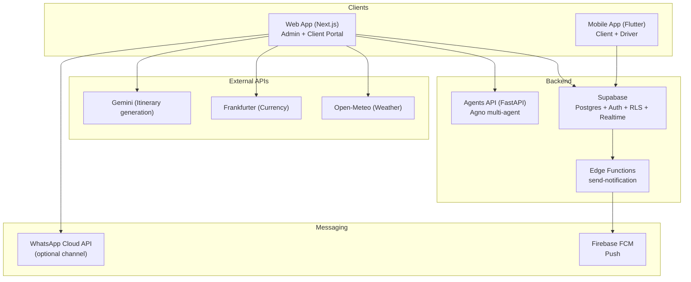

# Antigravity Repository Overview

Last Updated: 2026-02-12  
Primary Focus: `projects/travel-suite`

## What This Repo Is

This is a multi-project workspace. The main product effort is **Travel Suite** (GoBuddy Adventures) — a B2B SaaS travel-ops platform for tour operators (admin) with client + driver experiences.

Important clarifications:
- **Travel Suite mobile is Flutter** (not React Native).
- **Travel Suite automation does not use n8n**. It uses **Supabase (Postgres + Auth + RLS + Edge Functions)** plus **queue tables** and admin-triggered processors.
- n8n *is* present in this repo for other projects (notably `projects/ai-newsletter`) and as an embedded upstream MCP server (`servers/n8n-mcp`).

## Top-Level Structure

```
Antigravity/
├── projects/
│   ├── travel-suite/        # PRIMARY product focus
│   ├── ai-newsletter/       # n8n + python newsletter pipeline
│   └── milesmarketplace/    # scaffold / experimentation
├── servers/
│   └── n8n-mcp/             # upstream MCP server for n8n docs/tools
├── skills/                  # shared skill library for agents
└── docs/                    # repo-wide docs (this file)
```

## Travel Suite (Product) — Quick Index

Core docs (canonical):
- `projects/travel-suite/README.md`
- `projects/travel-suite/docs/deep_dive_analysis.md` (largest single technical summary)
- `projects/travel-suite/docs/next_critical_steps_2026-02-11.md`
- `projects/travel-suite/docs/critical_foundations_2026-02-11.md`
- `projects/travel-suite/docs/manual_testing_guide.md`
- `projects/travel-suite/docs/e2e_release_checklist.md`
- `projects/travel-suite/docs/monetization.md`
- `projects/travel-suite/docs/repo_audit_2026-02-12.md`

Apps/services:
- `projects/travel-suite/apps/web` (Next.js 16 admin + planner)
- `projects/travel-suite/apps/mobile` (Flutter iOS/Android)
- `projects/travel-suite/apps/agents` (FastAPI “AI Agents”)
- `projects/travel-suite/supabase` (migrations + Edge Functions)

## Travel Suite Architecture (Current)



## Travel Suite Components

### Web (`projects/travel-suite/apps/web`)

Primary responsibilities:
- Admin panel (CRM + Kanban lifecycle, trips, drivers, notifications, security/health dashboards)
- Trip planning UI (Gemini itinerary generation)
- Operational tools (queue processing, webhook health, etc.)

Key tech:
- Next.js 16 + React 19 + TypeScript
- Tailwind 4 + shadcn/ui
- Maps: MapLibre GL (Mapcn components)
- Observability: Sentry + PostHog
- Node runtime: **22** (see `.nvmrc` and `package.json#engines`)

### Mobile (`projects/travel-suite/apps/mobile`)

Primary responsibilities:
- Client trip viewing experience
- Driver mode: periodic GPS publishing (Realtime-backed)
- Push notifications (FCM) + local notifications
- Onboarding flow that determines role and required fields

Key tech:
- Flutter (Dart 3.10+)
- Riverpod + Freezed
- Maps: `flutter_map` (OpenStreetMap)
- Push: `firebase_messaging` + `flutter_local_notifications`

### Agents (`projects/travel-suite/apps/agents`)

Primary responsibilities:
- AI assistance endpoints (trip planner, recommender, support/RAG)
- JWT authentication + rate limiting

Key tech:
- FastAPI + Agno
- Pinned deps in `requirements.txt`

Operational note:
- Rate limiting is in-memory (fine for MVP; document/upgrade later if running multi-instance).

### Supabase (`projects/travel-suite/supabase`)

Primary responsibilities:
- Postgres schema + migrations (multi-tenant org scoping)
- RLS policies (tenant isolation)
- Edge Functions (notably `send-notification`)

Important patterns:
- Queue-based notifications and delivery tracking tables
- Admin-only endpoints and diagnostics guarded by JWT + role checks
- RLS verification helper script: `projects/travel-suite/scripts/verify_rls_policies.sql`

## CI / Workflows

Primary workflow (Travel Suite): `.github/workflows/ci.yml`
- Web: lint + typecheck + build
- Agents: compile checks + pytest (non-blocking if none)
- Mobile: `flutter analyze`
- Migrations: basic presence/syntax loop

## Other Projects (Non-Travel Suite)

### AI Newsletter (`projects/ai-newsletter`)

- Uses **n8n workflows** + python adapters.
- Has its own CI and tests.
- Not part of Travel Suite runtime.

### Miles Marketplace (`projects/milesmarketplace`)

- Currently scaffold + agent operating model; not a production app yet.

### n8n-MCP (`servers/n8n-mcp`)

- Embedded upstream MCP server for n8n node documentation/tools.
- Useful for n8n workflow work (Newsletter project), not required for Travel Suite.

## Recommended Maintenance Rule

To minimize future doc drift:
- Keep Travel Suite deep implementation details in `projects/travel-suite/docs/*`.
- Keep this file as “map of the repo” + “what depends on what” (not a full system design).

