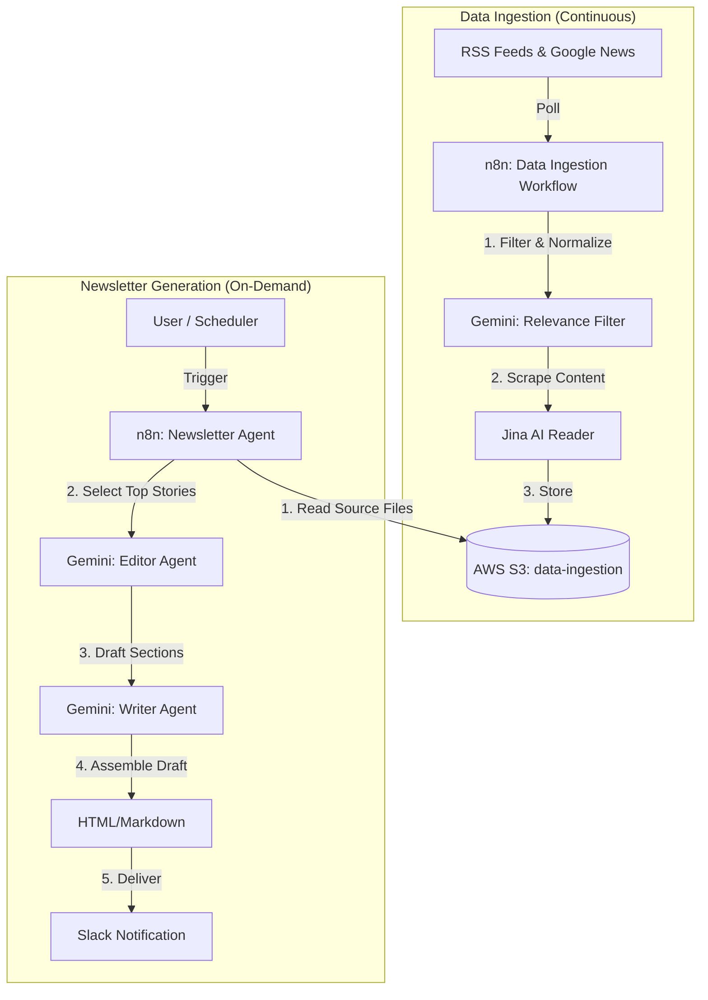

# AI Newsletter Architecture

This document outlines the architecture and workflows of your automated AI Newsletter system. The system works by continuously scraping high-quality AI news sources, storing them, and then using an AI agent to curate, write, and deliver a newsletter to Slack.

## System Overview

## Workflows

### 1. AI News Data Ingestion (`scraping_pipeline_adapted.json`)
This workflow runs in the background to build your database of news stories.

- **Triggers**:
  - **RSS Feeds**: Monitors top AI sources (The Neuron, The Rundown, Ben's Bites, etc.) every 4 hours.
  - **Google News**: Searches for keywords like "Artificial Intelligence", "LLM", etc.
  - **Hacker News**: Checks for trending AI stories.
- **Process**:
  1.  **Normalization**: Converts different feed formats into a standard JSON structure.
  2.  **Relevance Check**: Uses **Gemini 1.5 Flash** to analyze the title and summary. It discards irrelevant stories (e.g., crypto news, job postings).
  3.  **Deduplication**: Checks if the story has already been saved to S3.
  4.  **Scraping**: Uses **Jina AI** to convert the full article URL into clean, LLM-friendly Markdown.
  5.  **Storage**: Saves the scraped Markdown file to your **AWS S3** bucket (`data-ingestion`).

### 2. Content - Newsletter Agent (`newsletter_agent_adapted.json`)
This is the "Brain" that writes the newsletter. You trigger this manually when you want to generate a new edition.

- **Trigger**: manual form in n8n (or webhook).
  - *Inputs*: Date, Previous Content (to prevent repeating stories).
- **Process**:
  1.  **Retrieve Data**: Pulls all recent Markdown files from **AWS S3**.
  2.  **Editor Agent (Selection)**: Sends all stories to **Gemini 1.5 Flash**. The model acts as an "Editor-in-Chief" to pick the **Top 4** most important stories.
  3.  **Writer Agent (Drafting)**:
      - **Main Stories**: Iterates through selected stories. Gemini writes a "Recap", "Unpacked" (Analysis), and "Bottom Line" for each.
      - **Intro**: Writes a catchy introduction summarizing the themes.
      - **The Shortlist**: Picks 3-5 extra "quick hit" stories for the end of the newsletter.
  4.  **Assembly**: Combines all sections into a final formatted newsletter.
  5.  **Delivery**: Sends the final draft to **Slack** for your review.

## Tech Stack & Configuration

| Component | Service | reason |
| :--- | :--- | :--- |
| **Orchestration** | **n8n** | Connects all services and defines logic. |
| **AI Model** | **Google Gemini 1.5 Flash** | Fast, cost-efficient, and high context window (perfect for reading many news articles). |
| **Scraping** | **Jina AI** | Converts complex web pages into clean Markdown for the AI. |
| **Storage** | **AWS S3** | Cheap, reliable storage for thousands of news articles. |
| **Notifications** | **Slack** | Delivers the finished product to you. |

## How to Run

1.  **Ensure n8n is running**: `npm run start` (or your deployment command).
2.  **Check Ingestion**: Go to the **AI News Data Ingestion** workflow. It should be active. You can manually execute it to fetch immediate news.
3.  **Generate Newsletter**:
    - Open **Content - Newsletter Agent** workflow.
    - Click **"Test Workflow"** (or "Execute").
    - Wait ~1-2 minutes.
    - Check your **Slack** channel for the fresh draft!
