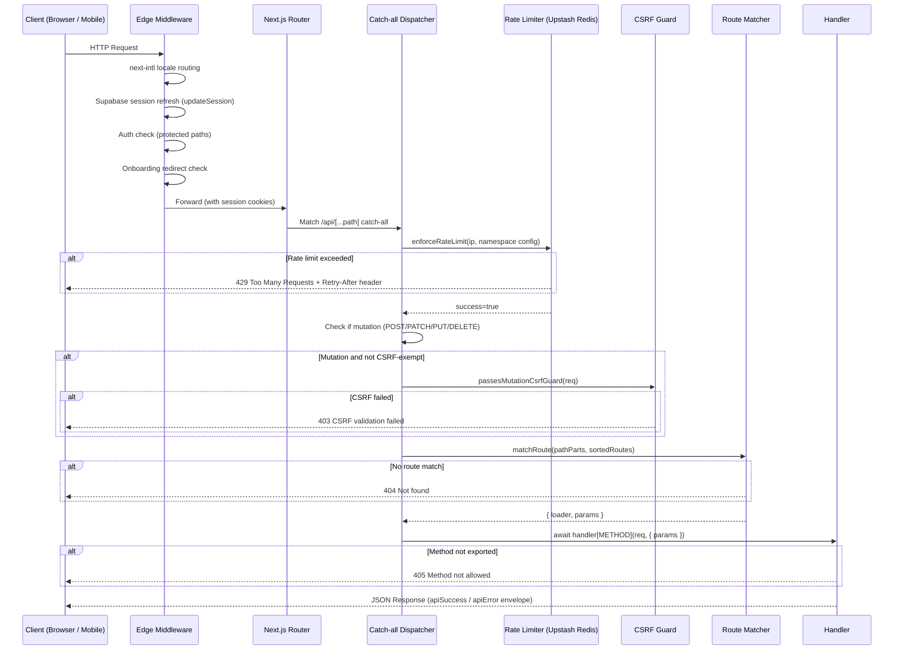
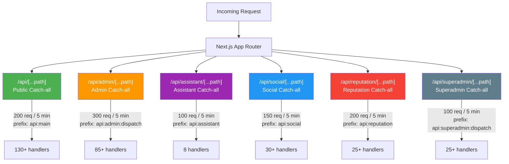
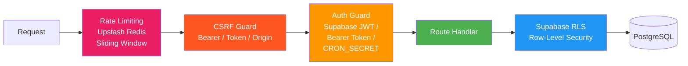

# API Architecture

> TripBuilt Travel SaaS -- API layer design, request lifecycle, and handler organization.

## Table of Contents

- [Request Flow](#request-flow)
- [Catch-all Namespaces](#catch-all-namespaces)
- [Handler Directory Tree](#handler-directory-tree)
- [Security Layers](#security-layers)
- [Response Format](#response-format)

---

## Request Flow

Every HTTP request passes through a layered pipeline before reaching a handler. The Edge Middleware handles locale detection, session refresh, and auth redirects. The catch-all dispatcher then applies rate limiting, CSRF checks, and route matching.



### Edge Middleware Details

The middleware (`src/middleware.ts`) runs on all non-API, non-static routes and handles:

1. **Locale routing** -- `next-intl` middleware detects browser locale via `Accept-Language` header. Default locale (`en`) has no URL prefix; non-default locales (e.g., `/hi/settings`) get prefixed.
2. **Session refresh** -- Calls `updateSession()` on every request to refresh Supabase cookies.
3. **Auth redirects** -- Unauthenticated users on protected prefixes (`/admin`, `/trips`, `/settings`, etc.) are redirected to `/auth?next=<original-path>`.
4. **Onboarding gate** -- Authenticated users who have not completed onboarding are redirected to `/onboarding`.
5. **Marketing redirect** -- Authenticated users on marketing pages (`/`, `/pricing`, `/about`) are redirected to `/admin`.

Protected path prefixes:
`/admin`, `/god`, `/planner`, `/trips`, `/settings`, `/proposals`, `/reputation`, `/social`, `/support`, `/clients`, `/drivers`, `/inbox`, `/add-ons`, `/analytics`, `/calendar`

---

## Catch-all Namespaces

All API routes use catch-all dispatchers instead of individual `route.ts` files. Each namespace has its own rate limit configuration, and all share the same `createCatchAllHandlers()` pipeline from `src/lib/api-dispatch.ts`.



### Rate Limit Summary

| Namespace | Path Prefix | Limit | Window | Redis Prefix |
|-----------|-------------|-------|--------|-------------|
| Public | `/api/*` | 200 req | 5 min | `api:main` |
| Admin | `/api/admin/*` | 300 req | 5 min | `api:admin:dispatch` |
| Assistant | `/api/assistant/*` | 100 req | 5 min | `api:assistant` |
| Social | `/api/social/*` | 150 req | 5 min | `api:social` |
| Reputation | `/api/reputation/*` | 200 req | 5 min | `api:reputation` |
| Superadmin | `/api/superadmin/*` | 100 req | 5 min | `api:superadmin:dispatch` |

### CSRF-Exempt Routes (Public Catch-all)

The following routes skip CSRF validation because they receive requests from external systems:

- `cron/*` -- Vercel cron scheduler (uses CRON_SECRET)
- `auth/password-login` -- Login form submission
- `payments/webhook` -- Razorpay webhook callbacks
- `whatsapp/webhook` -- WhatsApp/Meta webhook callbacks
- `webhooks/*` -- All external webhook integrations

All other mutation requests (POST, PATCH, PUT, DELETE) must pass CSRF validation via either:
- Bearer token in `Authorization` header, OR
- `x-admin-csrf` header matching `ADMIN_MUTATION_CSRF_TOKEN`, OR
- Same-origin check (Origin/Referer matches Host)

---

## Handler Directory Tree

All handlers live under `src/app/api/_handlers/` and are organized by domain:

```
_handlers/
  add-ons/            # Add-on catalog CRUD, stats
  admin/              # Admin-only operations
    activity/         #   Activity feed
    automation/       #   Workflow automation rules
    cache-metrics/    #   Cache performance metrics
    clients/          #   Client management
    contacts/         #   CRM contact management, promote to client
    cost/             #   Cost overview, alert acknowledgments
    dashboard/        #   Dashboard stats
    destinations/     #   Destination management
    e-invoicing/      #   GST e-invoicing (generate, cancel, status)
    funnel/           #   Sales funnel analytics
    generate-embeddings/  # RAG embedding generation
    geocoding/        #   Geocoding usage stats
    insights/         #   AI-powered insights (14 endpoints)
      action-queue/   margin-leak/   ops-copilot/   roi/
      ai-usage/       auto-requote/  proposal-risk/ win-loss/
      batch-jobs/     best-quote/    smart-upsell-timing/
      daily-brief/    upsell-recommendations/
    leads/            #   Lead management
    logo/             #   Organization logo upload
    ltv/              #   Customer lifetime value
    marketplace/      #   Marketplace verification
    notifications/    #   Notification delivery, retry
    operations/       #   Operations command center
    pdf-imports/      #   PDF import pipeline
    pricing/          #   Cost tracking, overheads, vendor history
    proposals/        #   Payment plans, tier management
    referrals/        #   Referral program
    reports/          #   GST reports, destination reports, operator reports
    reputation/       #   Client referral management
    revenue/          #   Revenue analytics
    scorecards/       #   Operator scorecards
    security/         #   Security diagnostics
    seed-demo/        #   Demo data seeding
    setup-progress/   #   Onboarding progress
    share/            #   Share content via WhatsApp/email
    social/           #   AI social content generation
    templates/        #   Tour template CRUD, fork
    tour-templates/   #   PDF tour template extraction
    trips/            #   Trip CRUD, clone
    whatsapp/         #   WhatsApp health, phone normalization
    workflow/         #   Workflow events, notification rules
  ai/                 # AI endpoints (pricing, review responses, reply suggestions)
  assistant/          # AI assistant (chat, streaming, conversations, usage)
  auth/               # Password login
  availability/       # Availability checking
  billing/            # Subscription billing, invoices, contact-sales
  bookings/           # Flight/hotel search, location search
  calendar/           # Calendar event management
  cron/               # Scheduled jobs (8 endpoints)
  currency/           # Currency conversion
  dashboard/          # User dashboard (schedule, tasks)
  drivers/            # Driver search
  emails/             # Welcome email
  health/             # Health check
  images/             # Image search (Pexels, Pixabay, Unsplash)
  integrations/       # Google Places, TripAdvisor
  invoices/           # Invoice CRUD, payment, PDF sending
  itineraries/        # Itinerary CRUD, bookings, feedback
  itinerary/          # AI itinerary generation, PDF/URL import, sharing
  leads/              # Lead conversion
  location/           # Live location sharing, cleanup
  marketplace/        # Public marketplace, inquiries, reviews, subscriptions
  nav/                # Navigation badge counts
  notifications/      # Notification queue processing, retry, scheduling
  onboarding/         # First-value wizard, sample data loading
  payments/           # Razorpay orders, verification, webhooks, payment links
  portal/             # Client portal (token-based)
  proposals/          # Proposal CRUD, PDF, bulk ops, public sharing
  reputation/         # Reviews, NPS, campaigns, AI analysis, widgets
  settings/           # E-invoicing, integrations, marketplace, team, UPI
  share/              # Token-based content sharing
  social/             # Social media posts, publishing, OAuth, calendar
  subscriptions/      # Subscription management, limits
  superadmin/         # Platform-wide admin (users, analytics, announcements, monitoring)
  support/            # Support ticket submission
  trips/              # Trip CRUD, add-ons, invoices, notifications
  webhooks/           # External webhook handlers (WAHA)
  whatsapp/           # WhatsApp messaging, QR, broadcast, chatbot
```

---

## Security Layers

Every API request passes through multiple security layers before reaching business logic.



### Layer Details

| Layer | Implementation | Failure Mode |
|-------|---------------|-------------|
| **Rate Limiting** | Upstash Redis sliding window; falls back to in-memory in dev; **fail-closed** in production when Redis is unavailable | 429 + `Retry-After` header |
| **CSRF** | Bearer tokens bypass; `x-admin-csrf` header with timing-safe compare; same-origin fallback | 403 CSRF validation failed |
| **Auth Guards** | Supabase JWT (user sessions), admin bearer tokens, service role key, CRON_SECRET with HMAC signatures | 401 Unauthorized |
| **RLS** | PostgreSQL row-level security on all tables; `is_org_admin()` and role-based policies | Query returns empty / error |

---

## Response Format

All API responses use a consistent envelope pattern defined in `src/lib/api/response.ts` and `src/lib/api-response.ts`.

### Success Response

```json
{
  "data": { ... },
  "error": null
}
```

### Error Response

```json
{
  "data": null,
  "error": "Human-readable error message",
  "code": "OPTIONAL_ERROR_CODE"
}
```

### Paginated Response

```json
{
  "data": [ ... ],
  "error": null,
  "meta": {
    "total": 142,
    "page": 1,
    "limit": 20,
    "hasMore": true
  }
}
```

### Helper Functions

| Function | Module | Purpose |
|----------|--------|---------|
| `apiSuccess(data)` | `@/lib/api/response` | Wraps data in `{ data, error: null }` |
| `apiError(message, status)` | `@/lib/api/response` | Wraps error in `{ data: null, error }` |
| `apiPaginated(data, meta)` | `@/lib/api-response` | Adds `meta` with `total`, `page`, `limit`, `hasMore` |
| `jsonWithRequestId(body, id)` | `@/lib/api/response` | Adds `request_id` field and `x-request-id` header |

### Error Status Codes

| Status | Meaning | When Used |
|--------|---------|-----------|
| 400 | Bad Request | Invalid JSON body, validation errors |
| 401 | Unauthorized | Missing or invalid auth credentials |
| 403 | Forbidden | CSRF failure, insufficient permissions |
| 404 | Not Found | No matching route in catch-all |
| 405 | Method Not Allowed | Route exists but handler does not export the HTTP method |
| 409 | Conflict | Cron replay detection |
| 429 | Too Many Requests | Rate limit exceeded |
| 500 | Internal Server Error | Unhandled exception in handler |

### OPTIONS / CORS Handling

The dispatcher handles `OPTIONS` preflight requests automatically. It checks the `Origin` header against `ALLOWED_ORIGINS` (sourced from `ALLOWED_ORIGINS` or `NEXT_PUBLIC_APP_URL` env vars) and returns appropriate CORS headers with a 24-hour `Access-Control-Max-Age`.
