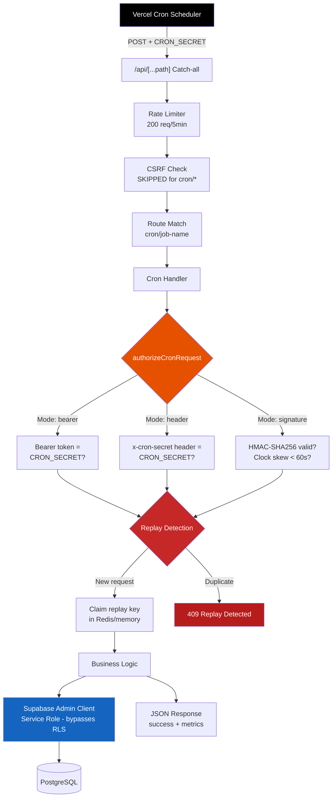
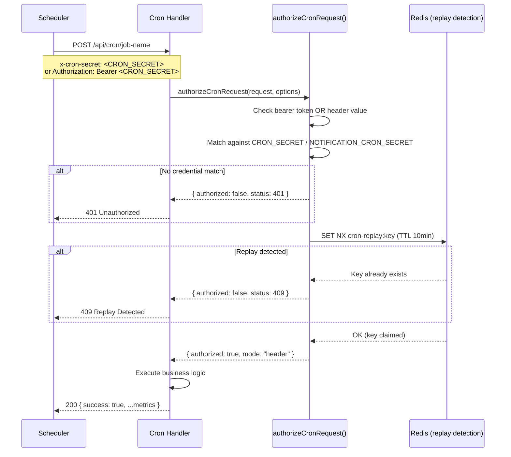
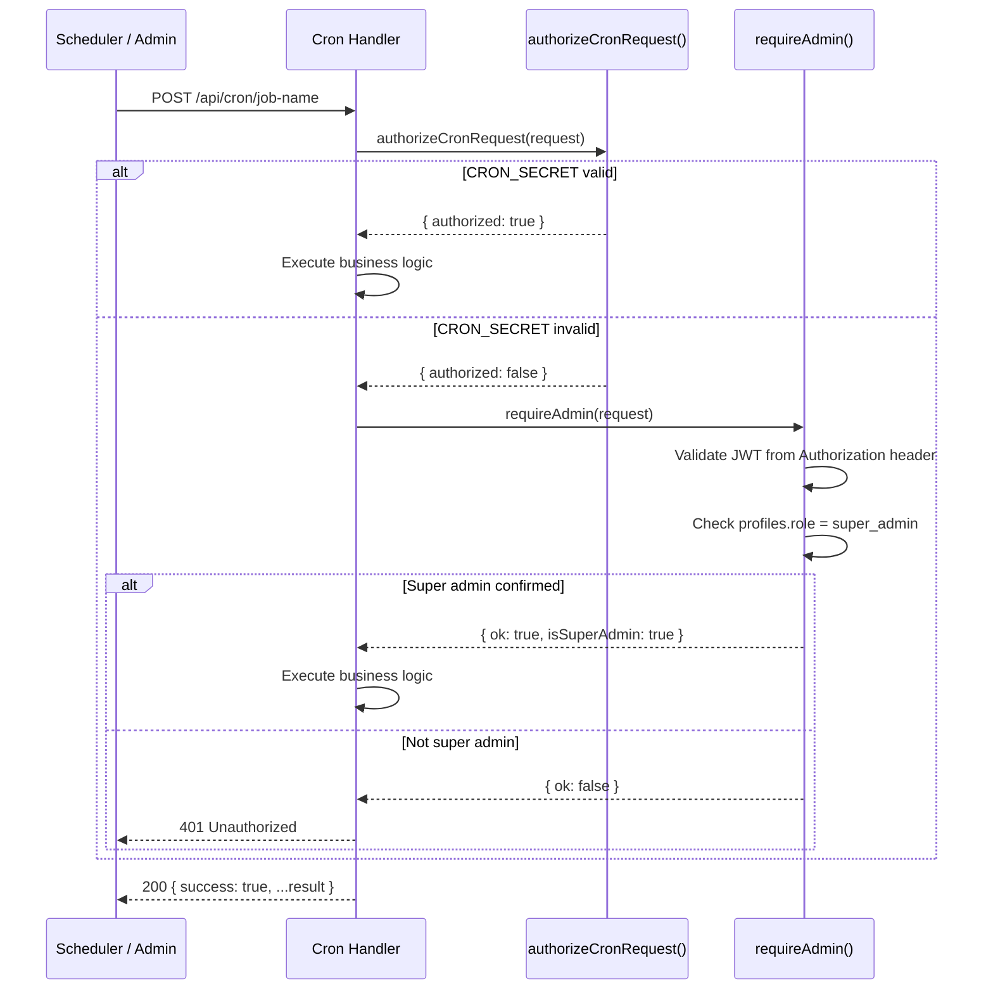

# Cron Jobs

> TripBuilt Travel SaaS -- scheduled background jobs running on Vercel with CRON_SECRET authentication.

## Table of Contents

- [Cron Architecture](#cron-architecture)
- [All Cron Jobs](#all-cron-jobs)
- [Vercel Constraints](#vercel-constraints)
- [Authentication Pattern](#authentication-pattern)
- [Handler Implementation Pattern](#handler-implementation-pattern)

---

## Cron Architecture

All cron jobs follow the same architecture: Vercel's scheduler sends a POST request to the API endpoint, which passes through the catch-all dispatcher, validates the CRON_SECRET, and executes the handler.



### External Scheduler Support

While only 2 cron jobs can be registered in `vercel.json` (Hobby plan limit), the remaining 6 jobs are designed to be triggered by external schedulers (e.g., GitHub Actions, Upstash QStash, or manual curl) using the same CRON_SECRET authentication. The endpoints are identical -- the only difference is who sends the POST request.

---

## All Cron Jobs

| # | Endpoint | Schedule | Purpose | Max Duration | Auth |
|---|----------|----------|---------|-------------|------|
| 1 | `/api/cron/assistant-briefing` | `0 1 * * *` (daily 01:00 UTC) | Generate and queue WhatsApp morning briefings for all eligible operators | 60s | CRON_SECRET + replay |
| 2 | `/api/cron/automation-processor` | `0 2 * * *` (daily 02:00 UTC) | Run workflow automation engine for all scheduled rules | 60s | CRON_SECRET or super_admin bearer |
| 3 | `/api/cron/assistant-alerts` | Every 4 hours (external) | Detect issues needing operator attention and queue WhatsApp alerts | 60s | CRON_SECRET + replay |
| 4 | `/api/cron/assistant-digest` | `0 3 * * 1` (weekly Mon 03:00 UTC) | Generate and queue weekly insights digest for all operators via WhatsApp | 60s | CRON_SECRET + replay |
| 5 | `/api/cron/operator-scorecards` | Monthly 1st (external) | Calculate and deliver monthly operator performance scorecards | 60s | CRON_SECRET or super_admin bearer |
| 6 | `/api/cron/reputation-campaigns` | Daily 03:00 UTC (external) | Trigger reputation review campaign sends for eligible trips | 60s | CRON_SECRET + replay |
| 7 | `/api/cron/social-publish-queue` | Every 15 min (external) | Process pending social media posts and publish to Instagram/Facebook | 60s | CRON_SECRET + replay |
| 8 | `/api/cron/social-sync-metrics` | Daily 02:00 UTC (external) | Fetch performance metrics for published posts from Meta Graph API | 60s | CRON_SECRET + replay |

### Vercel-Registered Crons (vercel.json)

Only 2 of the 8 jobs are registered in `vercel.json` due to the Hobby plan limit:

```json
{
  "crons": [
    {
      "path": "/api/cron/assistant-briefing",
      "schedule": "0 1 * * *"
    },
    {
      "path": "/api/cron/automation-processor",
      "schedule": "0 2 * * *"
    }
  ]
}
```

The remaining 6 jobs must be triggered by an external scheduler or manually.

---

## Vercel Constraints

The Vercel Hobby plan imposes several constraints on cron job execution.

| Constraint | Value | Impact |
|------------|-------|--------|
| Cron slots | 2 maximum | Only 2 jobs can be auto-scheduled in `vercel.json` |
| Function timeout | 60s maximum | All handlers set `maxDuration = 60` |
| HTTP method | POST only | Cron handlers must export `POST`, not `GET` |
| Authentication | CRON_SECRET env var | Vercel injects this automatically for registered crons |
| Cold starts | Serverless functions | In-memory state (replay keys, rate limits) resets per cold start |

### Timeout Handling

Jobs that process large datasets (like `social-sync-metrics`) implement a timeout guard:

```
Start timer
For each item in batch:
  if (elapsed > 50s):  // 10s buffer before 60s limit
    log("Approaching timeout, stopping early")
    break
  process(item)
Return partial results
```

This prevents Vercel from killing the function mid-execution and ensures partial progress is saved.

---

## Authentication Pattern

All cron handlers use the shared `authorizeCronRequest()` function from `src/lib/security/cron-auth.ts`. Two patterns exist:

### Pattern 1: CRON_SECRET Only

Used by assistant-alerts, assistant-briefing, assistant-digest, reputation-campaigns, social-publish-queue, social-sync-metrics.



### Pattern 2: CRON_SECRET with Admin Fallback

Used by automation-processor and operator-scorecards. These endpoints can also be triggered manually by super_admin users.



---

## Handler Implementation Pattern

All cron handlers follow a consistent implementation pattern:

```
1. Call authorizeCronRequest() with appropriate options
2. If unauthorized, return error response immediately
3. Create Supabase admin client (service role, bypasses RLS)
4. Execute business logic
5. Return JSON with success flag and metrics
6. Catch errors and return safe error message (never expose internals)
```

### Secret Header Names

Different cron handlers accept different header names for the secret:

| Handler | Accepted Headers |
|---------|-----------------|
| assistant-alerts | `x-cron-secret`, `x-notification-cron-secret` |
| assistant-briefing | `x-cron-secret`, `x-notification-cron-secret` |
| assistant-digest | `x-cron-secret`, `x-notification-cron-secret` |
| automation-processor | `x-cron-secret` (default) |
| operator-scorecards | `x-cron-secret` (default) |
| reputation-campaigns | `x-cron-secret`, `x-notification-cron-secret` |
| social-publish-queue | `x-cron-secret`, `x-social-cron-secret` |
| social-sync-metrics | `x-cron-secret`, `x-social-cron-secret` |

### Replay Window

All handlers use a 10-minute replay window (`replayWindowMs: 10 * 60 * 1000`), meaning the same request cannot be processed twice within 10 minutes. This prevents duplicate execution from scheduler retries or network issues.

### Environment Variables

| Variable | Purpose | Required |
|----------|---------|----------|
| `CRON_SECRET` | Primary cron authentication secret | Yes (for Vercel crons) |
| `NOTIFICATION_CRON_SECRET` | Alternative secret for notification-related crons | Optional |
| `CRON_SIGNING_SECRET` | HMAC signing key for signature-based auth | Optional |
| `UPSTASH_REDIS_REST_URL` | Redis for distributed replay detection | Recommended |
| `UPSTASH_REDIS_REST_TOKEN` | Redis auth token | Recommended |
