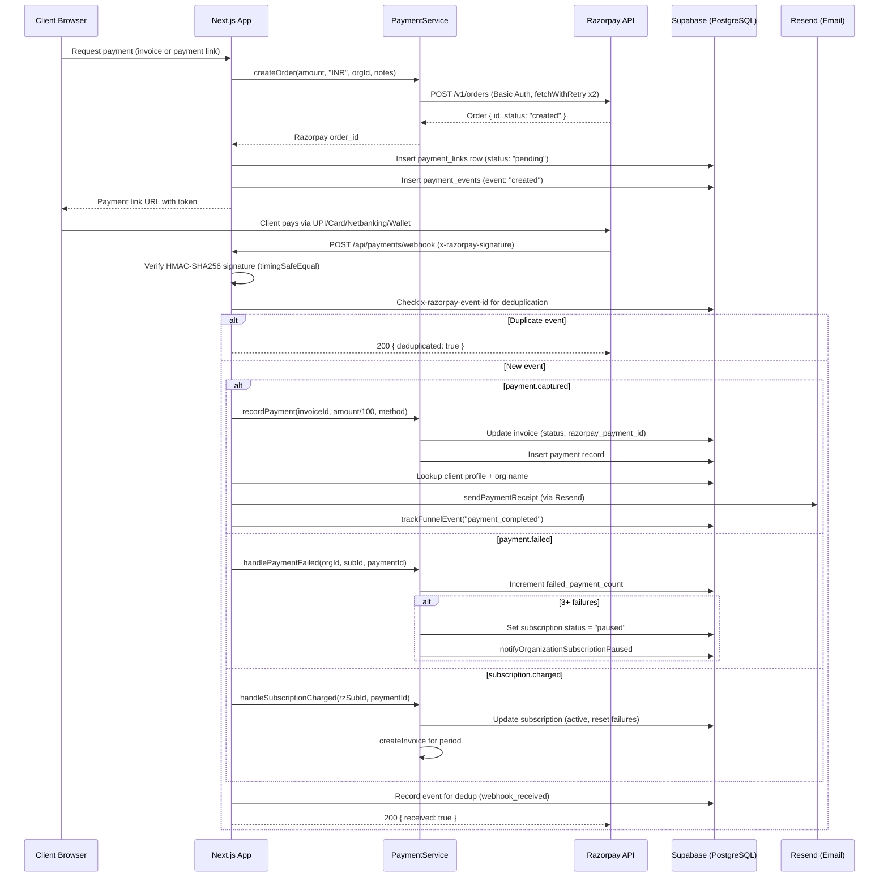
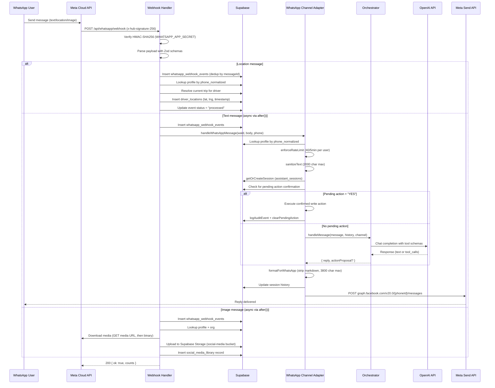
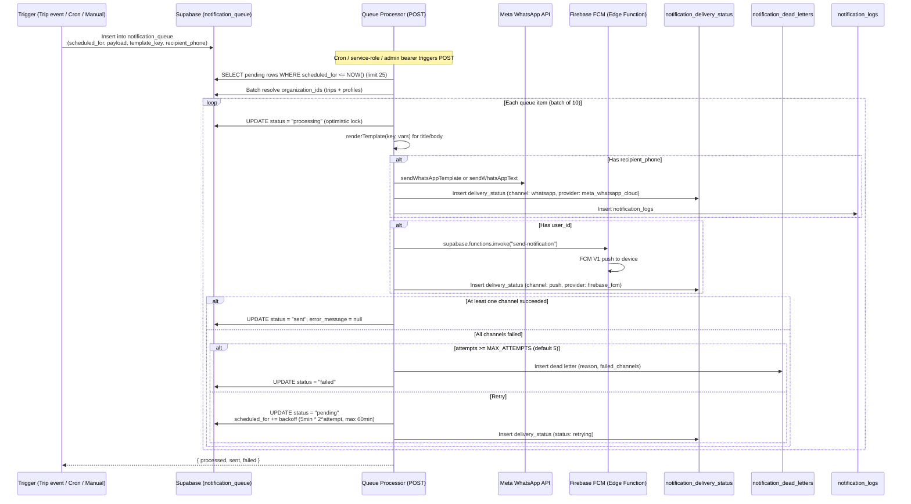
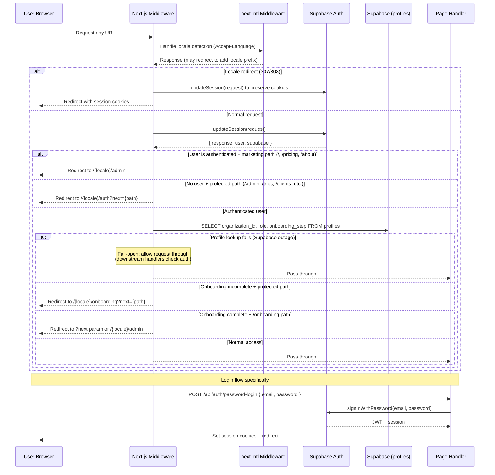
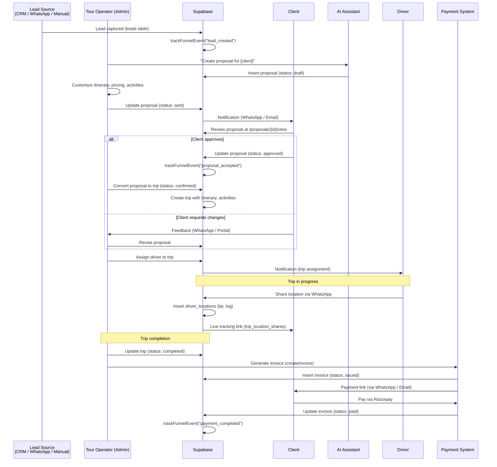
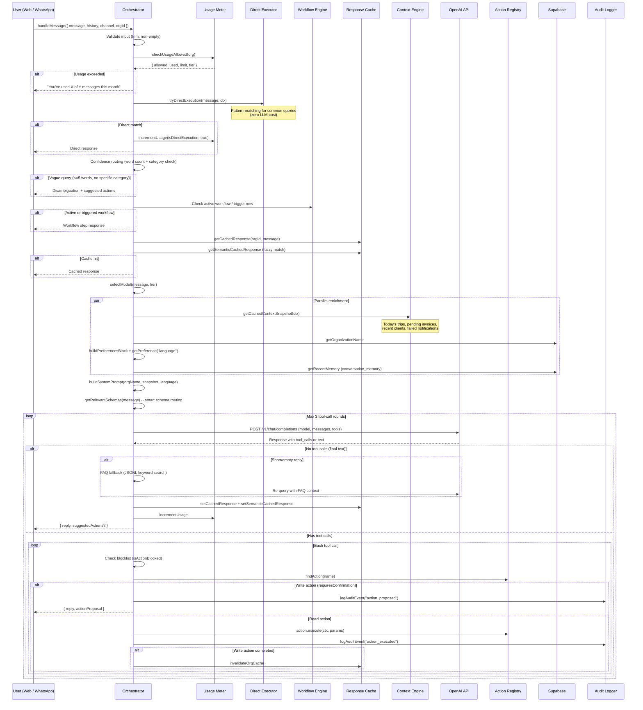
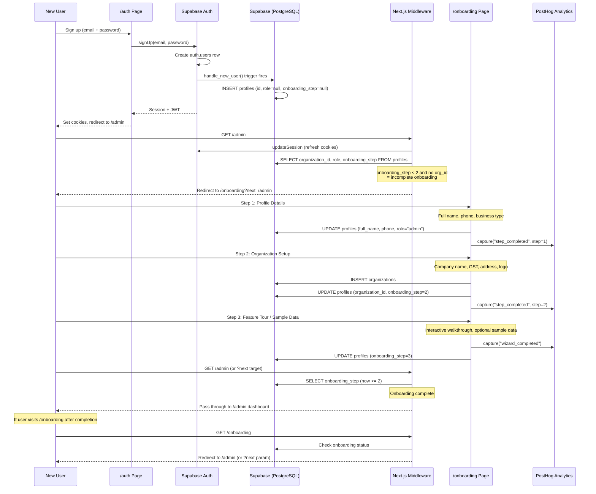

# TripBuilt Data Flows

Critical business flows across the TripBuilt travel SaaS platform. Each diagram reflects the actual implementation in `apps/web/src/`.

---

## Table of Contents

1. [Payment Flow](#1-payment-flow)
2. [WhatsApp Message Flow](#2-whatsapp-message-flow)
3. [Notification Pipeline](#3-notification-pipeline)
4. [Auth Flow](#4-auth-flow)
5. [Trip Lifecycle](#5-trip-lifecycle)
6. [AI Assistant Flow](#6-ai-assistant-flow)
7. [Onboarding Flow](#7-onboarding-flow)

---

## 1. Payment Flow

Razorpay handles all payments in INR. The flow covers order creation, client-side checkout, and webhook-driven settlement. Signature verification uses HMAC-SHA256 with timing-safe comparison. The webhook handler deduplicates events using the `x-razorpay-event-id` header stored in `payment_events`.

**Key files:** `src/lib/payments/razorpay.ts`, `src/lib/payments/payment-service.ts`, `src/lib/payments/webhook-handlers.ts`, `src/app/api/_handlers/payments/webhook/route.ts`, `src/lib/payments/payment-links.server.ts`

**Supported webhook events:** `payment.captured`, `payment.failed`, `subscription.charged`, `subscription.cancelled`, `subscription.paused`, `invoice.paid`

**Retry policy:** `fetchWithRetry` with 2 retries, 9s timeout, 300ms base delay with exponential backoff + jitter.

---

## 2. WhatsApp Message Flow

Incoming messages arrive via Meta Cloud API webhook. The webhook handler supports three message types (text, location, image) and routes text messages through the AI assistant channel adapter. Signature verification uses HMAC-SHA256 with the `WHATSAPP_APP_SECRET`.

**Key files:** `src/lib/whatsapp.server.ts`, `src/app/api/_handlers/whatsapp/webhook/route.ts`, `src/lib/assistant/channel-adapters/whatsapp.ts`

**Send retry policy:** 3 attempts with 300ms * attempt delay. Retries on HTTP 429 and 5xx.

---

## 3. Notification Pipeline

The notification system uses a queue-based architecture with multi-channel delivery (WhatsApp + Push), exponential backoff retries, and a dead letter table for permanently failed messages.

**Key files:** `src/lib/notifications.ts`, `src/app/api/_handlers/notifications/process-queue/route.ts`, `src/lib/notification-templates.ts`

**Backoff formula:** `BASE_BACKOFF_MINUTES (5) * 2^(attempt-1)`, capped at `MAX_BACKOFF_MINUTES (60)`.

**Auth:** Accepts cron secret (`x-notification-cron-secret`), service role bearer, or admin bearer token.

---

## 4. Auth Flow

Authentication uses Supabase Auth with email/password login. The Next.js middleware handles session refresh, locale routing (next-intl), protected route guards, and onboarding status checks. The middleware runs on every matched request before the page handler.

**Key files:** `src/middleware.ts`, `src/lib/supabase/middleware.ts`, `src/app/api/_handlers/auth/`

**Onboarding completeness rules:**
- `super_admin`: Always complete
- `client` / `driver`: Complete if `organization_id` is set
- `admin`: Complete if `organization_id` set AND `role = "admin"` AND `onboarding_step >= 2`

**Protected prefixes:** `/admin`, `/god`, `/planner`, `/trips`, `/settings`, `/proposals`, `/reputation`, `/social`, `/support`, `/clients`, `/drivers`, `/inbox`, `/add-ons`, `/analytics`, `/calendar`

---

## 5. Trip Lifecycle

A trip progresses through multiple stages from lead capture to final payment. This diagram represents the logical business flow coordinated across multiple handlers and database tables.

**Key tables:** `leads`, `proposals`, `trips`, `invoices`, `driver_locations`, `notification_queue`

---

## 6. AI Assistant Flow

The orchestrator is the core of the AI assistant. It uses OpenAI's function-calling API with registered tool schemas, supports multi-round tool execution (max 3 rounds), and includes caching, usage metering, and confidence routing.

**Key files:** `src/lib/assistant/orchestrator.ts`, `src/lib/assistant/context-engine.ts`, `src/lib/assistant/actions/registry.ts`, `src/lib/assistant/model-router.ts`, `src/lib/assistant/direct-executor.ts`

**Models used:** Selected by `model-router.ts` based on query complexity and org tier. FAQ fallback uses `gpt-4o-mini`. Main model is determined per-query.

**Context snapshot (5-min cache):** Today's trips, pending invoices, recently active clients (7 days), failed notifications.

---

## 7. Onboarding Flow

New user signup triggers a Supabase database trigger (`handle_new_user()`) that creates a profile. The middleware then redirects to the onboarding wizard, which is a multi-step form collecting profile and organization data.

**Key files:** `src/middleware.ts`, `src/app/(auth)/onboarding/`

**Onboarding status checks by role:**
- `super_admin`: Always considered complete (bypass)
- `client` / `driver`: Complete when `organization_id` is present (created by admins, never self-onboard)
- `admin`: Complete when `organization_id` is set AND `onboarding_step >= 2`
