# Database Schema

> TripBuilt Travel SaaS -- 109 tables across PostgreSQL (Supabase) with RLS enabled on all tables.

## Table of Contents

- [Master Overview](#master-overview)
- [Core Domain](#core-domain)
- [CRM Domain](#crm-domain)
- [Logistics Domain](#logistics-domain)
- [Payments Domain](#payments-domain)
- [Notifications Domain](#notifications-domain)
- [AI / RAG Domain](#ai--rag-domain)
- [Workflows Domain](#workflows-domain)
- [Location Sharing Domain](#location-sharing-domain)
- [Proposals Domain](#proposals-domain)
- [Social Media Domain](#social-media-domain)
- [Reputation Domain](#reputation-domain)
- [Marketplace Domain](#marketplace-domain)
- [Subscriptions Domain](#subscriptions-domain)
- [Templates Domain](#templates-domain)
- [Platform Admin Domain](#platform-admin-domain)
- [RLS Policy Patterns](#rls-policy-patterns)

---

## Master Overview

This diagram shows how the major domain groups connect to each other through shared foreign keys.

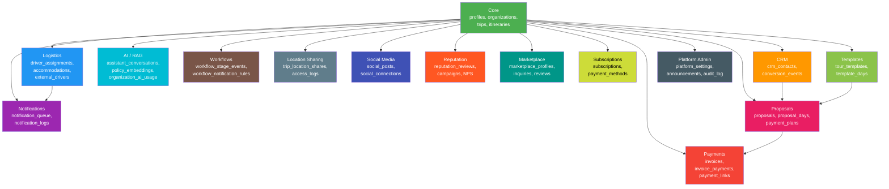

---

## Core Domain

The foundational tables that all other domains reference. Every row is scoped to an `organization_id` for multi-tenancy.

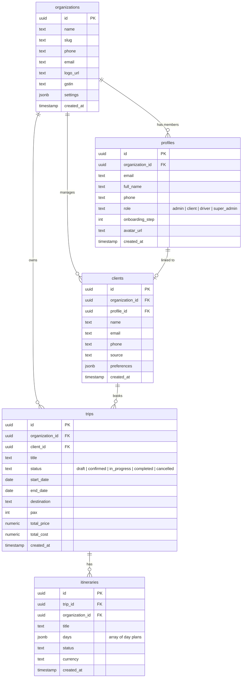

---

## CRM Domain

Lead and contact management with conversion tracking from initial inquiry to booked client.

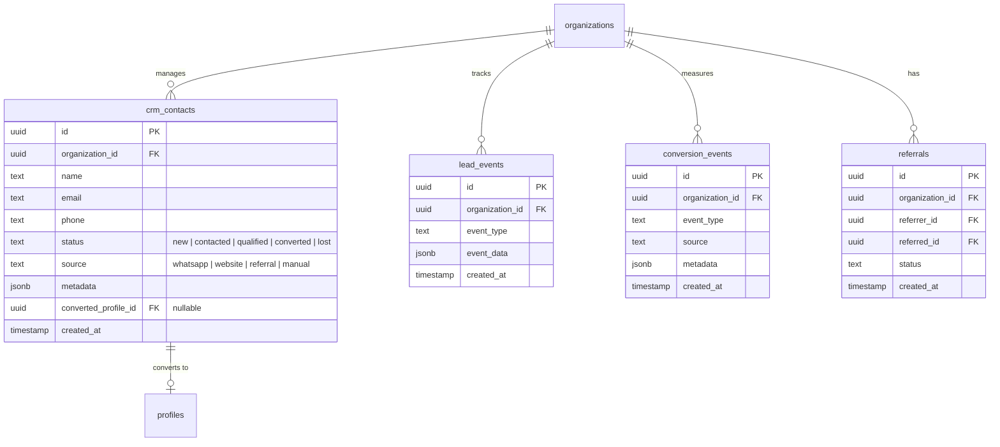

**Purpose**: CRM contacts represent pre-client leads. When a contact converts, their `converted_profile_id` links to the newly created `profiles` row, and a corresponding `clients` row is created.

---

## Logistics Domain

Driver management, trip assignments, vehicle tracking, and accommodation logistics.

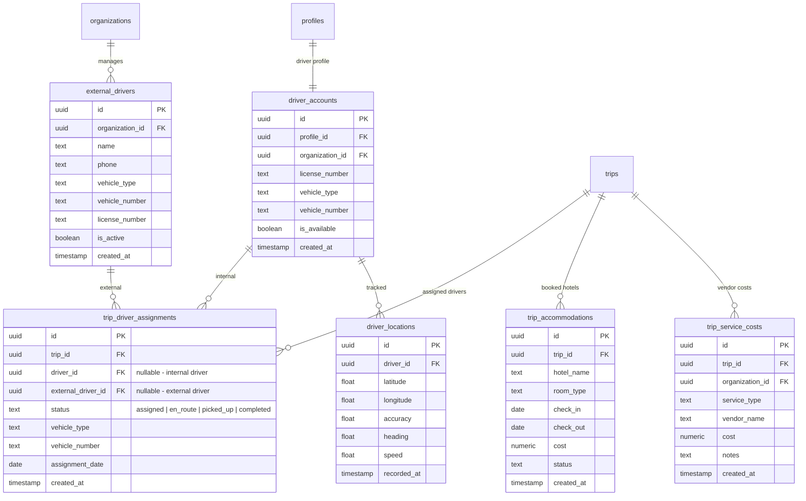

**Purpose**: Supports both internal drivers (linked via `profiles` and `driver_accounts`) and external/freelance drivers (via `external_drivers`). Each trip can have multiple driver assignments for multi-leg journeys.

---

## Payments Domain

Invoice generation, payment tracking, and Razorpay integration for the Indian market (INR currency).

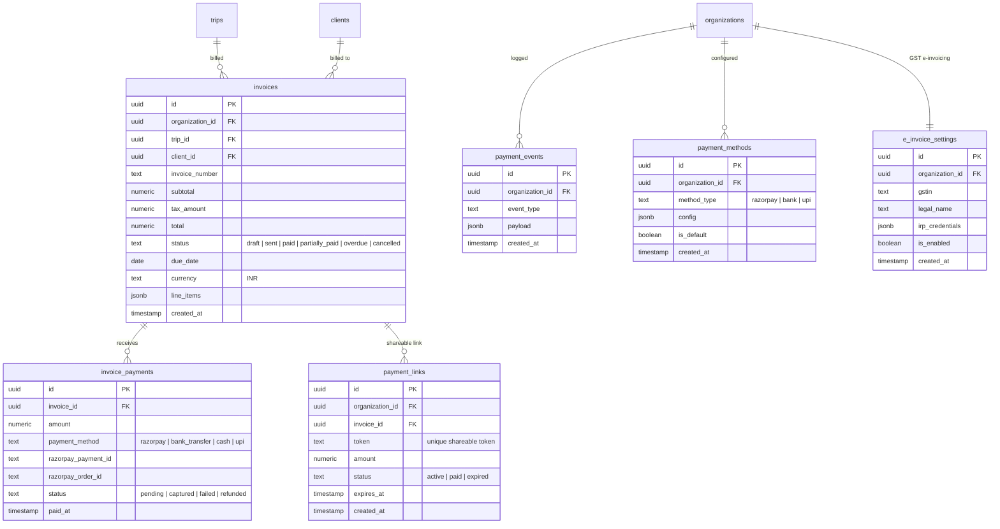

**Purpose**: Full billing lifecycle from invoice creation through Razorpay payment capture. Payment links allow clients to pay via a tokenized URL. E-invoicing supports Indian GST compliance with IRP integration.

---

## Notifications Domain

Multi-channel notification system with queue-based delivery, retry logic, and dead letter handling.

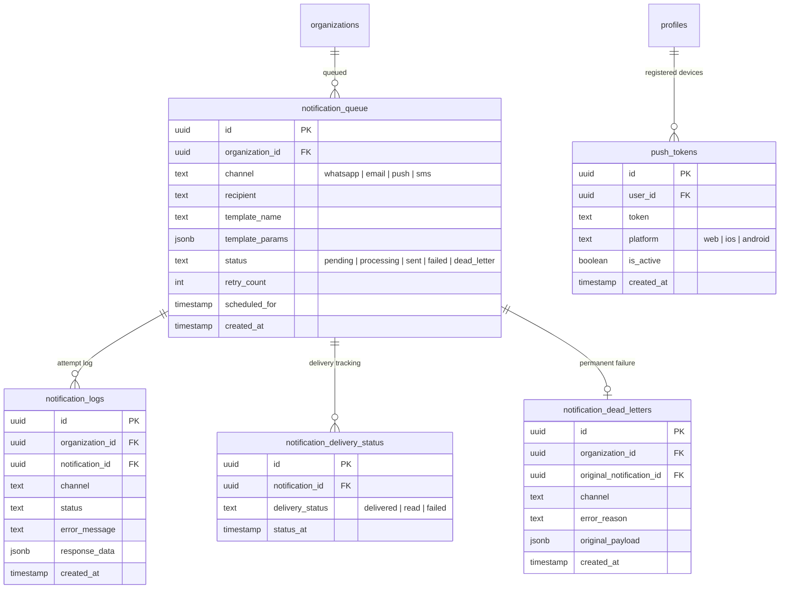

**Purpose**: Notifications are queued first (not sent directly) and processed by the notification engine. Failed deliveries are retried with exponential backoff. After max retries, notifications move to the dead letter table for investigation.

---

## AI / RAG Domain

AI assistant conversations, policy embeddings for RAG retrieval, and per-organization AI usage tracking.

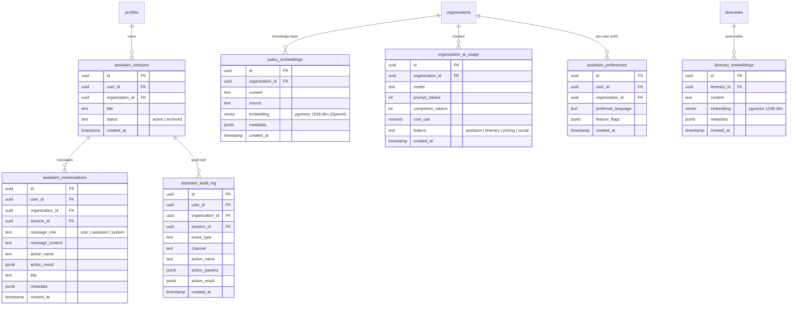

**Purpose**: The AI assistant uses RAG (Retrieval-Augmented Generation) with pgvector embeddings. `policy_embeddings` stores organizational policies and knowledge. `organization_ai_usage` tracks token consumption and cost per feature for billing and cost alerts.

---

## Workflows Domain

Event-driven workflow automation with configurable notification rules triggered by trip stage changes.

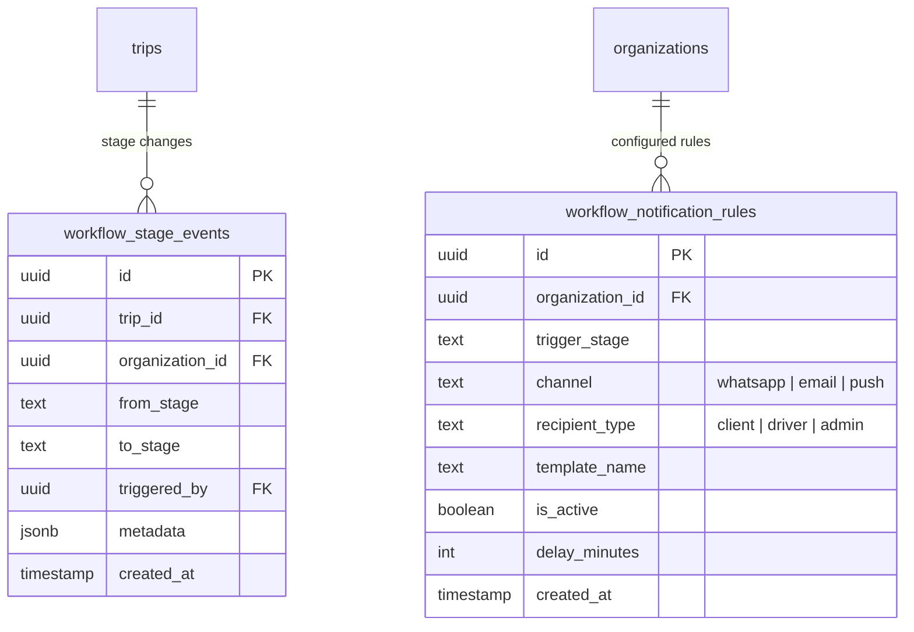

**Purpose**: When a trip transitions between stages (e.g., `confirmed` to `in_progress`), the automation engine checks `workflow_notification_rules` and queues appropriate notifications with optional delays.

---

## Location Sharing Domain

Real-time trip location sharing with tokenized access for clients and access logging.

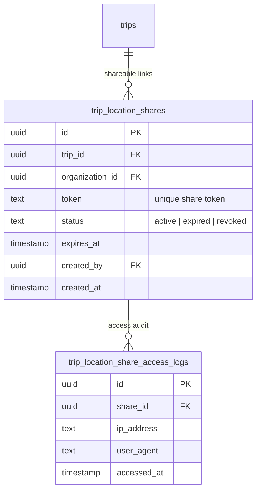

**Purpose**: Operators create shareable links for clients to track their driver's live location during a trip. Each access is logged for security auditing.

---

## Proposals Domain

Multi-tier trip proposals with day-by-day itineraries, activities, accommodations, and payment plans.

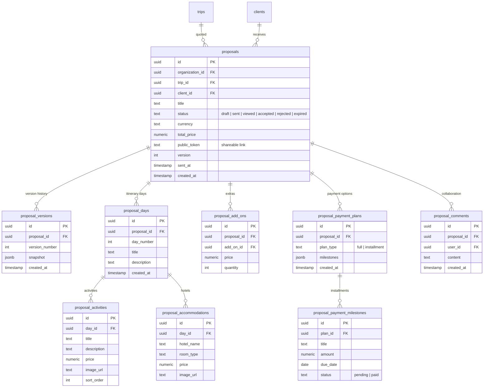

---

## Social Media Domain

Social media post management, multi-platform publishing queue, and OAuth connections.

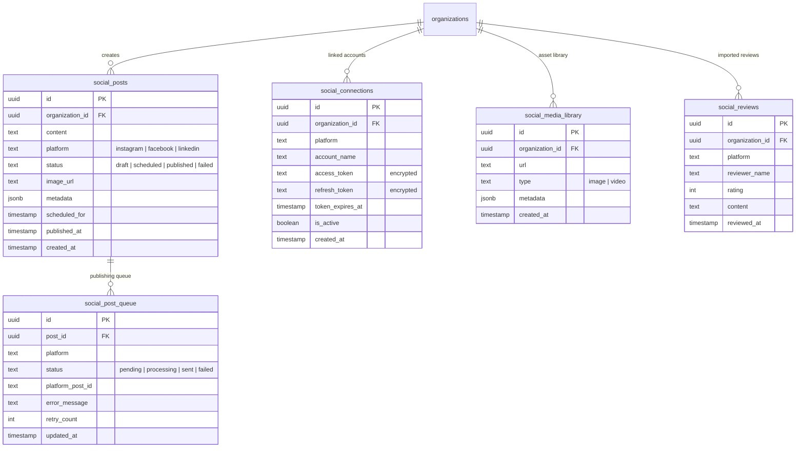

---

## Reputation Domain

Review management, NPS campaigns, competitor tracking, and AI-powered review response generation.

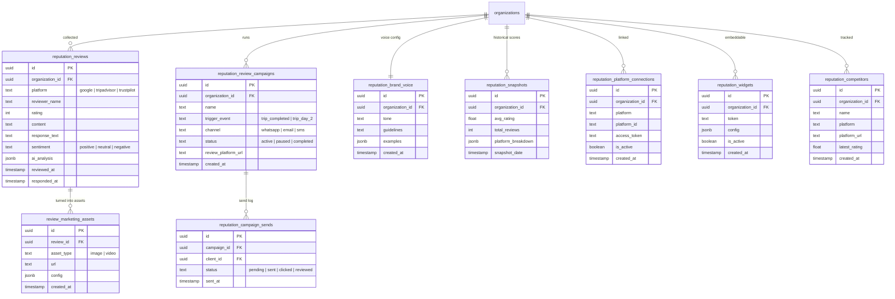

---

## Marketplace Domain

Public marketplace where travel operators list their services and receive inquiries.

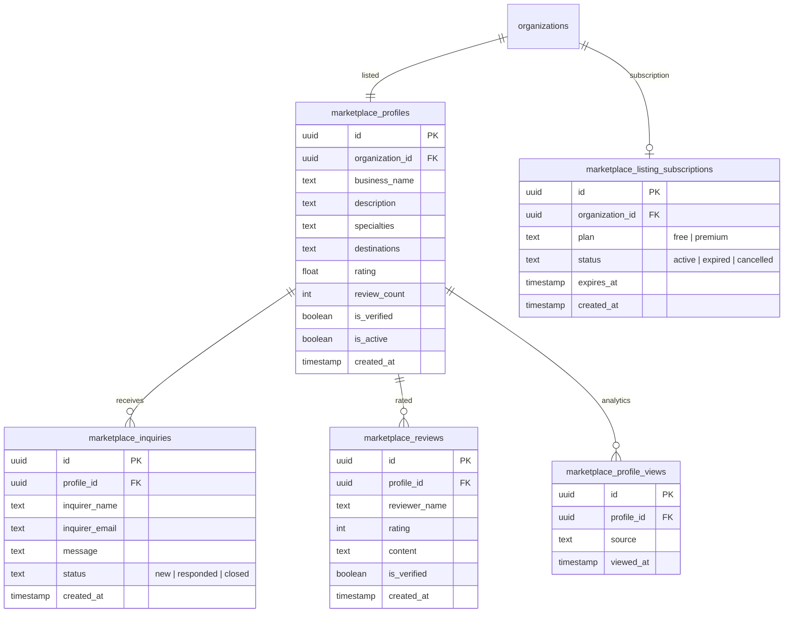

---

## Subscriptions Domain

SaaS subscription management with tier-based feature limits.

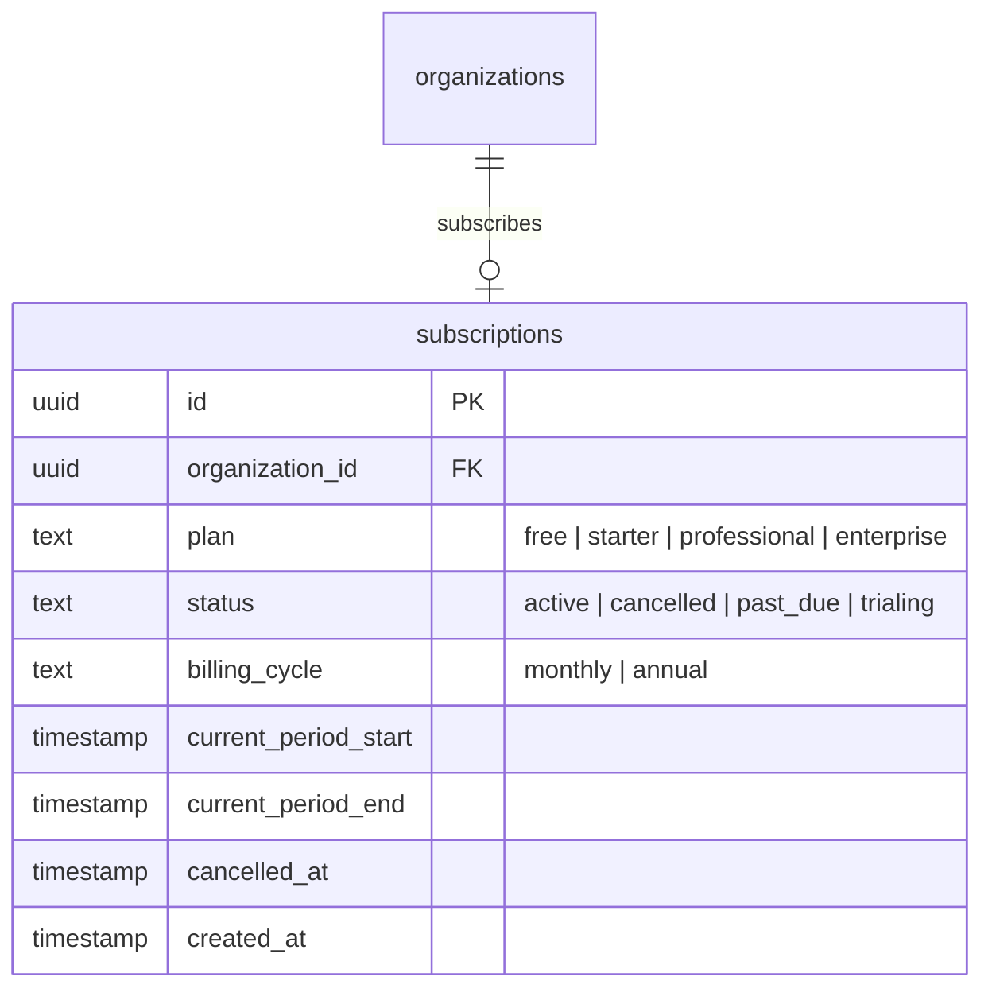

---

## Templates Domain

Reusable tour templates with quality scoring, usage tracking, and deep cloning into proposals.

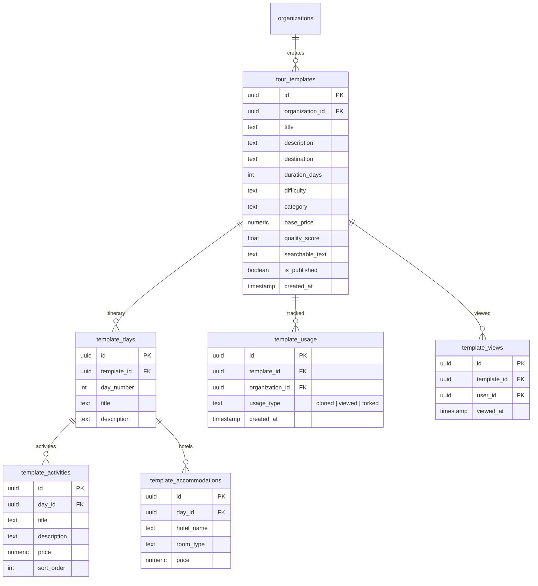

---

## Platform Admin Domain

Super-admin tables for platform-wide settings, announcements, and audit logging.

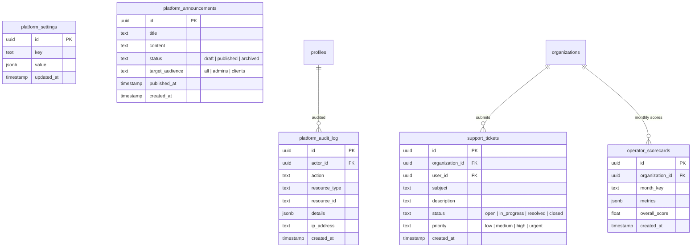

---

## RLS Policy Patterns

All 109 tables have Row-Level Security (RLS) enabled. The main policy patterns used are:

### Organization Scoping

Most tables use a policy like:

```sql
CREATE POLICY "org_access" ON table_name
  FOR ALL
  USING (
    organization_id = (
      SELECT organization_id FROM profiles WHERE id = auth.uid()
    )
  );
```

This ensures users can only access rows belonging to their organization.

### Role-Based Access

Admin-only operations use:

```sql
CREATE POLICY "admin_only" ON table_name
  FOR ALL
  USING (
    EXISTS (
      SELECT 1 FROM profiles
      WHERE id = auth.uid()
      AND role IN ('admin', 'super_admin')
      AND organization_id = table_name.organization_id
    )
  );
```

### Super Admin Access

Platform-wide tables use:

```sql
CREATE POLICY "super_admin_access" ON table_name
  FOR ALL
  USING (
    EXISTS (
      SELECT 1 FROM profiles
      WHERE id = auth.uid()
      AND role = 'super_admin'
    )
  );
```

### Public Read Access

Marketplace and public-facing tables allow unauthenticated reads:

```sql
CREATE POLICY "public_read" ON marketplace_profiles
  FOR SELECT
  USING (is_active = true AND is_verified = true);
```

### Service Role Bypass

Cron jobs and internal operations use the Supabase service role key, which bypasses RLS entirely. This is used for cross-organization operations like campaign processing and scorecard generation.
