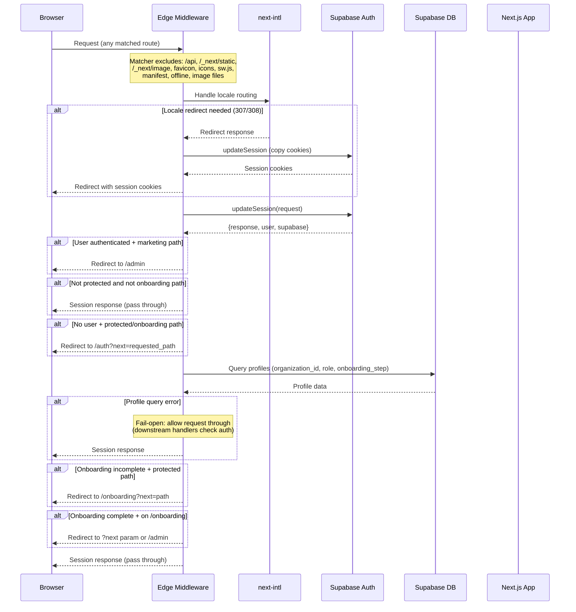
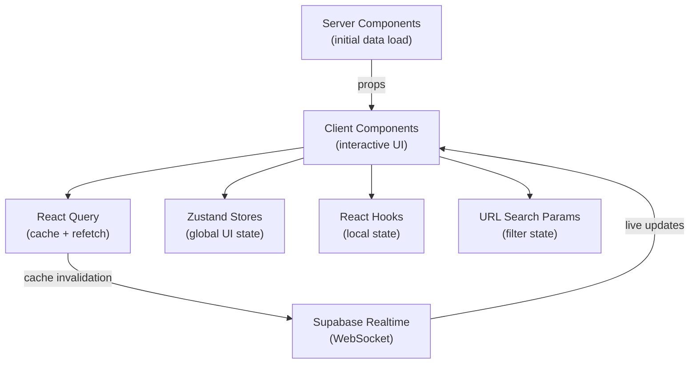
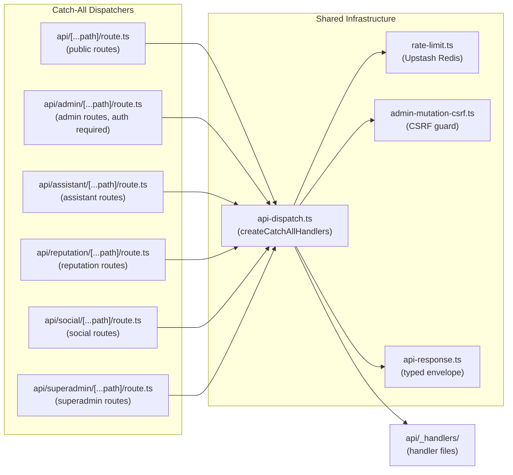

# Frontend Architecture

Detailed architecture of the Next.js 16 web application (`apps/web/`). Covers routing, middleware, component organization, and state management.

---

## Table of Contents

1. [Route Group Tree](#route-group-tree)
2. [Middleware Pipeline](#middleware-pipeline)
3. [Component Domain Map](#component-domain-map)
4. [State Management](#state-management)
5. [API Route Architecture](#api-route-architecture)

---

## Route Group Tree

The app uses Next.js App Router with route groups, protected prefixes, and guest token routes. Route groups in parentheses do not affect the URL path.

```mermaid
graph TD
    Root["/ (app root)"]

    subgraph "Route Groups (no URL segment)"
        Marketing["(marketing)<br/>layout.tsx"]
        SuperAdmin["(superadmin)<br/>layout.tsx"]
    end

    subgraph "Marketing Pages"
        MHome["/"]
        MPricing["/pricing"]
        MAbout["/about"]
        MBlog["/blog"]
        MDemo["/demo"]
        MSolutions["/solutions"]
    end

    subgraph "Super Admin (/god/*)"
        GodHome["/god"]
        GodAnalytics["/god/analytics"]
        GodAnnouncements["/god/announcements"]
        GodAuditLog["/god/audit-log"]
        GodCosts["/god/costs"]
        GodDirectory["/god/directory"]
        GodKillSwitch["/god/kill-switch"]
        GodMonitoring["/god/monitoring"]
        GodReferrals["/god/referrals"]
        GodSignups["/god/signups"]
        GodSupport["/god/support"]
    end

    subgraph "Admin Dashboard (/admin/*)"
        AdminHome["/admin"]
        AdminActivity["/admin/activity"]
        AdminBilling["/admin/billing"]
        AdminCost["/admin/cost"]
        AdminEInvoicing["/admin/e-invoicing"]
        AdminGstReport["/admin/gst-report"]
        AdminInsights["/admin/insights"]
        AdminInternal["/admin/internal"]
        AdminInvoices["/admin/invoices"]
        AdminKanban["/admin/kanban"]
        AdminNotifications["/admin/notifications"]
        AdminOperations["/admin/operations"]
        AdminPerformance["/admin/performance"]
        AdminPlanner["/admin/planner"]
        AdminPricing["/admin/pricing"]
        AdminReferrals["/admin/referrals"]
        AdminRevenue["/admin/revenue"]
        AdminSecurity["/admin/security"]
        AdminSettings["/admin/settings"]
        AdminSupport["/admin/support"]
        AdminTemplates["/admin/templates"]
        AdminTourTemplates["/admin/tour-templates"]
        AdminItineraryTemplates["/admin/itinerary-templates"]
        AdminTrips["/admin/trips"]
    end

    subgraph "Auth"
        AuthPage["/auth<br/>(login, signup, password reset, OAuth)"]
    end

    subgraph "Onboarding"
        OnboardingPage["/onboarding<br/>(multi-step wizard)"]
    end

    subgraph "Feature Modules"
        Trips["/trips"]
        Proposals["/proposals"]
        Planner["/planner"]
        Clients["/clients"]
        Drivers["/drivers"]
        Calendar["/calendar"]
        Analytics["/analytics"]
        Dashboard["/dashboard"]
        Inbox["/inbox"]
        Marketplace["/marketplace"]
        Billing["/billing"]
        Bookings["/bookings"]
        Settings["/settings"]
        AddOns["/add-ons"]
        Support["/support"]
        Welcome["/welcome"]
    end

    subgraph "Reputation & Social"
        RepAnalytics["/reputation/analytics"]
        RepCampaigns["/reputation/campaigns"]
        RepNps["/reputation/nps"]
        RepReviews["/reputation/reviews"]
        RepSettings["/reputation/settings"]
        RepWidget["/reputation/widget"]
        SocialHome["/social"]
    end

    subgraph "Guest Token Routes (public)"
        Live["/live/[token]"]
        Pay["/pay/[token]"]
        Proposal["/p/[token]"]
        Share["/share/[token]"]
        Portal["/portal/[token]"]
    end

    Root --> Marketing
    Root --> SuperAdmin
    Root --> AdminHome
    Root --> AuthPage
    Root --> OnboardingPage

    Marketing --> MHome
    Marketing --> MPricing
    Marketing --> MAbout
    Marketing --> MBlog
    Marketing --> MDemo
    Marketing --> MSolutions

    SuperAdmin --> GodHome
    SuperAdmin --> GodAnalytics
    SuperAdmin --> GodAnnouncements
    SuperAdmin --> GodAuditLog
    SuperAdmin --> GodCosts
    SuperAdmin --> GodDirectory
    SuperAdmin --> GodKillSwitch
    SuperAdmin --> GodMonitoring
    SuperAdmin --> GodReferrals
    SuperAdmin --> GodSignups
    SuperAdmin --> GodSupport

    Root --> Trips
    Root --> Proposals
    Root --> Planner
    Root --> Clients
    Root --> Drivers
    Root --> Calendar
    Root --> Analytics
    Root --> Dashboard
    Root --> Inbox
    Root --> Marketplace
    Root --> Billing
    Root --> Bookings
    Root --> Settings
    Root --> AddOns
    Root --> Support
    Root --> Welcome

    Root --> RepAnalytics
    Root --> SocialHome

    Root --> Live
    Root --> Pay
    Root --> Proposal
    Root --> Share
    Root --> Portal
```



### Route Protection Summary

| Category | Paths | Auth Required | Notes |
|----------|-------|---------------|-------|
| Marketing | `/`, `/pricing`, `/about`, `/blog`, `/demo`, `/solutions` | No | Authenticated users redirected to `/admin` |
| Auth | `/auth` | No | Login, signup, password reset, OAuth callback |
| Onboarding | `/onboarding` | Yes | Multi-step wizard; incomplete users forced here |
| Admin | `/admin/*` | Yes | Primary operator dashboard |
| Super Admin | `/god/*` | Yes | Platform-wide admin (super_admin role) |
| Features | `/trips`, `/planner`, `/clients`, etc. | Yes | All listed in `PROTECTED_PREFIXES` |
| Reputation | `/reputation/*` | Yes | Review management, NPS, campaigns |
| Social | `/social/*` | Yes | Social media management |
| Guest | `/live/[token]`, `/pay/[token]`, `/p/[token]`, `/share/[token]`, `/portal/[token]` | No | Token-based access, no auth required |

---

## Middleware Pipeline

All non-static requests pass through `src/middleware.ts`. The middleware handles locale routing, session management, authentication, and onboarding enforcement in a single edge function (required by Next.js 16 / Turbopack).



### Onboarding Completion Rules

The middleware checks `isOnboardingComplete()` based on role:

| Role | Completion Criteria |
|------|-------------------|
| `super_admin` | Always complete (bypasses onboarding) |
| `client`, `driver` | Has `organization_id` (created by admins, never self-onboard) |
| `admin` | Has `organization_id` + role is `admin` + `onboarding_step >= 2` |

### Protected Prefixes

Defined in `PROTECTED_PREFIXES` array in `middleware.ts`:

```
/admin, /god, /planner, /trips, /settings, /proposals,
/reputation, /social, /support, /clients, /drivers,
/inbox, /add-ons, /analytics, /calendar
```

---

## Component Domain Map

Components are organized by business domain under `src/components/`. Each directory contains components specific to that feature area.

```mermaid
graph TD
    Components["src/components/"]

    subgraph "Business Domains"
        Admin["admin/<br/>Dashboard panels, admin UI"]
        Analytics["analytics/<br/>Charts, metrics, reports"]
        Assistant["assistant/<br/>AI chat interface"]
        Billing["billing/<br/>Invoice, payment views"]
        Bookings["bookings/<br/>Booking management"]
        ClientComp["client/<br/>Client profiles, lists"]
        Dashboard["dashboard/<br/>Main dashboard widgets"]
        Itinerary["itinerary/<br/>Day-by-day builder"]
        ItineraryTemplates["itinerary-templates/<br/>Reusable itinerary templates"]
        Leads["leads/<br/>Lead management"]
        Map["map/<br/>Leaflet + MapLibre GL"]
        Payments["payments/<br/>Razorpay integration"]
        Proposals["proposals/<br/>Client proposals"]
        Social["social/<br/>Social media features"]
        Templates["templates/<br/>Trip templates"]
        Tour["tour/<br/>Tour management"]
        Trips["trips/<br/>Trip CRUD, timeline"]
    end

    subgraph "UI & Infrastructure"
        UI["ui/<br/>shadcn/ui primitives"]
        Forms["forms/<br/>Form components"]
        Layout["layout/<br/>Shell, sidebar, navigation"]
        Providers["providers/<br/>Context providers"]
        Glass["glass/<br/>Glassmorphism components"]
        Marketing["marketing/<br/>Landing page sections"]
        Portal["portal/<br/>Guest portal views"]
        PDF["pdf/<br/>PDF generation"]
    end

    subgraph "Specialized"
        GodMode["god-mode/<br/>Super admin panels"]
        Import["import/<br/>Data import wizards"]
        Planner["planner/<br/>Trip planner UI"]
        Settings["settings/<br/>User/org settings"]
        WhatsApp["whatsapp/<br/>WhatsApp integration UI"]
        PWA["pwa/<br/>PWA install prompt"]
        Demo["demo/<br/>Demo/showcase components"]
        India["india/<br/>India-specific features (GST)"]
    end

    subgraph "Standalone Components"
        ClientPicker["ClientPicker.tsx"]
        CreateTripModal["CreateTripModal.tsx"]
        CurrencyConverter["CurrencyConverter.tsx"]
        InteractivePricing["InteractivePricing.tsx"]
        ItineraryBuilder["ItineraryBuilder.tsx"]
        LanguageSwitcher["LanguageSwitcher.tsx"]
        NotificationSettings["NotificationSettings.tsx"]
        ShareTripModal["ShareTripModal.tsx"]
        TemplateAnalytics["TemplateAnalytics.tsx"]
        ThemeToggle["ThemeToggle.tsx"]
        VersionDiff["VersionDiff.tsx"]
        WeatherWidget["WeatherWidget.tsx"]
    end

    Components --> Admin
    Components --> Analytics
    Components --> Assistant
    Components --> Billing
    Components --> Bookings
    Components --> ClientComp
    Components --> Dashboard
    Components --> Itinerary
    Components --> Map
    Components --> Payments
    Components --> Proposals
    Components --> Social
    Components --> Templates
    Components --> Trips
    Components --> UI
    Components --> Forms
    Components --> Layout
    Components --> Providers
    Components --> GodMode
    Components --> Import
    Components --> Planner
    Components --> Settings
    Components --> WhatsApp
```



### Key Component Patterns

- **Error boundaries**: All route groups use a shared `RouteError` component via one-line re-exports (`export { RouteError as default } from '@/components/shared/RouteError'`)
- **Map rendering**: Both Leaflet and MapLibre GL are used intentionally for different use cases (accepted architectural decision)
- **shadcn/ui**: The `ui/` directory contains shadcn/ui primitives (Button, Dialog, Card, etc.) used across all domains
- **Extraction rules**: Components under 60 lines used only once stay co-located; aim for 4-6 sub-components per parent

---

## State Management

The application uses a combination of state management approaches depending on the data type and scope.

### Approach Summary

| Layer | Technology | Use Case |
|-------|-----------|----------|
| **Server state** | React Server Components | Initial page data, database queries |
| **Client cache** | React Query (TanStack Query) | API response caching, background refetching |
| **Realtime** | Supabase Realtime subscriptions | Live trip updates, notifications, collaborative editing |
| **Local UI state** | React hooks (`useState`, `useReducer`) | Form state, modal toggles, UI interactions |
| **Global client state** | Zustand stores | Cross-component state (sidebar, theme, user preferences) |
| **URL state** | `useSearchParams`, `usePathname` | Filters, pagination, active tabs |
| **Form state** | React Hook Form + Zod | Complex forms with validation |

### Data Flow



### Internationalization

- **Library**: `next-intl` with `as-needed` locale prefix strategy
- **Default locale**: English (no `/en` prefix)
- **Non-default locales**: Prefixed (e.g., `/hi/settings` for Hindi)
- **Locale detection**: Automatic via `Accept-Language` header

---

## API Route Architecture

All API endpoints use catch-all dispatchers rather than individual route files. This provides consistent rate limiting, CSRF protection, and error handling.



### Adding a New Endpoint

1. Create a handler file in `src/app/api/_handlers/`
2. Register it in the appropriate catch-all's route array via `createCatchAllHandlers()`
3. Do not create a new `route.ts` file (direct routes are tech debt)
