# TripBuilt Integrations Map

All external services integrated into the TripBuilt travel SaaS platform. Each integration documented from the actual source code in `apps/web/src/`.

---

## Table of Contents

1. [Integration Topology](#1-integration-topology)
2. [Integration Details](#2-integration-details)
3. [Failure Modes and Fallbacks](#3-failure-modes-and-fallbacks)
4. [Webhook Endpoints](#4-webhook-endpoints)

---

## 1. Integration Topology

```mermaid
graph TD
    TB["TripBuilt<br/>(Next.js 16 App)"]

    subgraph Payments
        RZ["Razorpay<br/>Payments (INR)"]
    end

    subgraph Messaging
        META["Meta Cloud API<br/>WhatsApp"]
        RESEND["Resend<br/>Email"]
        FCM["Firebase FCM<br/>Push Notifications"]
    end

    subgraph AI/LLM
        GEMINI["Google Gemini<br/>gemini-2.0-flash"]
        OAI["OpenAI<br/>GPT-4o / GPT-4o-mini"]
    end

    subgraph Infrastructure
        SUPA["Supabase<br/>PostgreSQL + Auth + Realtime<br/>+ Storage + Edge Functions"]
        UPSTASH["Upstash Redis<br/>Rate Limiting + Caching"]
    end

    subgraph Travel APIs
        AMADEUS["Amadeus<br/>Flights + Hotels"]
        MAPBOX["Mapbox<br/>Geocoding"]
    end

    subgraph Content
        GOOGLE["Google OAuth<br/>Social Login"]
        TA["TripAdvisor<br/>Reviews + Ratings"]
        WEATHER["Open-Meteo<br/>Weather Forecasts"]
        WIKI["Wikimedia<br/>Destination Images"]
    end

    subgraph Observability
        PH["PostHog<br/>Product Analytics"]
        SENTRY["Sentry<br/>Error Tracking"]
    end

    TB -->|"Basic Auth, fetchWithRetry"| RZ
    TB -->|"Bearer token, retry x3"| META
    TB -->|"API key"| RESEND
    TB -->|"Edge Function invoke"| FCM
    TB -->|"API key"| GEMINI
    TB -->|"Bearer token"| OAI
    TB -->|"Service Role Key"| SUPA
    TB -->|"REST URL + Token"| UPSTASH
    TB -->|"OAuth2 client_credentials"| AMADEUS
    TB -->|"Access token"| MAPBOX
    TB -->|"OAuth2 code exchange"| GOOGLE
    TB -->|"API key in query"| TA
    TB -->|"No auth required"| WEATHER
    TB -->|"No auth required"| WIKI
    TB -->|"API key"| PH
    TB -->|"DSN"| SENTRY
```

---

## 2. Integration Details

### Payment Services

| Service | Auth Method | Retry Policy | Rate Limit | Key Files | Env Vars |
|---------|------------|--------------|------------|-----------|----------|
| **Razorpay** | Basic Auth (`keyId:keySecret` base64) | `fetchWithRetry`: 2 retries, 9s timeout, 300ms base delay + jitter | Razorpay-managed | `src/lib/payments/razorpay.ts`, `src/lib/payments/payment-service.ts`, `src/lib/payments/webhook-handlers.ts`, `src/lib/payments/payment-links.server.ts` | `RAZORPAY_KEY_ID`, `RAZORPAY_KEY_SECRET`, `RAZORPAY_WEBHOOK_SECRET`, `NEXT_PUBLIC_RAZORPAY_KEY_ID` |

**Razorpay capabilities used:** Orders, Payments, Subscriptions, Customers, Invoices, Payment Links, Webhooks (HMAC-SHA256 signature verification with `timingSafeEqual`). Currency is exclusively INR. Webhook deduplication via `x-razorpay-event-id` stored in `payment_events` table.

### Messaging Services

| Service | Auth Method | Retry Policy | Rate Limit | Key Files | Env Vars |
|---------|------------|--------------|------------|-----------|----------|
| **Meta WhatsApp Cloud API** | Bearer token | 3 attempts, 300ms * attempt delay. Retries on 429 + 5xx | 40 messages / 5 min per user (app-enforced via Upstash) | `src/lib/whatsapp.server.ts`, `src/lib/assistant/channel-adapters/whatsapp.ts`, `src/app/api/_handlers/whatsapp/webhook/route.ts` | `WHATSAPP_TOKEN`, `WHATSAPP_PHONE_ID`, `WHATSAPP_APP_SECRET`, `WHATSAPP_WEBHOOK_VERIFY_TOKEN` |
| **Resend** (Email) | API key | None (single attempt) | Resend-managed | `src/lib/email/resend.ts`, `src/lib/email/send.ts` | `RESEND_API_KEY`, `RESEND_FROM_EMAIL`, `RESEND_FROM_NAME` |
| **Firebase FCM** (Push) | Via Supabase Edge Function | Edge Function handles FCM V1 | FCM-managed | `src/lib/notifications.ts` | Configured in Supabase Edge Function `send-notification` |

**WhatsApp message types supported:** Text (plain + templates), Location (driver tracking), Image (media download + storage). Webhook payload validated with Zod schemas. HMAC-SHA256 signature verification on POST with `WHATSAPP_APP_SECRET`.

**Email capabilities:** HTML rendering via `@react-email/render`, attachment support (Buffer or string), error tracking via Sentry. Returns boolean success indicator.

### AI / LLM Services

| Service | Auth Method | Retry Policy | Rate Limit | Key Files | Env Vars |
|---------|------------|--------------|------------|-----------|----------|
| **Google Gemini** | API key via `GoogleGenerativeAI` SDK | SDK-managed | SDK-managed | `src/lib/ai/gemini.server.ts` | `GOOGLE_GEMINI_API_KEY` or `GOOGLE_API_KEY` |
| **OpenAI** | Bearer token | None (single attempt per round, max 3 rounds) | Usage metering per org (plan-based monthly limits) | `src/lib/assistant/orchestrator.ts`, `src/lib/assistant/model-router.ts` | `OPENAI_API_KEY` |

**OpenAI usage:** The assistant orchestrator calls `POST /v1/chat/completions` with function-calling. Max 3 tool-call rounds. Max 800 tokens, temperature 0.3. Model selected dynamically by `model-router.ts` based on query complexity and org tier. FAQ fallback uses `gpt-4o-mini`.

**Gemini usage:** Default model `gemini-2.0-flash`. Used for itinerary generation, AI suggestions, and content features. Helper functions for JSON cleaning (strip markdown code fences).

### Infrastructure

| Service | Auth Method | Retry Policy | Rate Limit | Key Files | Env Vars |
|---------|------------|--------------|------------|-----------|----------|
| **Supabase** | Anon key (client), Service role key (server) | None (Supabase SDK handles) | Supabase-managed | `src/lib/supabase/admin.ts`, `src/lib/supabase/middleware.ts`, `src/lib/supabase/database.types.ts` | `NEXT_PUBLIC_SUPABASE_URL`, `NEXT_PUBLIC_SUPABASE_ANON_KEY`, `SUPABASE_SERVICE_ROLE_KEY` |
| **Upstash Redis** | REST URL + Token | None (single attempt, fail-safe) | Self-managed sliding window | `src/lib/cache/upstash.ts`, `src/lib/security/rate-limit.ts` | `UPSTASH_REDIS_REST_URL`, `UPSTASH_REDIS_REST_TOKEN` |

**Supabase features used:** PostgreSQL (113 tables, RLS enabled), Auth (email/password, magic link, Google OAuth), Realtime subscriptions, Storage (file uploads: social media, documents), Edge Functions (FCM push notifications via `send-notification`).

**Upstash Redis dual use:**
1. **Rate limiting:** `@upstash/ratelimit` with sliding window. Configurable per-endpoint. Production: fail-closed (deny all) when Redis unavailable.
2. **JSON caching:** Generic `getCachedJson` / `setCachedJson` with TTL. Local dev: in-memory `Map` fallback with 4096-entry cap.

### Travel APIs

| Service | Auth Method | Retry Policy | Rate Limit | Key Files | Env Vars |
|---------|------------|--------------|------------|-----------|----------|
| **Amadeus** | OAuth2 `client_credentials` (token cached until 30s before expiry) | `fetchWithRetry`: 2 retries, 9s timeout, 250ms base delay | Amadeus-managed | `src/lib/external/amadeus.ts` | `AMADEUS_CLIENT_ID`, `AMADEUS_CLIENT_SECRET`, `AMADEUS_ENV`, `AMADEUS_BASE_URL` |
| **Mapbox** | Access token in query string | None | Mapbox-managed (batch: 100ms delay between requests) | `src/lib/geocoding.ts` | `NEXT_PUBLIC_MAPBOX_TOKEN` |

**Amadeus capabilities:** Location search (city/airport, IATA codes). Base URL auto-resolved: production (`api.amadeus.com`) vs sandbox (`test.api.amadeus.com`). Sandbox override blocked in production with warning log.

**Mapbox capabilities:** Forward geocoding (location name to coordinates), batch geocoding with rate-limit-safe delays. Results cached in-memory (500 entries max, 24h TTL, insertion-order eviction).

### Content / Enrichment APIs

| Service | Auth Method | Retry Policy | Rate Limit | Key Files | Env Vars |
|---------|------------|--------------|------------|-----------|----------|
| **Google OAuth** | OAuth2 code exchange (`client_id` + `client_secret`) | `fetchWithRetry`: 2 retries, 5s timeout, 250ms base delay | Google-managed | `src/lib/external/google.server.ts` | `GOOGLE_CLIENT_ID`, `GOOGLE_CLIENT_SECRET` |
| **TripAdvisor** | API key in query string | None | TripAdvisor-managed | `src/lib/external/tripadvisor.server.ts` | `TRIPADVISOR_API_KEY` (passed at call site) |
| **Open-Meteo** (Weather) | None (free tier) | `fetchWithRetry`: 2 retries, 5s timeout | 10,000 calls/day (free tier) | `src/lib/external/weather.ts` | None |
| **Wikimedia** | None (open API) | None | Wikipedia API rate limits | `src/lib/external/wikimedia.ts` | None |

**TripAdvisor capabilities:** Location details (name, rating, review count, address) and reviews (rating, title, text, date, username). Referer header set to `https://tripbuilt.app`.

**Open-Meteo capabilities:** 7-day weather forecast (temp max/min, precipitation, WMO weather codes). Includes built-in geocoding (`geocoding-api.open-meteo.com`). Payload validated with Zod schemas.

**Wikimedia capabilities:** Destination image search via Wikipedia API. Returns 800px thumbnail URL for search query. Graceful null return on failure.

### Observability

| Service | Auth Method | Retry Policy | Rate Limit | Key Files | Env Vars |
|---------|------------|--------------|------------|-----------|----------|
| **PostHog** | API key (client-side + server-side) | None (best-effort, fire-and-forget) | PostHog-managed | `src/lib/analytics/events.ts` (client), `src/lib/observability/metrics.ts` (server) | `NEXT_PUBLIC_POSTHOG_KEY`, `POSTHOG_HOST` |
| **Sentry** | DSN | `@sentry/nextjs` SDK handles | Sentry-managed | `sentry.client.config.ts`, `sentry.server.config.ts` | `NEXT_PUBLIC_SENTRY_DSN`, `SENTRY_DSN` |

**PostHog dual usage:**
- **Client-side:** `posthog-js/react` hook with named events: `proposal_created`, `payment_completed`, `itinerary_generated`, `review_responded`, `whatsapp_message_sent`, `ai_suggestion_used`, onboarding step tracking.
- **Server-side:** `captureOperationalMetric` via POST to `/capture/` endpoint. Used for API metrics (`api.notifications.queue.processed`, error counts). `distinct_id: "tripbuilt-server"`. Errors are silently swallowed (best-effort).

---

## 3. Failure Modes and Fallbacks

```mermaid
graph LR
    subgraph "WhatsApp Sending"
        WA_PRIMARY["Meta Cloud API<br/>(Primary)"]
        WA_RETRY["Retry x3<br/>(429 + 5xx)"]
        WA_FAIL["Return error result<br/>(success: false)"]
    end
    WA_PRIMARY -->|"Retryable error"| WA_RETRY
    WA_RETRY -->|"Max attempts"| WA_FAIL

    subgraph "Cache Layer"
        REDIS["Upstash Redis<br/>(Production)"]
        LOCAL["In-Memory Map<br/>(Dev/Test only)"]
        REDIS_FAIL["Return null<br/>(cache miss)"]
    end
    REDIS -->|"Connection error"| REDIS_FAIL
    REDIS -->|"Not configured<br/>(dev)"| LOCAL

    subgraph "Rate Limiting"
        RL_REDIS["Upstash Ratelimit<br/>(Sliding Window)"]
        RL_CLOSED["FAIL-CLOSED<br/>(Deny request)"]
        RL_LOCAL["In-Memory Fallback<br/>(Dev only)"]
    end
    RL_REDIS -->|"Redis unavailable<br/>(production)"| RL_CLOSED
    RL_REDIS -->|"Redis unavailable<br/>(dev + RATE_LIMIT_FAIL_OPEN)"| RL_LOCAL

    subgraph "Amadeus API"
        AM_PROD["Production API<br/>api.amadeus.com"]
        AM_SANDBOX["Sandbox API<br/>test.api.amadeus.com"]
        AM_OVERRIDE["Force Production<br/>(in prod env)"]
    end
    AM_PROD -->|"AMADEUS_ENV=test<br/>(non-prod)"| AM_SANDBOX
    AM_SANDBOX -->|"In production"| AM_OVERRIDE

    subgraph "Notification Pipeline"
        NQ_SEND["Send (WA + Push)"]
        NQ_RETRY["Exponential Backoff<br/>(5min * 2^attempt)"]
        NQ_DLQ["Dead Letter Table<br/>(notification_dead_letters)"]
    end
    NQ_SEND -->|"All channels fail<br/>(< 5 attempts)"| NQ_RETRY
    NQ_SEND -->|"All channels fail<br/>(>= 5 attempts)"| NQ_DLQ

    subgraph "Auth Middleware"
        AUTH_CHECK["Profile Lookup"]
        AUTH_FAIL_OPEN["Pass Through<br/>(Fail-Open)"]
    end
    AUTH_CHECK -->|"Supabase outage"| AUTH_FAIL_OPEN

    subgraph "Email Sending"
        EMAIL_SEND["Resend API"]
        EMAIL_LOG["Log error + Sentry<br/>(return false)"]
    end
    EMAIL_SEND -->|"Any error"| EMAIL_LOG

    subgraph "Geocoding"
        GEO_CACHE["In-Memory Cache<br/>(500 entries, 24h TTL)"]
        GEO_API["Mapbox API"]
        GEO_NULL["Return null"]
    end
    GEO_CACHE -->|"Cache miss"| GEO_API
    GEO_API -->|"Error or no results"| GEO_NULL
```

### Failure behavior summary

| Integration | Failure Mode | Behavior |
|-------------|-------------|----------|
| Razorpay API | Network/timeout | `fetchWithRetry` retries 2x with exponential backoff + jitter |
| Razorpay Webhook | Invalid signature | 401 response, event rejected |
| Razorpay Webhook | Duplicate event | 200 `{ deduplicated: true }`, no reprocessing |
| WhatsApp Send | Retryable (429/5xx) | 3 attempts with 300ms * attempt delay |
| WhatsApp Send | Non-retryable (4xx) | Immediate failure return |
| WhatsApp Webhook | Invalid HMAC | 401 in production; rate-limited invalid-sig logging |
| Rate Limiting | Redis unavailable (prod) | **Fail-closed** -- all requests denied |
| Rate Limiting | Redis unavailable (dev) | In-memory fallback (resets on cold start) |
| Cache (Upstash) | Redis unavailable (prod) | Return null (cache miss), log error |
| Cache (Upstash) | Redis unavailable (dev) | In-memory Map fallback (4096 entry cap) |
| Notification Queue | All channels fail | Exponential backoff retry (5 attempts max) then dead letter |
| Amadeus | Auth failure | Throw error (no fallback) |
| Amadeus | Sandbox in production | Override to production URL, log warning |
| Auth Middleware | Profile lookup fails | **Fail-open** -- request passes through to handler |
| Email (Resend) | Send failure | Log error, capture in Sentry, return `false` |
| Geocoding (Mapbox) | API failure | Return `null`, log error |
| Weather (Open-Meteo) | API failure | Return empty array `[]` |
| Wikimedia | API failure | Return `null`, log error |
| PostHog (server) | Capture failure | Silently swallowed (best-effort) |

---

## 4. Webhook Endpoints

All webhook endpoints receive POST requests and validate signatures before processing.

| Endpoint | Source | Signature Method | Verification Key | Deduplication | Key Events |
|----------|--------|-----------------|-----------------|---------------|------------|
| `POST /api/payments/webhook` | Razorpay | HMAC-SHA256 via `x-razorpay-signature` header | `RAZORPAY_WEBHOOK_SECRET` | `x-razorpay-event-id` stored in `payment_events` table | `payment.captured`, `payment.failed`, `subscription.charged`, `subscription.cancelled`, `subscription.paused`, `invoice.paid` |
| `GET /api/whatsapp/webhook` | Meta Cloud API | Verify token challenge (`hub.mode=subscribe`) | `WHATSAPP_WEBHOOK_VERIFY_TOKEN` | N/A (verification only) | Webhook subscription verification |
| `POST /api/whatsapp/webhook` | Meta Cloud API | HMAC-SHA256 via `x-hub-signature-256` header | `WHATSAPP_APP_SECRET` | `provider_message_id` unique constraint in `whatsapp_webhook_events` (23505 = duplicate) | Location shares, text messages, image messages |
| `POST /api/webhooks/waha` | WAHA (WPPConnect) | Secret token validation | `WAHA_WEBHOOK_SECRET` | Event-specific | QR code, connection status (kept for self-hosted fallback) |

### Webhook security details

**Razorpay webhook verification:**
1. Extract `x-razorpay-signature` header
2. Read raw body as text
3. Compute `HMAC-SHA256(body, RAZORPAY_WEBHOOK_SECRET)`
4. Compare digests using `crypto.timingSafeEqual` (constant-time)
5. On mismatch: return 401

**WhatsApp webhook verification (POST):**
1. Check content length (reject > 1MB)
2. Extract `x-hub-signature-256` header (format: `sha256=<hex>`)
3. Compute `HMAC-SHA256(rawBody, WHATSAPP_APP_SECRET)`
4. Compare using `crypto.timingSafeEqual`
5. In production: unsigned webhooks blocked (`isUnsignedWebhookAllowed()` returns false)
6. Invalid signature attempts are rate-limited for logging (10/min per IP)

**WhatsApp webhook verification (GET -- subscription):**
1. Extract `hub.mode`, `hub.verify_token`, `hub.challenge` from query
2. Compare `verify_token` against `WHATSAPP_WEBHOOK_VERIFY_TOKEN` using `safeEqual` (timing-safe)
3. Return `hub.challenge` value on success (200), 403 on failure
