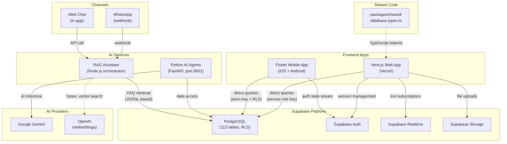
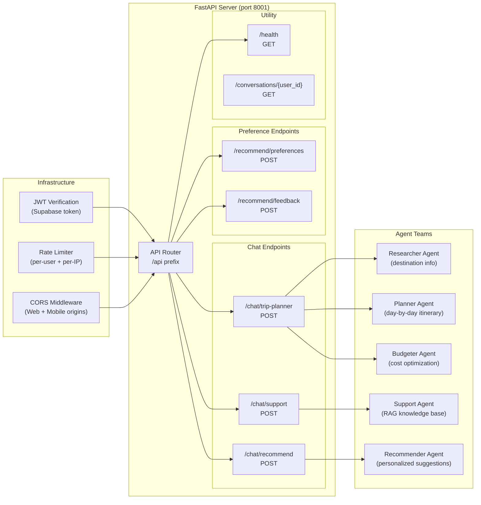
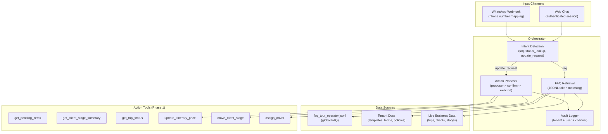
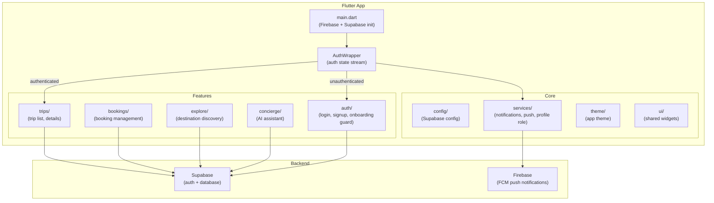
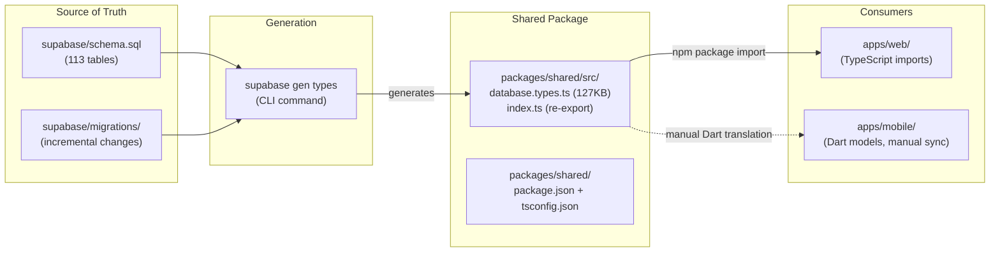

# Multi-App Architecture

How the four applications (Web, Mobile, Agents, RAG Assistant) communicate, share types, and integrate with the Supabase backend.

---

## Table of Contents

1. [App Communication Topology](#app-communication-topology)
2. [Python Agents Architecture](#python-agents-architecture)
3. [RAG Assistant Architecture](#rag-assistant-architecture)
4. [Mobile App Architecture](#mobile-app-architecture)
5. [Type Sharing](#type-sharing)

---

## App Communication Topology

All four apps connect to Supabase as the central data layer. The Python agents add AI capabilities, and the RAG assistant provides multi-channel conversational support.



### Communication Patterns

| Source | Target | Method | Auth |
|--------|--------|--------|------|
| Web -> Supabase | PostgreSQL | Direct client (`@supabase/ssr`) | Service role key (server) / anon key + RLS (client) |
| Mobile -> Supabase | PostgreSQL | `supabase_flutter` SDK | Anon key + RLS |
| Web -> Agents | FastAPI endpoints | HTTP REST | Supabase JWT forwarded |
| RAG -> Supabase | PostgreSQL | Direct queries | Service role key |
| WhatsApp -> RAG | Webhook | HTTP POST | Webhook signature verification |
| Web Chat -> RAG | Internal API | HTTP POST | Authenticated session |

---

## Python Agents Architecture

The agents app (`apps/agents/`) is a FastAPI server using the Agno framework for multi-agent AI collaboration. It exposes three AI agents through REST endpoints.



### Agent Details

| Agent | File | Capabilities |
|-------|------|-------------|
| **Trip Planner Team** | `agents/trip_planner.py` | Multi-agent team: Researcher gathers destination info, Planner creates day-by-day itinerary, Budgeter optimizes costs. Supports structured JSON output. |
| **Support Bot** | `agents/support_bot.py` | RAG-powered support using loaded knowledge base (FAQs, policies). Provides quick responses for common questions before falling back to full agent. |
| **Recommender** | `agents/recommender.py` | Personalized destination recommendations. Learns user preferences over time. Supports preference updates and feedback loops. |

### Request Flow

1. Request arrives with Supabase JWT in `Authorization` header
2. `verify_supabase_token()` validates the JWT and extracts `user_id`
3. Rate limiter checks per-user and per-IP limits
4. Request body validated via Pydantic models (`TripPlanRequest`, `ChatMessage`, `RecommendationRequest`)
5. Agent processes request and returns structured response
6. Response wrapped in `{success: true, data: ...}` envelope

### CORS Configuration

```
Development: http://localhost:3000, http://localhost:8081
Production: WEB_APP_URL, MOBILE_APP_URL (from env vars)
Methods: GET, POST, OPTIONS
Headers: Authorization, Content-Type, X-Client-Info, apikey
```

---

## RAG Assistant Architecture

The RAG assistant (`apps/rag-assistant/`) is a multi-tenant chatbot blueprint designed for both web chat and WhatsApp channels.



### Multi-Tenant Isolation

Every query and action is scoped by `organization_id`:

- Retrieval queries always include tenant filter
- Action tools verify `organization_id` before execution
- Chat memory is partitioned per tenant
- Audit log records `organization_id`, `user_id`, and `channel` for every interaction

### Retrieval Pipeline

The current implementation uses token-based matching against a JSONL knowledge base:

1. Query is tokenized (lowercased, alphanumeric split)
2. Each FAQ row is scored by token overlap between query and `question + answer`
3. Top-N matching rows returned (configurable via `maxRetrievedChunks`)
4. Best match formatted as response with source citation

### Rollout Phases

| Phase | Scope | Status |
|-------|-------|--------|
| **A** | FAQ RAG only (read-only Q/A in web + WhatsApp) | Implemented |
| **B** | Live status answers (pending items, stage summaries) | Planned |
| **C** | Controlled updates with confirm step + audit | Planned |
| **D** | Rate limiting, anomaly detection, audit export | Planned |

---

## Mobile App Architecture

The mobile app (`apps/mobile/`) is built with Flutter/Dart using Riverpod for state management and connects directly to Supabase.



### Mobile Tech Stack

| Layer | Technology |
|-------|-----------|
| Framework | Flutter (Dart) |
| State management | Riverpod (`flutter_riverpod`) |
| Backend | Supabase (`supabase_flutter` SDK) |
| Push notifications | Firebase Cloud Messaging |
| Local notifications | `flutter_local_notifications` |
| Auth flow | Supabase Auth stream + `OnboardingGuard` widget |

### Auth Flow

1. App initializes Firebase and Supabase on startup
2. `AuthWrapper` listens to `onAuthStateChange` stream
3. On login: syncs profile role, initializes push notifications, flushes pending navigation
4. On logout: resets initialization flags, shows `AuthScreen`
5. `OnboardingGuard` wraps the main screen to enforce onboarding completion

---

## Type Sharing

Database types flow from Supabase schema generation into the shared package and are consumed by the web app.



### How It Works

1. **Schema changes** are made via SQL migration files in `supabase/migrations/`
2. **Type generation**: `supabase gen types typescript` produces `database.types.ts` (127KB, covering all 113 tables)
3. **Shared package** (`packages/shared/`) exports all generated types via `index.ts`
4. **Web app** imports types: `import type { Database } from '@gobuddy/shared'`
5. **Mobile app** maintains Dart model classes that mirror the database schema (manually synchronized)

### Package Configuration

The shared package uses a standard npm package setup:

```
packages/shared/
  src/
    database.types.ts   # Auto-generated Supabase types (127KB)
    index.ts            # Re-exports: export * from './database.types'
  package.json          # Package metadata
  tsconfig.json         # TypeScript configuration
```

### Type Safety Across the Stack

| App | Type Source | Sync Method |
|-----|-----------|-------------|
| **Web** (TypeScript) | `packages/shared/database.types.ts` | Direct import (automatic) |
| **Agents** (Python) | Supabase client library | Runtime validation via Pydantic |
| **Mobile** (Dart) | Manual Dart model classes | Manual sync with schema changes |
| **RAG Assistant** (JavaScript) | No strict typing | Runtime JSONL schema |
