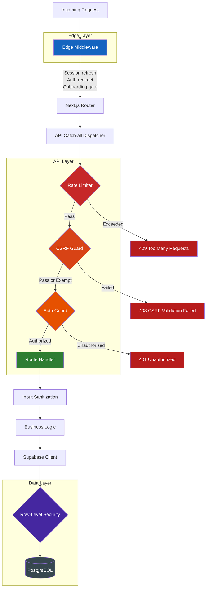
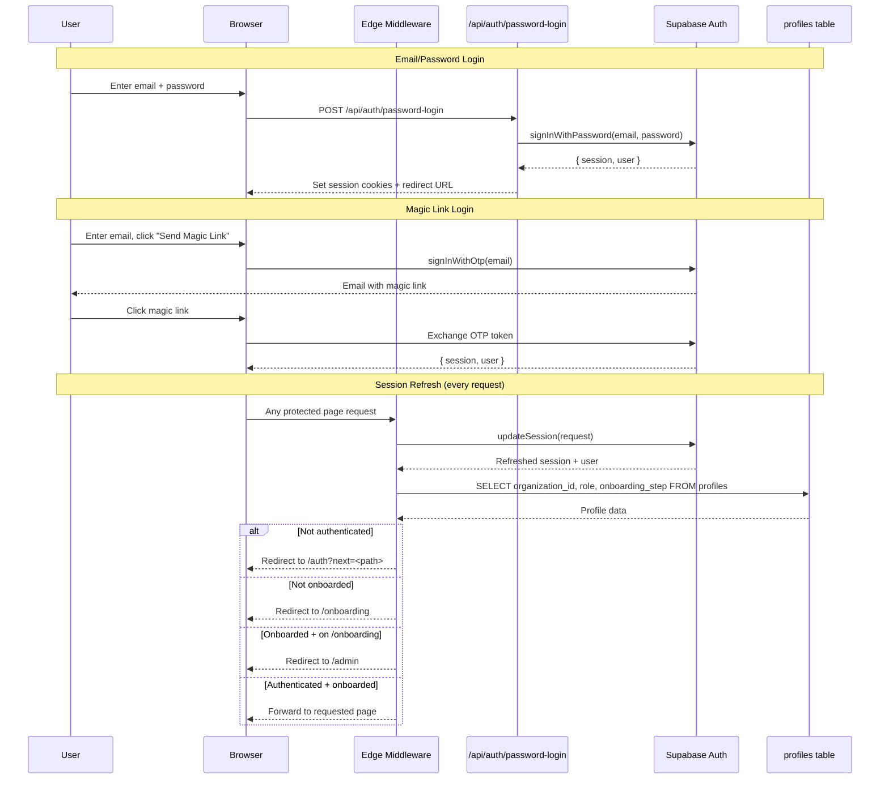
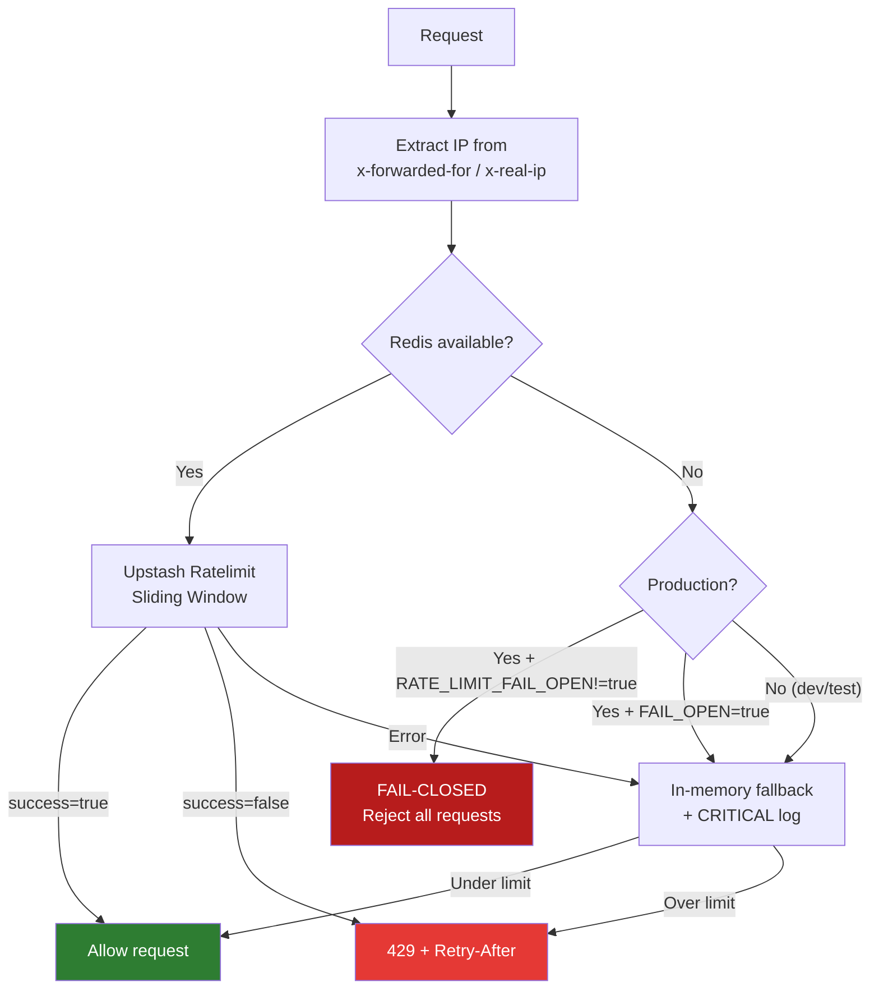
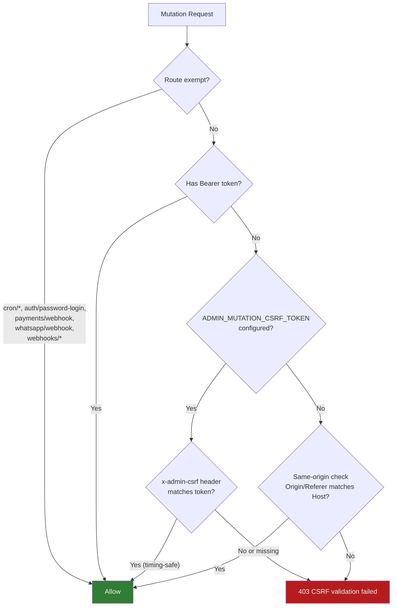
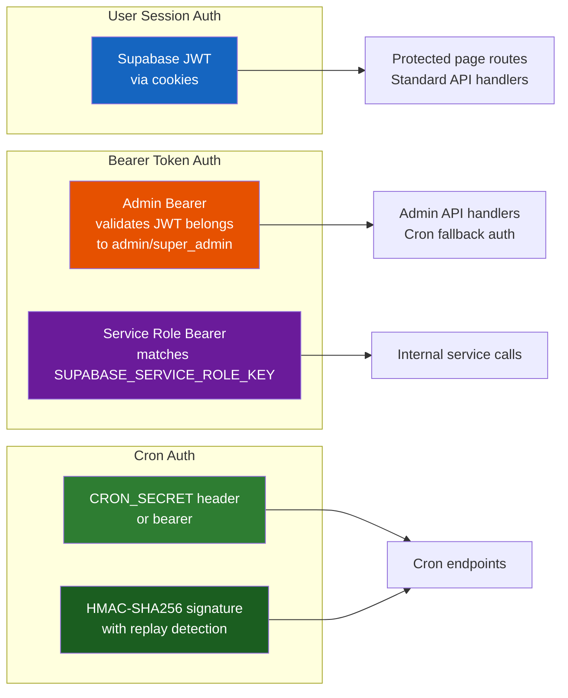
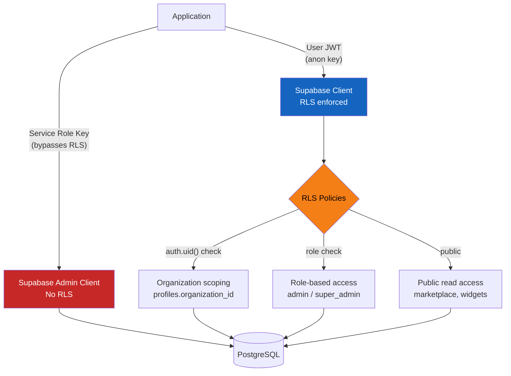

# Security Model

> TripBuilt Travel SaaS -- defense-in-depth security architecture across Edge, API, and database layers.

## Table of Contents

- [Security Layer Diagram](#security-layer-diagram)
- [Auth Flow](#auth-flow)
- [Rate Limiting](#rate-limiting)
- [CSRF Protection](#csrf-protection)
- [Auth Guards](#auth-guards)
- [Input Sanitization](#input-sanitization)
- [Webhook Signature Validation](#webhook-signature-validation)
- [Row-Level Security (RLS)](#row-level-security-rls)
- [Security Files Reference](#security-files-reference)

---

## Security Layer Diagram

Every request passes through multiple independent security layers. Each layer can reject a request independently, providing defense-in-depth.



### Security Mechanisms Summary

| Mechanism | Implementation | Location |
|-----------|---------------|----------|
| Session management | Supabase `updateSession()` -- refreshes JWT cookies | Edge Middleware |
| Auth redirect | Unauthenticated users on protected paths redirect to `/auth` | Edge Middleware |
| Rate limiting | Upstash Redis sliding window; fail-closed in production | `src/lib/security/rate-limit.ts` |
| CSRF protection | Bearer bypass, CSRF token, or same-origin check | `src/lib/security/admin-mutation-csrf.ts` |
| Admin bearer auth | Validates JWT belongs to admin/super_admin profile | `src/lib/security/admin-bearer-auth.ts` |
| Service role auth | Timing-safe comparison of `SUPABASE_SERVICE_ROLE_KEY` | `src/lib/security/service-role-auth.ts` |
| Cron auth | CRON_SECRET header/bearer + HMAC signatures + replay detection | `src/lib/security/cron-auth.ts` |
| Input sanitization | Text, email, phone sanitization with length limits | `src/lib/security/sanitize.ts` |
| Timing-safe compare | Padded `timingSafeEqual` preventing length-based timing attacks | `src/lib/security/safe-equal.ts` |
| Webhook signatures | HMAC-SHA256 validation for Razorpay and WhatsApp webhooks | Handler-level |
| Row-Level Security | PostgreSQL RLS on all 109 tables | Supabase database |

---

## Auth Flow

TripBuilt supports three authentication methods, all powered by Supabase Auth.



### Auth Roles

| Role | Access Level | Created By |
|------|-------------|-----------|
| `admin` | Full organization access | Self-registration + onboarding |
| `client` | Client portal, trip viewing | Admin creates via CRM |
| `driver` | Driver app, location sharing | Admin creates via driver management |
| `super_admin` | Platform-wide access, all organizations | Manual database entry |

---

## Rate Limiting

Rate limiting uses Upstash Redis with a sliding window algorithm. The implementation is in `src/lib/security/rate-limit.ts`.



### Rate Limiting Tiers

| Namespace | Limit | Window | Redis Prefix | Notes |
|-----------|-------|--------|-------------|-------|
| Public | 200 req | 5 min | `ratelimit:api:main` | General API access |
| Admin | 300 req | 5 min | `ratelimit:api:admin:dispatch` | Higher limit for admin dashboards |
| Assistant | 100 req | 5 min | `ratelimit:api:assistant` | AI chat is token-expensive |
| Social | 150 req | 5 min | `ratelimit:api:social` | Social media operations |
| Reputation | 200 req | 5 min | `ratelimit:api:reputation` | Review management |
| Superadmin | 100 req | 5 min | `ratelimit:api:superadmin:dispatch` | Platform admin (few users) |

### Failure Modes

| Scenario | Behavior |
|----------|----------|
| Redis available | Distributed rate limiting via Upstash sliding window |
| Redis error (production) | Falls back to in-memory + logs CRITICAL warning |
| Redis missing (production, FAIL_OPEN!=true) | **Fail-closed**: rejects all requests |
| Redis missing (dev/test) | In-memory fallback (resets per cold start) |

The in-memory fallback uses a `Map<string, { count, resetAt }>` with automatic cleanup when the map exceeds 5,000 entries.

---

## CSRF Protection

CSRF protection is applied to all mutation requests (POST, PATCH, PUT, DELETE) except explicitly exempt routes. Implemented in `src/lib/security/admin-mutation-csrf.ts`.

### CSRF Decision Flow



### CSRF Bypass Conditions

1. **Bearer token present** -- API clients using `Authorization: Bearer <jwt>` are already authenticated and not vulnerable to CSRF.
2. **CSRF token match** -- The `x-admin-csrf` header is compared against `ADMIN_MUTATION_CSRF_TOKEN` using timing-safe comparison.
3. **Same-origin** -- When no CSRF token is configured, falls back to checking that `Origin` or `Referer` header matches the request `Host`.

---

## Auth Guards

Different API endpoints use different auth guard mechanisms depending on the caller type.

### Guard Types



### Admin Bearer Auth (`admin-bearer-auth.ts`)

Validates that the `Authorization: Bearer <token>` contains a valid Supabase JWT belonging to a user with `role = 'admin'` or `role = 'super_admin'` in the `profiles` table. Used by cron endpoints as a fallback when CRON_SECRET is not present.

### Service Role Auth (`service-role-auth.ts`)

Performs timing-safe comparison of the bearer token against `SUPABASE_SERVICE_ROLE_KEY`. Used for internal service-to-service calls that need to bypass RLS.

### Cron Auth (`cron-auth.ts`)

The most comprehensive auth guard, supporting three modes:

| Mode | How it works |
|------|-------------|
| **Bearer** | `Authorization: Bearer <CRON_SECRET>` |
| **Header** | `x-cron-secret: <CRON_SECRET>` (or `x-notification-cron-secret`) |
| **Signature** | HMAC-SHA256 of `timestamp:nonce:method:path` with `CRON_SIGNING_SECRET`, validated within 60s clock skew |

All three modes include **replay detection**:
- Uses Redis `SET NX EX` to claim a one-time replay key
- Falls back to in-memory `Map` when Redis is unavailable
- Default replay window: 10 minutes
- Replay key is derived from: mode + pathname + nonce/timestamp/idempotency key

---

## Input Sanitization

All user input is sanitized at API boundaries using utilities in `src/lib/security/sanitize.ts`.

### Sanitization Functions

| Function | Input | Output | Rules |
|----------|-------|--------|-------|
| `sanitizeText(value, options)` | Any value | `string` | Strips control chars, optional HTML strip, max length (default 200), optional newline preservation |
| `sanitizeEmail(value)` | Any value | `string \| null` | Lowercased, max 320 chars, basic email format validation |
| `sanitizePhone(value)` | Any value | `string \| null` | Strips non-digit chars (except leading `+`), handles `00` prefix as `+`, max 32 chars |

### Sanitization Options

```typescript
type SanitizeTextOptions = {
  maxLength?: number;       // Default: 200
  preserveNewlines?: boolean; // Default: false
  stripHtml?: boolean;       // Default: false
};
```

### Safe Error Messages (`safe-error.ts`)

Error messages returned to clients are sanitized to prevent leaking internal details:
- Stack traces are never exposed
- Database error messages are replaced with generic messages
- A default fallback message is always provided

---

## Webhook Signature Validation

External webhooks are validated using HMAC-SHA256 signatures to prevent forged requests.

### Razorpay Webhooks

Razorpay sends a `x-razorpay-signature` header containing an HMAC-SHA256 hash of the request body, signed with `RAZORPAY_WEBHOOK_SECRET`. The handler validates this signature before processing payment events.

### WhatsApp Webhooks (Meta Cloud API)

Meta sends webhook events with a signature in the `x-hub-signature-256` header. The handler validates the HMAC-SHA256 hash against `WHATSAPP_WEBHOOK_SECRET`. In development only, unsigned webhooks can be allowed by setting `WHATSAPP_ALLOW_UNSIGNED_WEBHOOK=true` (blocked in production by `whatsapp-webhook-config.ts`).

### Cron Webhooks (HMAC Signature Mode)

Cron requests can use HMAC-SHA256 signatures via the `x-cron-signature` header. The payload is `timestamp:nonce:method:path`, signed with `CRON_SIGNING_SECRET`. Clock skew tolerance is 60 seconds.

---

## Row-Level Security (RLS)

All 109 tables in Supabase have RLS enabled. This provides a final security boundary at the database level, ensuring that even if application logic has a bug, users cannot access data outside their authorization scope.

### RLS Architecture



### RLS Policy Patterns

| Pattern | Used For | How |
|---------|----------|-----|
| **Organization scope** | Most tables | `organization_id = (SELECT organization_id FROM profiles WHERE id = auth.uid())` |
| **Admin-only write** | Settings, templates | Adds `AND role IN ('admin', 'super_admin')` to write policies |
| **Super admin all** | Platform tables | `role = 'super_admin'` grants full access |
| **Public read** | Marketplace, widgets | `SELECT` allowed for all, filtered by `is_active = true` |
| **Self-access** | Profiles, preferences | `id = auth.uid()` for own record |
| **Service role bypass** | Cron jobs, internal ops | Uses `createAdminClient()` with service role key |

### When Service Role is Used

The service role key (`SUPABASE_SERVICE_ROLE_KEY`) bypasses RLS and is used only in:

- Cron job handlers (cross-organization processing)
- Admin bearer auth validation (looking up profile roles)
- Notification processing (sending across organizations)
- Webhook handlers (no user session available)
- Scorecard generation (aggregating across organizations)

---

## Security Files Reference

| File | Purpose |
|------|---------|
| `src/lib/security/rate-limit.ts` | Upstash Redis rate limiting with in-memory fallback |
| `src/lib/security/admin-mutation-csrf.ts` | CSRF protection for mutation endpoints |
| `src/lib/security/admin-bearer-auth.ts` | Validates bearer token belongs to admin user |
| `src/lib/security/service-role-auth.ts` | Validates bearer token is service role key |
| `src/lib/security/cron-auth.ts` | Multi-mode cron authentication with replay detection |
| `src/lib/security/safe-equal.ts` | Timing-safe string comparison (padded `timingSafeEqual`) |
| `src/lib/security/safe-error.ts` | Sanitizes error messages for client responses |
| `src/lib/security/sanitize.ts` | Input sanitization (text, email, phone) |
| `src/lib/security/public-rate-limit.ts` | Rate limiting for public-facing endpoints |
| `src/lib/security/cost-endpoint-guard.ts` | Authorization guard for cost/pricing endpoints |
| `src/lib/security/diagnostics-auth.ts` | Auth for security diagnostics endpoint |
| `src/lib/security/mock-endpoint-guard.ts` | Guards mock/test endpoints from production access |
| `src/lib/security/irp-crypto.ts` | Encryption utilities for GST e-invoicing IRP credentials |
| `src/lib/security/social-oauth-state.ts` | CSRF state parameter for social OAuth flows |
| `src/lib/security/social-token-crypto.ts` | Encryption for social media OAuth tokens |
| `src/lib/security/whatsapp-webhook-config.ts` | Controls unsigned webhook acceptance (dev only) |
| `src/middleware.ts` | Edge middleware for session, auth, locale routing |
