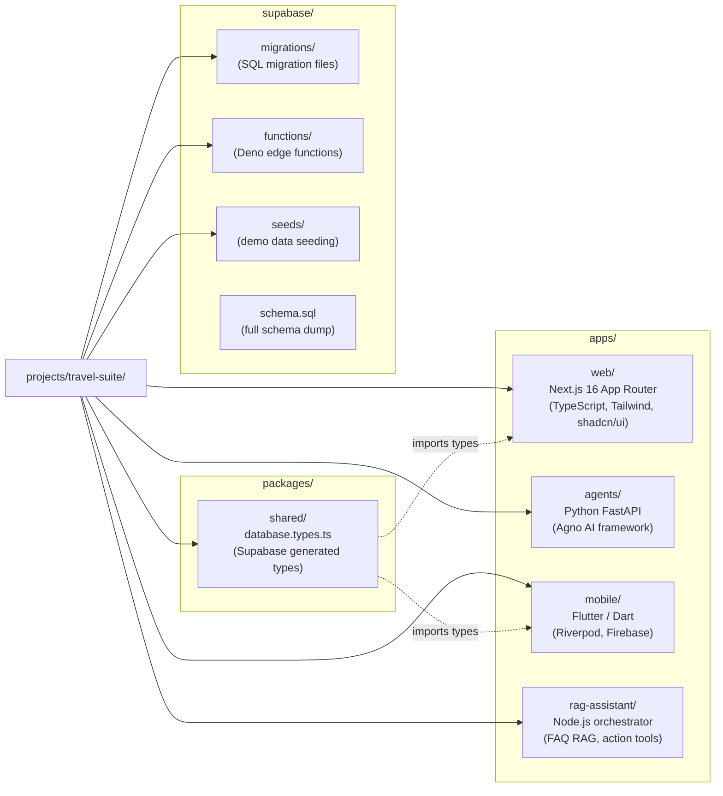
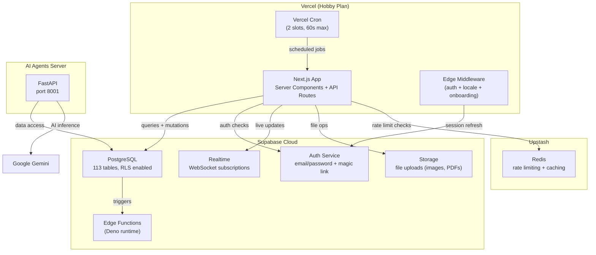

# System Overview

High-level architecture of the TripBuilt (GoBuddy) travel SaaS platform. This document covers the context boundary, monorepo layout, and infrastructure topology.

---

## Table of Contents

1. [C4 Context Diagram](#c4-context-diagram)
2. [Monorepo Layout](#monorepo-layout)
3. [Infrastructure Topology](#infrastructure-topology)

---

## C4 Context Diagram

The platform serves four authenticated user roles and unauthenticated guests. The Next.js web app is the primary interface, supported by a mobile app, Python AI agents, and a RAG assistant. All apps share Supabase as the central data layer.

```mermaid
graph TD
    subgraph Users
        Admin["Admin / Operator"]
        Client["Client"]
        Driver["Driver"]
        SuperAdmin["Super Admin"]
        Guest["Guest (unauthenticated)"]
    end

    subgraph "Applications"
        Web["Next.js 16 Web App<br/>(Vercel Hobby)"]
        Mobile["React Native Mobile App<br/>(Flutter / Dart)"]
        Agents["Python AI Agents<br/>(FastAPI + Agno)"]
        RAG["RAG Assistant<br/>(Node.js orchestrator)"]
    end

    subgraph "Supabase Platform"
        DB["PostgreSQL<br/>(113 tables, RLS)"]
        Auth["Supabase Auth<br/>(email + magic link)"]
        Realtime["Supabase Realtime<br/>(subscriptions)"]
        Storage["Supabase Storage<br/>(file uploads)"]
        EdgeFn["Edge Functions<br/>(Deno)"]
    end

    subgraph "External Services"
        Razorpay["Razorpay<br/>(INR payments)"]
        WhatsApp["WhatsApp Meta Cloud API"]
        Resend["Resend<br/>(transactional email)"]
        FCM["Firebase FCM<br/>(push notifications)"]
        Redis["Upstash Redis<br/>(rate limiting + cache)"]
        Gemini["Google Gemini<br/>(AI generation)"]
        Amadeus["Amadeus<br/>(flights + hotels)"]
        GooglePlaces["Google Places API"]
        TripAdvisor["TripAdvisor API"]
        PostHog["PostHog<br/>(analytics)"]
        Sentry["Sentry<br/>(error tracking)"]
    end

    Admin -->|manages trips, billing, templates| Web
    Client -->|views proposals, pays invoices| Web
    Driver -->|receives assignments| Mobile
    SuperAdmin -->|platform-wide admin via /god| Web
    Guest -->|views /live, /pay, /share tokens| Web

    Admin --> Mobile
    Client --> Mobile

    Web --> DB
    Web --> Auth
    Web --> Realtime
    Web --> Storage
    Web --> EdgeFn

    Mobile --> DB
    Mobile --> Auth
    Mobile --> FCM

    Agents --> DB
    Agents --> Gemini

    RAG --> DB

    Web --> Razorpay
    Web --> WhatsApp
    Web --> Resend
    Web --> Redis
    Web --> Amadeus
    Web --> GooglePlaces
    Web --> TripAdvisor
    Web --> PostHog
    Web --> Sentry
```

### User Roles

| Role | Access | Primary App |
|------|--------|-------------|
| **Admin / Operator** | Full trip management, billing, templates, settings | Web |
| **Client** | View proposals, make payments, track trips | Web + Mobile |
| **Driver** | Receive trip assignments, update status | Mobile |
| **Super Admin** | Platform-wide analytics, kill switches, audit logs | Web (`/god/*`) |
| **Guest** | Token-based access to live tracking, payment, sharing pages | Web |

### External Service Roles

| Service | Purpose |
|---------|---------|
| **Razorpay** | Payment gateway for INR transactions (Indian market focus) |
| **WhatsApp Meta Cloud API** | Customer notifications, operator messaging (WPPConnect kept as self-hosted fallback) |
| **Resend** | Transactional emails (invoices, confirmations, magic links) |
| **Firebase FCM** | Push notifications to mobile devices |
| **Upstash Redis** | Rate limiting for API endpoints, fail-closed without credentials |
| **Google Gemini** | AI text generation for trip planning and support |
| **Amadeus** | Flight and hotel search/booking data |
| **Google Places + TripAdvisor** | Destination information, reviews, place details |
| **PostHog** | Product analytics and feature flags |
| **Sentry** | Error tracking and performance monitoring |

---

## Monorepo Layout

The project uses a monorepo structure under `projects/travel-suite/`. The web app is the primary codebase where most development happens.

### App Descriptions

| App | Tech Stack | Entry Point | Purpose |
|-----|-----------|-------------|---------|
| **web** | Next.js 16, TypeScript, Tailwind CSS, shadcn/ui | `src/app/layout.tsx` | Primary SaaS web application for tour operators |
| **agents** | Python, FastAPI, Agno framework | `main.py` | AI-powered trip planning, support chat, destination recommendations |
| **mobile** | Flutter/Dart, Riverpod, Supabase SDK, Firebase | `lib/main.dart` | Mobile app for drivers and clients (trips, auth, bookings, explore) |
| **rag-assistant** | Node.js | `starter/index.js` | Multi-tenant RAG chatbot for web and WhatsApp channels |

### Shared Packages

The `packages/shared/` package exports Supabase-generated TypeScript types (`database.types.ts`) consumed by the web app. The mobile app uses its own Dart models but targets the same Supabase schema.

---

## Infrastructure Topology

Shows the runtime connections between hosting, database, and caching layers.

### Vercel Hobby Plan Constraints

| Constraint | Limit |
|-----------|-------|
| Cron jobs | 2 slots maximum |
| Function timeout | 60 seconds maximum (10s default) |
| Team features | Not available |
| Edge Functions | Standard (no enterprise features) |

### Data Flow

1. **Browser** sends request to Vercel Edge Network
2. **Edge Middleware** runs locale detection (next-intl), session refresh (Supabase), auth/onboarding checks
3. **Server Components** query Supabase directly using the service role key
4. **API Routes** use catch-all dispatchers with built-in rate limiting (Upstash Redis) and CSRF protection
5. **Realtime subscriptions** push live updates to the browser via Supabase WebSocket channels
6. **Cron handlers** export only `POST` and verify `CRON_SECRET` header
