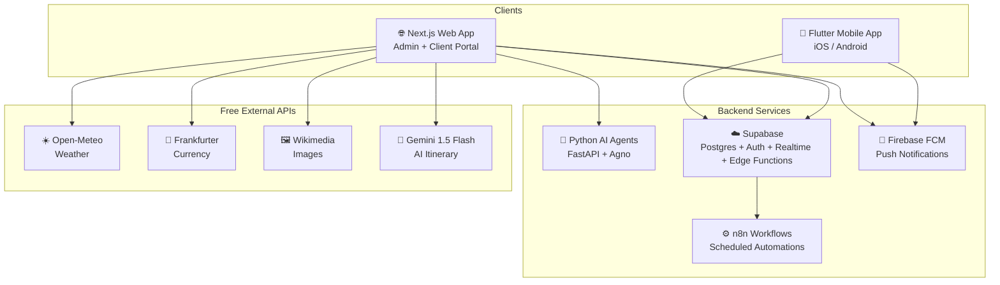

# 🔍 Travel Suite — Deep Dive Analysis (2026-02-11 23:29 CST)

> **Project**: GoBuddy Adventures Travel Suite  
> **Analyzed**: Feb 11, 2026  
> **Scope**: Full codebase, architecture, security, database, deployment readiness, and strategic recommendations

---

## 1. Architecture Overview

The project is a well-structured **monorepo** with four major workloads:

| Layer | Tech | Status |
|-------|------|--------|
| Mobile App | Flutter (Dart 3.10+, Riverpod, Freezed, flutter_map) | ✅ Feature-complete |
| Web App | Next.js 16, React 19, shadcn/ui, Tailwind 4 | ✅ Feature-complete |
| AI Agents | Python FastAPI, Agno framework, pgvector RAG | ⚠️ Built but untested in production |
| Database | Supabase Postgres, 14 tables, RLS, Realtime | ✅ Schema complete |
| Notifications | Firebase FCM + Supabase Edge Functions | ⚠️ Code-complete, deployment **blocked** |
| Automation | n8n (4 workflow types) | ⚠️ Not deployed |

---

## 2. 🚨 Critical Issues You Need to Know

### 2.1 Push Notification Deployment is Blocked

> [!CAUTION]
> The `send-notification` Edge Function has **never been successfully deployed** to Supabase. The local Docker/CLI issue (`"unexpected end of JSON input"`) was documented but not resolved.

**Impact**: No push notifications work in production. This is the **single biggest blocker** to going live.

**Action Required**:
1. Update Supabase CLI to latest version
2. Deploy via `npx supabase functions deploy send-notification --no-verify-jwt`
3. Set Firebase secrets: `FIREBASE_SERVICE_ACCOUNT` and `FIREBASE_PROJECT_ID`
4. Run the DB migration: `npx supabase db push`

---

### 2.2 Firebase Service Account Key Committed to Git

> [!CAUTION]
> The file `firebase-service-account.json` (2.4KB) exists in the web app directory. Even though `.gitignore` is configured, **if this was ever committed**, the key is compromised.

**Action Required**:
1. Immediately check `git log -- apps/web/firebase-service-account.json` — if it shows commits, **rotate the key** in Firebase Console
2. Add the file to `.gitignore` at the repo root level (not just `apps/web/.gitignore`)
3. Use environment variables or Supabase secrets instead; never store JSON keys in the repo

---

### 2.3 Edge Function JWT Verification Disabled

> [!WARNING]
> Deployment instructions use `--no-verify-jwt`. The function relies on "trusted caller" assumption (Next.js API route with service role key). This means **anyone** who discovers the Edge Function URL can invoke it without authentication.

**Recommendation**: Enable JWT verification and pass the user's JWT from the admin panel. The function should verify that the caller has an `admin` role.

---

## 3. 🔒 Security Audit

| Area | Finding | Severity |
|------|---------|----------|
| **RLS Policies** | ✅ All 14 tables have RLS enabled with well-scoped policies | Low |
| **Admin Checks** | ⚠️ Admin policies rely on `profiles.role = 'admin'` — no org-scoping for multi-tenant | Medium |
| **Shared Itineraries** | ⚠️ `SELECT true` policy means **all** shared itineraries are publicly readable | Medium |
| **Service Account Key** | 🔴 JSON key file in repo (see §2.2) | **High** |
| **Edge Function Auth** | 🔴 `--no-verify-jwt` on `send-notification` (see §2.3) | **High** |
| **CORS (AI Agents)** | ⚠️ `allow_methods=["*"]` and `allow_headers=["*"]` — overly permissive | Medium |
| **Google OAuth Client ID** | ⚠️ Client ID appears in plaintext in `implementation_plan.md` | Low |
| **push_tokens table** | ⚠️ `FOR ALL` policy on own user — means user can delete their own tokens, but no admin policy to clean stale tokens | Low |
| **Expo Push migration** | ⚠️ Schema says `expo_push_token` but mobile uses Firebase FCM tokens — **naming inconsistency** may cause confusion | Medium |

### Multi-Tenant Security Gap

The `organizations` table exists but admin policies on `trip_driver_assignments`, `trip_accommodations`, and `notification_logs` use a **global admin check** (`profiles.role = 'admin'`) without filtering by `organization_id`. This means:

> **Any admin from Organization A can see/modify Organization B's drivers, trips, and notifications.**

**Fix**: Add `AND profiles.organization_id = <resource>.organization_id` to all admin policies, or add an `organization_id` FK to these tables.

---

## 4. 📊 Database Design Analysis

### What's Good
- Clean normalized schema with proper FK relationships
- `updated_at` triggers via `handle_updated_at()` function
- Auto-profile creation via `handle_new_user()` trigger
- pgvector for RAG embedding search (future-proof)
- Realtime enabled for `driver_locations` and `trips`
- Proper indexing on frequently queried columns

### What Needs Attention

| Issue | Detail | Recommendation |
|-------|--------|----------------|
| **No `updated_at` on some tables** | `trip_driver_assignments`, `trip_accommodations`, `notification_logs` lack `updated_at` triggers | Add triggers for audit consistency |
| **Missing `organization_id` on trips** | Trips link to `client_id` but not to an org — multi-tenant queries require joins | Add `organization_id` FK to `trips` |
| **`push_tokens.expo_push_token` naming** | Mobile uses Firebase FCM, not Expo | Rename to `fcm_token` or `device_token` |
| **`notification_queue` vs `notification_logs`** | Two tables serve similar purposes — queue for pending, logs for history | Consider merging or clearly documenting the boundary |
| **Single `schema.sql` + migrations divergence** | `schema.sql` is 626 lines but only 2 migrations exist. They may be out of sync. | Regenerate schema from migrations as source of truth |
| **No soft-delete** | No `deleted_at` column on any table — cascade deletes are permanent | Consider adding soft-delete for compliance/audit trails |
| **IVFFlat index on empty table** | `policy_embeddings` uses IVFFlat but this requires existing data to build index lists. On empty/small tables, use HNSW instead | Switch to `USING hnsw (embedding vector_cosine_ops)` |

---

## 5. 💰 Cost Analysis

### Current MVP: $0/month ✅

Your cost optimization is excellent. All major services are on free tiers:

| Service | Free Tier Limit | Your Expected Usage |
|---------|-----------------|---------------------|
| Supabase | 500MB DB, 1GB storage, 2GB bandwidth | Well within |
| Gemini 1.5 Flash | 15 RPM, 1,500/day | Sufficient for MVP |
| Vercel (Hobby) | 100GB bandwidth | Fine for admin use |
| Firebase FCM | Unlimited push notifications | ✅ |
| Open-Meteo | Unlimited | ✅ |
| Frankfurter | Unlimited | ✅ |

### Scale Trigger Points 📈

| Metric | Free Tier Breaks At | Estimated Cost |
|--------|---------------------|----------------|
| Supabase DB | >500MB data or >50K MAU | $25/mo (Pro) |
| Vercel | Commercial use or team features | $20/mo (Pro) |
| n8n Cloud | >5 workflows | $24/mo |
| Gemini API | >1,500 requests/day | ~$0.075/1K requests |
| Firebase | Auth >50K MAU | $0.0055/MAU |

### Monetization Readiness

Your planned pricing (Free / $29/mo Pro) is reasonable, but:

> [!IMPORTANT]
> **You need Stripe integration** before launching Pro tier. Consider Supabase + Stripe for subscription management.

There's no payment/billing infrastructure in the codebase yet.

---

## 6. 🏗️ Tech Debt & Code Quality

### Web App
- **Next.js 16 + React 19** — very bleeding-edge. React 19 has limited ecosystem support; some libraries may break
- `@react-pdf/renderer` — client-side PDF is smart for cost but creates large client bundles
- Both `leaflet` AND `maplibre-gl` are in `package.json` — pick one (MapLibre is the better choice for commercial use)
- No state management library — fine for now, but will need something (Zustand/Jotai) as admin panel grows
- Playwright e2e tests exist but no test files found in `e2e/` directory

### Mobile App
- Solid architecture: feature-based folder structure with clean separation (data/domain/presentation)
- Using `flutter_lints` (old) instead of `flutter_lints` v7+ or custom `analysis_options.yaml` — minor
- `go_router` imported but routing setup unclear from pubspec alone
- No unit tests found in `test/` directory
- `cached_network_image` good for performance
- `flutter_local_notifications` + `firebase_messaging` — both present, which is correct for local + remote

### AI Agents
- Clean FastAPI structure with agent separation
- Knowledge base RAG loading on startup is good
- `print()` used instead of proper `logging` module — should use `logging.getLogger(__name__)`
- No authentication/authorization on agent endpoints — anyone can access `/api/chat/*`
- `requirements.txt` pinning unclear — should use exact versions for reproducibility

---

## 7. 📋 Deployment Readiness Checklist

| Step | Status | Notes |
|------|--------|-------|
| Web app builds (`npm run build`) | ⚠️ Had build errors fixed previously | Re-verify before deploy |
| Mobile app analyzes clean | ✅ 0 errors | Warnings only |
| Supabase schema deployed | ⚠️ Migrations may be out of sync | Run `supabase db push` |
| Edge Function deployed | ❌ Never deployed | Docker/CLI issue |
| Firebase configured | ✅ Project created, apps registered | Keys need rotation check |
| n8n workflows deployed | ❌ Not deployed | Need n8n instance |
| Environment variables documented | ✅ `.env.example` exists | Good |
| CI/CD pipeline | ❌ None exists | Need GitHub Actions |
| App Store Connect | ❌ Not configured | $99/year Apple Developer |
| Google Play Console | ❌ Not configured | $25 one-time |
| Vercel deployment | ❌ Not configured | Hobby plan is free |
| AI Agents hosting | ❌ Not addressed | Need Railway/Render/Fly.io |
| Domain/DNS | ❓ Unknown | gobuddyadventures.com exists |

---

## 8. 🎯 Top 10 Recommendations (Priority Ordered)

### Immediate (Before Launch)

1. **🔴 Deploy the Edge Function** — Fix the Supabase CLI issue and get push notifications working. This is your #1 blocker.

2. **🔴 Rotate Firebase service account key** — Check git history, rotate if committed, move to environment variables only.

3. **🔴 Fix multi-tenant RLS policies** — Scope all admin policies to `organization_id` before onboarding a second travel agent.

4. **🟡 Set up CI/CD** — Create a GitHub Actions workflow for:
   - `npm run build` + `npm run lint` on web app
   - `flutter analyze` on mobile app
   - `pytest` on agents
   - Auto-deploy to Vercel on merge to main

5. **🟡 Decide on map library** — Remove either Leaflet or MapLibre from `package.json`. MapLibre is recommended (no usage limits, better for commercial apps, OSM-based).

### Short-Term (First Month)

6. **🟡 Add authentication to AI Agent endpoints** — Currently anyone can call `/api/chat/*`. Add Supabase JWT verification.

7. **🟡 Write tests** — Currently zero unit tests for mobile and web. Start with:
   - Mobile: Repository layer tests (mock Supabase client)
   - Web: API route tests for itinerary generation
   - Agents: Agent response format validation

8. **🟡 Set up error monitoring** — Add Sentry (free tier: 5K events/mo) to web, mobile, and agents. You currently have zero observability.

### Medium-Term (Months 2-3)

9. **🟢 Build Stripe integration** — Before launching Pro tier, integrate Stripe Checkout + webhooks → `organizations.subscription_tier`

10. **🟢 Rename `expo_push_token` → `device_token`** — The schema uses Expo naming but the actual implementation uses Firebase FCM. Clean up before more migrations pile up.

---

## 9. Things You Probably Didn't Know

1. **Supabase Free Tier has a pause policy** — Projects inactive for 7 days get paused. You need to keep the project active or upgrade to Pro ($25/mo) for production.

2. **IVFFlat indexes on pgvector require training data** — Your `policy_embeddings` table uses IVFFlat, but this index type needs existing rows to build. With an empty or tiny table, queries will return incorrect results. Switch to HNSW.

3. **Next.js 16 is not a stable LTS release** — React 19 + Next.js 16 is bleeding-edge. Some packages in your `package.json` (like `react-leaflet`) may not fully support React 19 yet.

4. **Your `notification_queue` table is unused** — It was designed for n8n but n8n workflows directly query `trips` and `trip_driver_assignments`. The queue pattern is good but needs actual integration.

5. **`shared_itineraries` has a public SELECT policy** — `USING (true)` means any authenticated user (or even unauthenticated if anon key is used) can enumerate all shared links. Consider restricting to `share_code = <provided_code>` via a function-based approach.

6. **No rate limiting anywhere** — The AI itinerary endpoint (`/api/itinerary/generate`) calls Gemini with no rate limiting. A single bad actor could exhaust your free tier quota (1,500/day) in minutes.

7. **Flutter web builds are included** — Your mobile app has a `web/` directory, meaning it can compile to web. But your actual web app is Next.js. This creates confusion — consider removing Flutter web target or documenting the distinction.

8. **The `packages/shared` directory is empty** — Your monorepo has a shared packages concept but nothing in it. TypeScript types in web and Freezed models in mobile are completely separate — no shared contract.

9. **Your n8n workflows reference Expo Push** — The n8n README mentions "Expo Push: No API key needed" but your mobile app uses Firebase FCM, not Expo. The workflows may be sending to the wrong service.

10. **No backup strategy** — Supabase Free tier doesn't include automated backups. If the database gets corrupted, you lose everything. Consider enabling Point-in-Time Recovery ($25/mo) or manual `pg_dump` exports.
