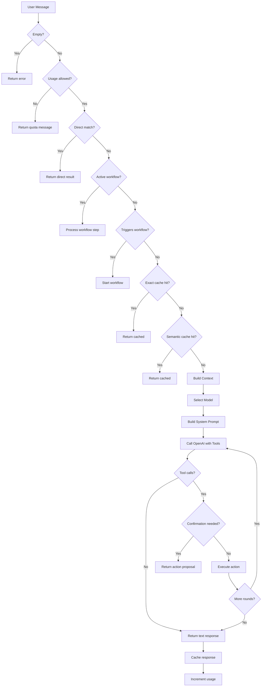
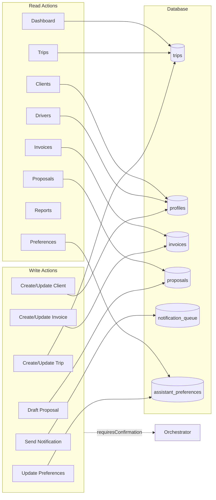

# AI Assistant

## Architecture Overview

The TripBuilt AI assistant follows an **Orchestrator pattern** that processes every user message through a deterministic pipeline:

1. **Validate** input
2. **Check usage** metering (per-org monthly caps)
3. **Try direct execution** (zero-cost pattern matching, no LLM)
4. **Check for active workflow** (guided multi-step flows, no LLM)
5. **Check response cache** (exact match, then semantic fuzzy match)
6. **Build context** (business snapshot, preferences, conversation memory)
7. **Call LLM** with function-calling tools
8. **Execute tool calls** (up to 3 rounds)
9. **Return response** with suggested follow-up actions

```
src/lib/assistant/
  orchestrator.ts          -- Main entry point (handleMessage)
  context-engine.ts        -- Business data enrichment
  conversation-store.ts    -- Persistent chat history
  conversation-memory.ts   -- Short-term memory for context
  types.ts                 -- All type definitions
  actions/                 -- Read and write action handlers
    registry.ts            -- Central action registry
    reads/                 -- Read-only data lookups
    writes/                -- Mutating actions (require confirmation)
  workflows/               -- Multi-step guided flows
    engine.ts              -- State machine (Redis-backed)
    definitions.ts         -- Workflow step definitions
  prompts/system.ts        -- Dynamic system prompt builder
  model-router.ts          -- Model selection logic
  usage-meter.ts           -- Per-org monthly usage tracking
  schema-router.ts         -- Smart tool schema filtering
  direct-executor.ts       -- Zero-cost pattern matching
  response-cache.ts        -- Exact-match response cache
  semantic-response-cache.ts -- Fuzzy semantic cache
  guardrails.ts            -- Action blocklist
  audit.ts                 -- Audit event logging
  session.ts               -- Session management
  channel-adapters/        -- Channel-specific adapters
    whatsapp.ts            -- WhatsApp channel bridge
```

## Orchestrator

**File:** `src/lib/assistant/orchestrator.ts`

The orchestrator (`handleMessage()`) is the single entry point for all assistant requests from both web and WhatsApp channels.

### Request Flow

1. **Input validation** -- Rejects empty messages.
2. **API key check** -- Verifies `OPENAI_API_KEY` is set.
3. **Usage metering** -- Calls `checkUsageAllowed()` to enforce monthly plan limits. Returns a quota-exceeded message if the org has hit their cap.
4. **Direct execution** -- `tryDirectExecution()` attempts zero-cost pattern matching for simple queries (no LLM call needed). If matched, the result is returned immediately.
5. **Confidence routing** -- Short-circuits vague queries (fewer than 5 words, no specific domain keywords) with suggested actions instead of wasting an LLM call.
6. **Workflow handling** -- Checks for an active guided workflow or triggers a new one if the message matches a workflow pattern.
7. **Response cache** -- Checks exact-match cache, then semantic (fuzzy) cache.
8. **Model selection** -- `selectModel()` picks `gpt-4o-mini` for most queries, `gpt-4o` only for complex analytical queries on enterprise plans.
9. **Context enrichment** -- Runs in parallel: business snapshot, org name, user preferences, language preference, conversation memory.
10. **System prompt construction** -- Combines static rules, org-specific context, and user preferences.
11. **Function-calling loop** -- Up to 3 rounds of OpenAI calls with tool execution between rounds.
12. **FAQ fallback** -- If the model produces an empty or weak response, falls back to token-overlap FAQ retrieval from `faq_tour_operator.jsonl`.

### Error Handling

- Unknown actions return a "not found" tool result to the model.
- Blocked actions (via guardrails) return a "not permitted" message.
- Invalid JSON parameters are caught and reported gracefully.
- Every action execution is audit-logged (fire-and-forget).
- Cache is invalidated after write actions.

### Constants

| Constant | Value | Purpose |
|----------|-------|---------|
| `MAX_TOOL_ROUNDS` | 3 | Prevents infinite tool-call loops |
| `MAX_HISTORY_MESSAGES` | 10 | Conversation history window |
| `MAX_TOKENS` | 800 | Response length cap |
| `TEMPERATURE` | 0.3 | Low creativity for factual answers |

## Context Engine

**File:** `src/lib/assistant/context-engine.ts`

The context engine enriches every assistant request with a real-time business snapshot. All queries are scoped by `organization_id` and run in parallel via `Promise.all()`.

### Data Loaded

| Query | Source Table | Scope |
|-------|-------------|-------|
| Today's trips | `trips` (joined with `profiles`) | Trips whose date range overlaps today, limit 10 |
| Pending invoices | `invoices` (joined with `profiles`) | Status in `issued`, `partially_paid`, `overdue`, limit 10 |
| Recently active clients | `clients` (joined with `profiles`) | Updated within last 7 days, limit 10 |
| Failed notifications | `notification_queue` (joined with `trips`, `profiles`) | Status = `failed`, org-scoped via inner join, limit 5 |

### Caching

The snapshot is cached in-memory per organization with a 5-minute TTL (`CACHE_TTL_MS = 300000`). Subsequent requests within the TTL window reuse the cached snapshot.

## Gemini Integration

**File:** `src/lib/ai/gemini.server.ts`

Gemini (model: `gemini-2.0-flash`) is used for specific tasks outside the main assistant flow (e.g., trip planning AI agents). The integration provides:

- `getGeminiModel()` -- Initializes the Google Generative AI client with the configured API key.
- `cleanGeminiJson()` -- Strips markdown code fences from Gemini's raw output.
- `parseGeminiJson<T>()` -- Parses cleaned JSON into a typed object.

**Note:** The main orchestrator uses **OpenAI** (`gpt-4o-mini` / `gpt-4o`), not Gemini. Gemini is used by the Python agent layer.

## Action System

**File:** `src/lib/assistant/actions/registry.ts`

Actions are the assistant's hands -- they read from and write to the database. Every action is defined as an `ActionDefinition` with:

- `name` -- Unique identifier (used as OpenAI function name)
- `description` -- Human-readable description (sent to the LLM)
- `category` -- `"read"` or `"write"`
- `parameters` -- JSON Schema for the function parameters
- `requiresConfirmation` -- Whether the orchestrator should ask for user confirmation before executing
- `execute()` -- Async handler that performs the action

### Read Actions

| Module | Actions |
|--------|---------|
| `reads/dashboard.ts` | Dashboard summary queries |
| `reads/trips.ts` | Search/lookup trips |
| `reads/clients.ts` | Search/lookup clients |
| `reads/invoices.ts` | Search/lookup invoices |
| `reads/drivers.ts` | Search/lookup drivers |
| `reads/proposals.ts` | Search/lookup proposals |
| `reads/preferences.ts` | Read user preferences |
| `reads/reports.ts` | Generate reports |

### Write Actions

| Module | Actions | Confirmation Required |
|--------|---------|----------------------|
| `writes/trips.ts` | Create/update trips | Yes |
| `writes/clients.ts` | Create/update clients | Yes |
| `writes/invoices.ts` | Create/update invoices | Yes |
| `writes/proposals.ts` | Draft/update proposals | Yes |
| `writes/notifications.ts` | Send notifications | Yes |
| `writes/preferences.ts` | Update preferences | No (low-risk) |

Write actions that modify business data require user confirmation. The orchestrator presents a proposal with details and waits for explicit approval before executing.

## Workflow Engine

**Files:** `src/lib/assistant/workflows/engine.ts`, `workflows/definitions.ts`

The workflow engine provides guided multi-step conversational flows that collect structured input without any LLM calls (zero cost per interaction).

### How It Works

1. User message matches a workflow trigger pattern (regex).
2. Engine creates a `WorkflowState` in Redis (30-minute TTL).
3. Each step prompts the user for a specific field (text, date, number, or select).
4. User responses are validated and stored.
5. After all steps complete, the collected values are passed to the corresponding action.
6. Users can type "cancel" at any time to abort.

### Defined Workflows

| Workflow | Trigger Patterns | Steps | Action |
|----------|-----------------|-------|--------|
| Create a Trip | "create trip", "new trip", "book trip" | Client name, destination, start date, end date, travelers, notes | `create_trip` |
| Onboard a Client | "add client", "new client", "onboard client" | Full name, email, phone, lifecycle stage, notes | `create_client` |
| Create an Invoice | "create invoice", "new invoice" | Client name, amount, currency, due date, description | `create_invoice` |

### Features

- **Natural language date parsing** -- "tomorrow", "next Friday", "March 15" are resolved to ISO dates.
- **Select validation** -- Dropdown-style options are validated against allowed values.
- **Custom validators** -- Per-step validation functions (e.g., email format, positive numbers).
- **Skip optional fields** -- User types "skip" for non-required fields.

## Conversation Store

**File:** `src/lib/assistant/conversation-store.ts`

Conversations are persisted in the `assistant_conversations` table, grouped by `session_id`.

### Operations

| Function | Description |
|----------|-------------|
| `saveConversationMessages()` | Saves a user + assistant message pair |
| `listConversations()` | Lists recent conversations (grouped by session) |
| `getConversation()` | Retrieves full conversation by session ID |
| `searchConversations()` | Full-text search via PostgreSQL `textSearch` |
| `deleteConversation()` | Deletes all messages in a session |

### Table Schema

- `organization_id` -- Tenant isolation
- `user_id` -- Per-user conversations
- `session_id` -- Groups messages into conversations
- `title` -- Auto-generated from first user message (first 80 chars)
- `message_role` -- `"user"` or `"assistant"`
- `message_content` -- The message text
- `action_name` -- Which action was executed (if any)
- `action_result` -- JSON result of the executed action

## Usage Tracking

**File:** `src/lib/assistant/usage-meter.ts`

Usage is tracked per organization per month in both Redis (fast reads) and the `organization_ai_usage` table (durable storage).

### Table: `organization_ai_usage`

| Column | Type | Description |
|--------|------|-------------|
| `organization_id` | uuid | FK to organizations |
| `month_start` | date | First day of the month |
| `ai_requests` | integer | Total requests this month |
| `cache_hits` | integer | Requests served from cache |
| `direct_execution_count` | integer | Requests handled without LLM |
| `estimated_cost_usd` | numeric | Estimated OpenAI cost |
| `rag_hits` | integer | RAG-answered requests |
| `token_count_input` | integer | Total input tokens |
| `token_count_output` | integer | Total output tokens |

### Metering Flow

1. **Check** -- `checkUsageAllowed()` reads the Redis counter (falls back to DB). Compares against the plan's AI request limit.
2. **Increment** -- `incrementUsage()` bumps the Redis counter. Flushes to the database every 10 increments.
3. **Report** -- `getUsageStats()` returns a full usage summary for API responses.

### Plan Limits

Limits are defined in the billing plan catalog (`src/lib/billing/plan-catalog.ts`). The default cap is approximately 400 requests/month.

## Python Agents

**Directory:** `apps/agents/`

A separate FastAPI service hosts three AI agents powered by the Agno framework:

| Agent | Endpoint | Purpose |
|-------|----------|---------|
| Trip Planner Team | `/api/chat/trip-planner` | Multi-agent team for itinerary generation |
| Support Bot | `/api/chat/support` | RAG-powered FAQ and support |
| Recommender | `/api/chat/recommend` | Destination and activity recommendations |

The Python agents run independently and communicate with the Next.js app via HTTP. The knowledge base is loaded at startup for RAG retrieval.

## Diagrams

### Orchestrator Flow



### Action Types and Data Access


