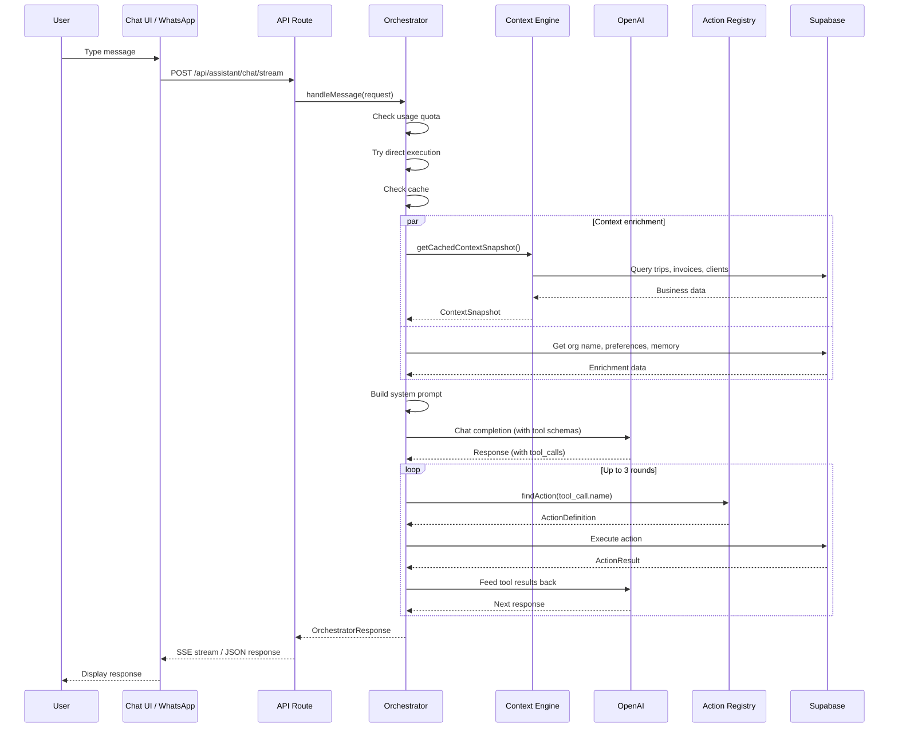

# Chatbot

## Overview

TripBuilt provides an AI-powered chatbot available through two channels:

1. **Web Chat** -- A floating chat panel in the admin dashboard, built with React and Framer Motion.
2. **WhatsApp** -- The same orchestrator logic accessed via Meta Cloud API webhooks.

Both channels share the same backend orchestrator (`src/lib/assistant/orchestrator.ts`), ensuring consistent behavior regardless of how the user interacts.

## Web Chat UI

### Component Structure

```
src/components/assistant/
  TourAssistantChat.tsx           -- Main stateful component (container)
  TourAssistantPresentation.tsx   -- Pure presentational component
  tour-assistant-helpers.tsx      -- Types, constants, markdown renderer
  ConversationHistory.tsx         -- Conversation history panel
  UsageDashboard.tsx              -- Usage statistics display
```

**Architecture:** The chat follows a container/presentation split:

- `TourAssistantChat` (container) -- Manages all state: messages, input, loading, streaming, recording, custom prompts. Handles API calls, SSE streaming, and user interactions.
- `TourAssistantPresentation` (presentation) -- Pure rendering component that receives all data and callbacks as props.

### UI Elements

| Element | Description |
|---------|-------------|
| **Floating action button** | Bottom-right corner, animated conic gradient border, sparkle icon. Unread badge pulses when new messages arrive while panel is closed. |
| **Chat panel** | 420px wide, 600px tall overlay with backdrop blur. Dark theme (`#060d1a` background). Spring animation on open/close. |
| **Header** | Bot name ("TripBuilt"), status indicator ("Operations AI - Live data"), close button. |
| **Message bubbles** | User messages: violet gradient, right-aligned. Assistant messages: dark glass effect with purple left border, left-aligned. |
| **Input bar** | Text input with focus ring, voice input button (Web Speech API), send button with gradient. |
| **Quick actions** | Pill-shaped buttons shown on first load. Default: "What's happening today?", "Show me overdue invoices", etc. Custom prompts loaded from `/api/assistant/quick-prompts`. |

### Streaming

The chat uses **Server-Sent Events (SSE)** via `/api/assistant/chat/stream`:

| Event | Payload | Behavior |
|-------|---------|----------|
| `status` | `{ status: "Thinking..." }` | Shows animated status indicator |
| `token` | `{ token: "..." }` | Appends text to the assistant message (streaming cursor) |
| `proposal` | `{ reply, actionName, params, confirmationMessage }` | Renders confirmation buttons |
| `suggestions` | `{ suggestedActions: [...] }` | Renders follow-up action pills |
| `error` | `{ message: "..." }` | Displays error in message bubble |
| `done` | `{ suggestedActions?: [...] }` | Final event, may include suggestions |

Falls back to non-streaming `/api/assistant/chat` endpoint if SSE fails.

### Rich Features

- **Markdown rendering** -- Headings, bold, italic, code, links, ordered/unordered lists via custom `MarkdownContent` component.
- **Inline charts** -- When action results contain chart-compatible data (2-20 items with numeric keys), a Recharts bar chart is rendered inline.
- **Action results** -- Success/failure badges with optional CSV export button.
- **Confirmation flow** -- Confirm/Cancel buttons for write actions. Calls `/api/assistant/confirm` endpoint.
- **Copy to clipboard** -- Hover to reveal copy button on assistant messages.
- **Regenerate** -- Re-sends the last user message to get a fresh response.
- **Voice input** -- Web Speech API (SpeechRecognition) with real-time transcription. Toggle button with visual recording state.
- **CSV export** -- Export action result data as CSV via `/api/assistant/export` endpoint.
- **Keyboard shortcuts** -- ESC closes the panel.

## WhatsApp Channel

**File:** `src/lib/assistant/channel-adapters/whatsapp.ts`

The WhatsApp adapter bridges incoming WhatsApp messages to the same orchestrator and sends replies back via the Meta Cloud API.

### Entry Point

`handleWhatsAppMessage(waId, messageText, senderPhone)` is called by the webhook route when a text message is received.

### Flow

1. **Resolve sender** -- `resolveWhatsAppSender()` looks up the WhatsApp ID (`waId`) in `profiles.phone_normalized` to find the user's `userId` and `organizationId`.
2. **Rate limit** -- 40 messages per 5 minutes per WhatsApp user (via `enforceRateLimit`).
3. **Sanitize input** -- `sanitizeText()` with 2000 character max, preserving newlines.
4. **Load session** -- `getOrCreateSession()` retrieves or creates a session from `assistant_sessions` table.
5. **Check pending action** -- If there's a pending write action awaiting confirmation, check if the user sent "yes"/"confirm" or "no"/"cancel".
6. **Call orchestrator** -- `handleMessage()` with the sanitized text, conversation history, and `channel: "whatsapp"`.
7. **Handle proposals** -- If the orchestrator returns an `actionProposal`, store it as a pending action and append "_Reply YES to confirm or NO to cancel._" to the reply.
8. **Update history** -- Persist the user message and assistant reply to the session.
9. **Send reply** -- `sendWhatsAppText()` via Meta Cloud API.

### Differences from Web

| Aspect | Web Chat | WhatsApp |
|--------|----------|----------|
| Confirmation | Confirm/Cancel buttons | Text-based: "YES" / "NO" |
| Formatting | Rich markdown, charts | Plain text, WhatsApp bold/italic |
| Max reply length | Unlimited | 3,800 chars (API limit 4,096) |
| Auth | Supabase session cookie | Phone number lookup |
| Rate limit | Standard API rate limit | 40 messages / 5 minutes |

## Conversation Management

### Multi-turn Dialogue

Conversation history is maintained per session:

- **Web:** The frontend keeps an in-memory array of messages. The last 10 messages (excluding the welcome message) are sent with each API request as `history`.
- **WhatsApp:** Session history is persisted in `assistant_sessions` table and loaded on each message.

### Context Window

The orchestrator uses `MAX_HISTORY_MESSAGES = 10` to limit the conversation context sent to the LLM. Additionally, `conversation-memory.ts` provides short-term memory from recent interactions to supplement the history.

## Quick Prompts

Default quick prompts (shown in the web UI on first load):

1. "What's happening today?"
2. "Show me overdue invoices"
3. "Any trips without drivers?"
4. "Client follow-ups needed"

Custom prompts can be configured per organization via the `/api/assistant/quick-prompts` endpoint. The UI merges custom prompts with defaults, keeping a maximum of 8.

## Action Execution

The chatbot can perform these categories of operations:

### Read Operations (Immediate)
- Look up clients by name, email, or lifecycle stage
- Search trips by destination, date, or status
- Find overdue invoices
- Check driver availability
- View proposal status
- Generate dashboard summaries and reports

### Write Operations (Confirmation Required)
- Create a new trip (via guided workflow or direct action)
- Onboard a new client
- Create an invoice
- Draft a proposal
- Send notifications
- Update user preferences

### Workflow Integration

Multi-step workflows are triggered directly from chat messages:

- "Create a new trip" starts the 6-step trip creation workflow.
- "Add a client" starts the 5-step client onboarding workflow.
- "Create an invoice" starts the 5-step invoice creation workflow.

Each step collects one field, with validation and natural language date parsing. No LLM calls are needed during the workflow -- all prompts are template-based (zero cost).

## Channel-Specific Formatting

### Web (Rich)

- Markdown headings, bold, italic, code blocks
- Clickable links
- Inline bar charts for tabular data
- Action result badges (green for success, red for failure)
- Suggested action pills
- CSV export buttons

### WhatsApp (Plain Text)

`formatForWhatsApp()` transforms the response:

- `## Heading` becomes `*Heading*` (WhatsApp bold)
- `**bold**` becomes `*bold*` (WhatsApp bold)
- `[text](url)` becomes `text: url` (plain link)
- Response truncated to 3,800 characters

## Error Handling

| Scenario | Web Behavior | WhatsApp Behavior |
|----------|-------------|-------------------|
| Unknown user | N/A (authenticated) | Polite message asking to register phone number |
| Rate limited | Standard 429 response | "You're sending messages too quickly" |
| LLM error | "Connection error" in bubble | "I ran into an issue" reply |
| Usage quota exceeded | "You've used X of Y messages" | Same message via WhatsApp |
| Empty/weak LLM response | FAQ fallback | FAQ fallback |

## Sequence Diagram


