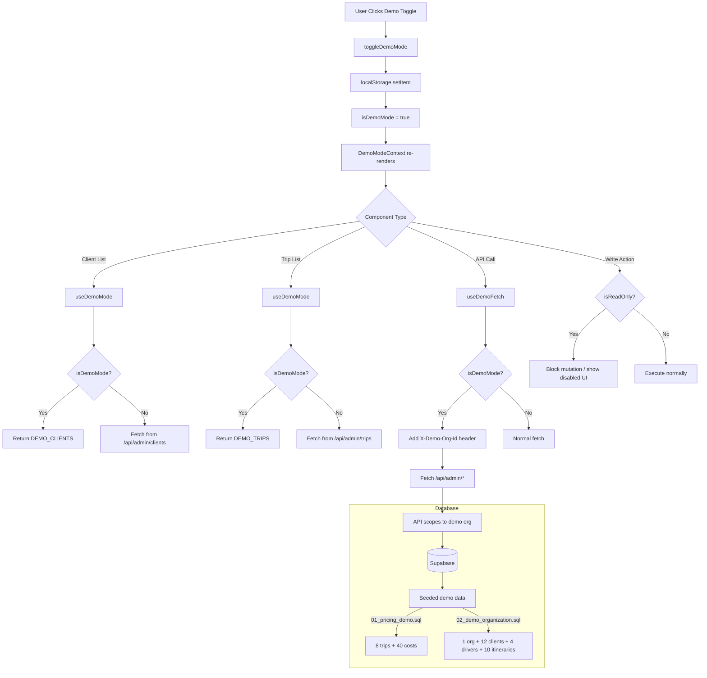

# Demo Mode

## Purpose

Demo mode allows prospects to explore TripBuilt without creating an account or connecting to live data. It provides a fully populated dashboard experience using hardcoded sample data that mirrors a real Indian tour operator's business.

## Activation

Demo mode is controlled by a toggle in the admin dashboard. The state is persisted in `localStorage` under the key `tripbuilt:demo_mode`.

### How It Activates

1. User clicks a "Demo Mode" toggle in the admin UI.
2. `toggleDemoMode()` flips the boolean and writes to `localStorage`.
3. All components consuming the `DemoModeContext` re-render with demo data.
4. When demo mode is active, `isReadOnly` is set to `true`, blocking mutations.

### Implementation

**File:** `src/lib/demo/demo-mode-context.tsx`

```tsx
// Context shape
interface DemoModeContextValue {
  isDemoMode: boolean;      // Whether demo mode is active
  toggleDemoMode: () => void; // Toggle function
  demoOrgId: string;        // Fixed demo organization UUID
  isReadOnly: boolean;      // Matches isDemoMode (blocks writes)
  mounted: boolean;         // SSR hydration guard
}
```

The `DemoModeProvider` wraps the admin layout so all child pages can access demo state via the `useDemoMode()` hook.

## Demo Context Provider

**File:** `src/lib/demo/demo-mode-context.tsx`

A React context provider that:

1. **Initializes** from `localStorage` on mount (with SSR hydration guard via `mounted` state).
2. **Provides** `isDemoMode`, `toggleDemoMode`, `demoOrgId`, `isReadOnly`, and `mounted` to all consumers.
3. **Uses** `useMemo` for stable context values to prevent unnecessary re-renders.

### Demo Organization ID

**File:** `src/lib/demo/constants.ts`

```typescript
export const DEMO_ORG_ID =
  process.env.NEXT_PUBLIC_DEMO_ORG_ID || "d0000000-0000-4000-8000-000000000001";
```

A deterministic UUID that matches the seeded demo organization in the database. Configurable via `NEXT_PUBLIC_DEMO_ORG_ID` environment variable.

### Demo Fetch Hook

**File:** `src/lib/demo/use-demo-fetch.ts`

`useDemoFetch()` is a drop-in replacement for `fetch()` that injects an `X-Demo-Org-Id` header on all `/api/admin/*` requests when demo mode is active. This allows the API handlers to scope queries to the demo organization's data.

```typescript
// Usage in a page component
const demoFetch = useDemoFetch();
const data = await demoFetch("/api/admin/trips");
// In demo mode, this adds: X-Demo-Org-Id: d0000000-0000-4000-8000-000000000001
```

## Seed Data

Two SQL seed files populate the demo organization in Supabase:

### `01_pricing_demo.sql`

Creates realistic Indian tour pricing data:

- **8 trips** covering popular Indian destinations:
  - Golden Triangle Classic (Delhi, Agra, Jaipur)
  - Kerala Backwaters Escape
  - Goa Beach Holiday
  - Rajasthan Royal Tour
  - Himachal Adventure
  - Andaman Island Break
  - Varanasi Heritage Journey
  - Coorg & Mysore Retreat

- **~40 trip service cost entries** broken down by category:
  - Hotels (Taj Hotels, Kerala Houseboats, OYO, etc.)
  - Vehicle (tempo travellers, AC Innova, mini bus)
  - Flights (IndiGo, Air India, SpiceJet)
  - Insurance (HDFC Ergo, Bajaj Allianz)
  - Other (watersports packages)

- All costs in INR with both cost and price amounts for margin calculation.
- Mix of trip statuses: `completed`, `in_progress`, `confirmed`.
- **Idempotent:** Skips if demo trips already exist.

### `02_demo_organization.sql`

Creates a complete demo organization ("GoBuddy Adventures (Demo)") with all related entities:

- **Organization:** Premium tier, slug `gobuddy-demo`.
- **1 admin profile:** Avinash Kapoor (operator).
- **12 client profiles** at various lifecycle stages:
  - `active` (2), `review` (1), `past` (1), `payment_confirmed` (1), `payment_pending` (1), `proposal` (2), `prospect` (2), `lead` (2)
  - All with Indian names, phone numbers (+91), and realistic email addresses.
- **4 driver profiles** with Indian names and phone numbers.
- **10 trips** spanning multiple destinations.
- **10 itineraries** linked to the trips.
- **Fixed UUIDs** using deterministic patterns (e.g., `d0000000-0000-4000-8001-00000000000X` for clients).
- **Idempotent:** Skips if the demo org UUID already exists.

## Data Structure

### Hardcoded Client-Side Data

When demo mode is active, components use hardcoded TypeScript data instead of API calls:

**File:** `src/lib/demo/data/index.ts` (barrel export)

| Export | File | Records | Description |
|--------|------|---------|-------------|
| `DEMO_CLIENTS` | `data/clients.ts` | 12 | Full CRM profiles with travel preferences, lifecycle stages, tags |
| `DEMO_TRIPS` | `data/trips.ts` | 10 | Trips with destinations, dates, statuses, linked profiles and itineraries |
| `DEMO_PROPOSALS` | `data/proposals.ts` | -- | Sample travel proposals |
| `DEMO_NOTIFICATIONS` | `data/notifications.ts` | -- | Sample notification entries |
| `DEMO_TASKS` | `data/tasks.ts` | -- | Pending tasks and follow-ups |
| `DEMO_SCHEDULE` | `data/tasks.ts` | -- | Daily schedule items |

### Demo Client Data Shape

Each demo client includes all CRM fields a real client would have:

- Basic info: name, email, phone, avatar
- Travel preferences: destination, travelers count, budget range, travel style
- Interests: array of activities (e.g., `["beach", "snorkeling", "spa"]`)
- Business fields: lifecycle stage, lead status, client tag (VIP, family, etc.)
- Engagement: referral source, source channel, marketing opt-in, language preference
- Metrics: trips count

## Restrictions

When `isDemoMode` is `true`, the following are restricted:

| Feature | Behavior in Demo |
|---------|-----------------|
| **Data writes** | `isReadOnly = true` -- UI disables mutation controls |
| **Payments (Razorpay)** | Blocked -- no real payment processing |
| **WhatsApp messaging** | Blocked -- no real messages sent |
| **Notifications** | Display only -- no actual push/email/SMS delivery |
| **API mutations** | Admin API routes check `X-Demo-Org-Id` header |
| **Auth** | Not required -- demo data is self-contained |

## Demo Routes

The demo experience is accessed through the standard admin dashboard routes. When demo mode is toggled on:

- `/admin/dashboard` -- Shows demo trips, revenue, client pipeline
- `/admin/clients` -- Lists 12 demo clients with full CRM data
- `/admin/trips` -- Shows 10 demo trips across Indian destinations
- `/admin/invoices` -- Demo invoice data
- `/admin/proposals` -- Demo proposals

There is no separate `/demo` route -- the toggle switches the data source for all existing admin pages.

## Diagram

### Demo Mode Activation and Data Flow


