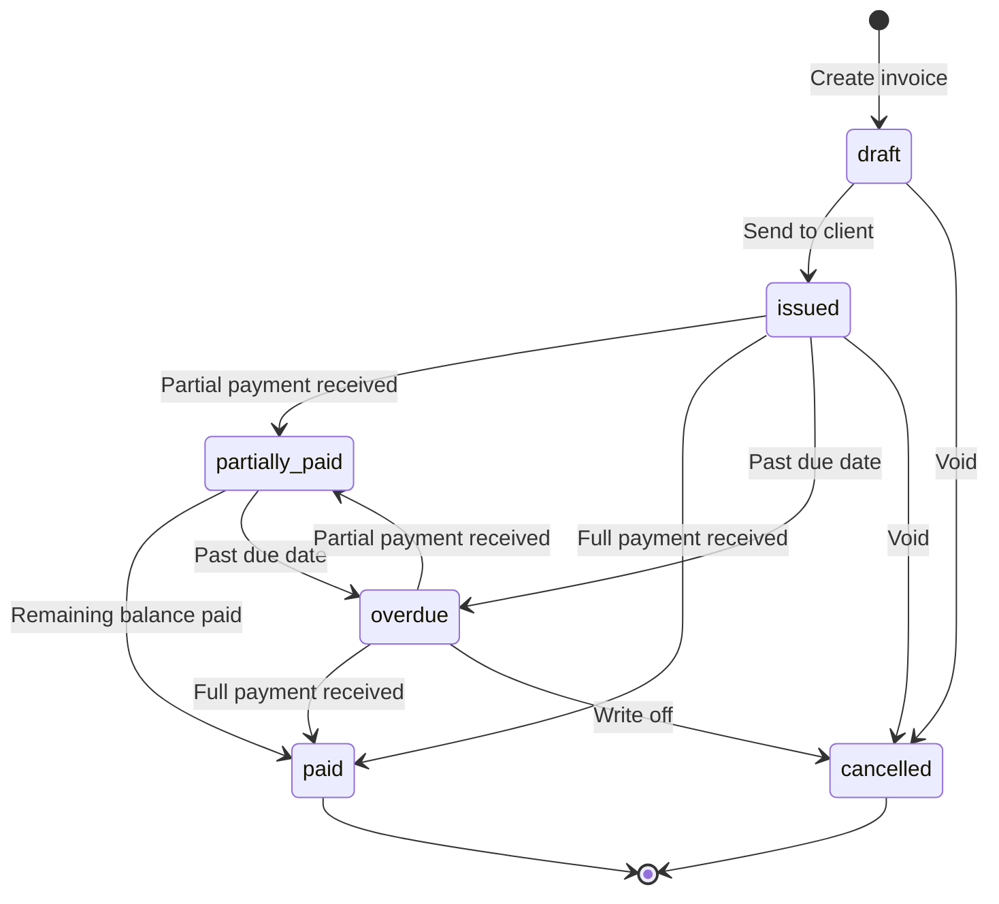
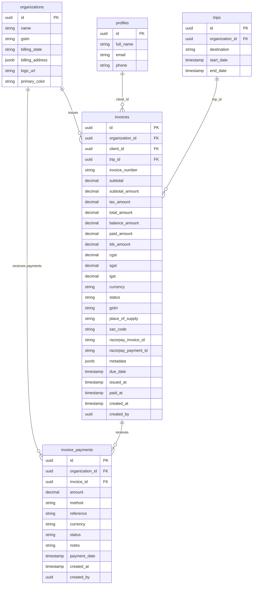

# Invoicing and GST Compliance

## Invoice Lifecycle

Invoices follow a defined state machine from creation to final resolution.

### Statuses

| Status | Description |
|--------|-------------|
| `draft` | Invoice created but not sent to client |
| `issued` | Invoice sent/visible to client |
| `partially_paid` | Some payment received but balance remains |
| `paid` | Full amount received |
| `overdue` | Past due date without full payment |
| `cancelled` | Invoice voided |

### Key Source Files

| File | Purpose |
|------|---------|
| `src/lib/invoices/module.ts` | Schemas, totals calculation, GST breakdown, numbering, metadata normalization |
| `src/lib/invoices/public-link.ts` | HMAC-signed public invoice download URLs |
| `src/lib/payments/invoice-service.ts` | Invoice creation with Razorpay, payment recording |
| `src/lib/payments/payment-types.ts` | Shared types for invoice and payment operations |

---

## Invoice Numbering

Invoices use per-organization sequential numbering with a year-month prefix:

**Format**: `INV-{YYYYMM}-{NNNN}`

Example: `INV-202603-0001`, `INV-202603-0002`

The `getNextInvoiceNumber()` function:

1. Builds the prefix from the current UTC year and month: `INV-YYYYMM`
2. Queries the latest invoice for the organization matching that prefix
3. Extracts the trailing numeric suffix via regex (`-(\d{4,})$`)
4. Increments by 1, zero-padded to 4 digits minimum

This ensures unique, chronologically ordered invoice numbers per organization per month.

---

## Line Items

Each invoice contains one or more line items, validated by `InvoiceLineItemSchema`:

| Field | Type | Constraints |
|-------|------|-------------|
| `description` | string | 1-240 chars, trimmed |
| `quantity` | number | Positive, max 100,000 |
| `unit_price` | number | 0 to 100,000,000 |
| `tax_rate` | number | 0 to 100 (percentage) |

### Calculated Fields (per line item)

| Field | Formula |
|-------|---------|
| `line_subtotal` | `quantity * unit_price` |
| `line_tax` | `line_subtotal * tax_rate / 100` |
| `line_total` | `line_subtotal + line_tax` |

### Invoice Totals

`calculateInvoiceTotals(items)` produces:

| Field | Formula |
|-------|---------|
| `subtotal` | Sum of all `line_subtotal` |
| `taxTotal` | Sum of all `line_tax` |
| `grandTotal` | `subtotal + taxTotal` |

All currency values are rounded to 2 decimal places using `Math.round((value + Number.EPSILON) * 100) / 100`.

---

## GST Compliance

### GSTIN Storage

The organization's GSTIN (Goods and Services Tax Identification Number) is stored on the `organizations` table and included in:

- Razorpay customer records
- Invoice records
- Organization snapshots embedded in invoice metadata

### Tax Calculations

GST is calculated via `calculateTaxBreakdown(taxAmount, billingState, placeOfSupply)`:

| Scenario | CGST | SGST | IGST |
|----------|------|------|------|
| **Intra-state** (billing state == place of supply) | `taxAmount / 2` | `taxAmount - CGST` | 0 |
| **Inter-state** (billing state != place of supply) | 0 | 0 | `taxAmount` |
| **No tax** (taxAmount == 0) | 0 | 0 | 0 |

State comparison is case-insensitive (both values are uppercased before comparison).

### SAC Code

Invoices default to SAC code `998314` (tour operator services). This can be overridden per invoice via the `sac_code` field (max 24 characters).

### E-Invoicing

When `e_invoice_settings.auto_generate_enabled` is true for an organization:

1. Check if invoice amount meets the configured `threshold_amount`
2. Build seller and buyer details from organization profile
3. Call `registerEInvoice()` with invoice items
4. If e-invoice generation fails, log the error but do not block invoice creation

The state code is derived from the organization's `billing_state` (2-character code expected).

---

## Payment Tracking

### `invoice_payments` Table

Each payment against an invoice is recorded in the `invoice_payments` table:

| Column | Type | Description |
|--------|------|-------------|
| `id` | UUID | Primary key |
| `organization_id` | UUID | Organization FK |
| `invoice_id` | UUID | Invoice FK |
| `amount` | decimal | Payment amount |
| `method` | string | Payment method (UPI, card, netbanking, wallet) |
| `reference` | string | Razorpay payment ID (used for idempotency) |
| `currency` | string | Currency code (default `INR`) |
| `status` | enum | `pending`, `completed`, `failed`, `refunded` |
| `payment_date` | timestamp | When payment was received |
| `notes` | text | JSON with Razorpay details |
| `created_by` | UUID | User who recorded the payment |

### Multiple Payment Methods

An invoice can receive multiple payments. After each payment:

- If `amount >= total_amount`: invoice status becomes `paid`
- Otherwise: invoice status becomes `partially_paid`

### Manual Payment Recording

The `RecordInvoicePaymentSchema` validates manual payment entries:

| Field | Constraints |
|-------|-------------|
| `amount` | Positive, max 100,000,000 |
| `method` | Max 120 chars (optional) |
| `reference` | Max 191 chars (optional) |
| `notes` | Max 1,000 chars (optional) |
| `status` | One of: `pending`, `completed`, `failed`, `refunded` |
| `payment_date` | ISO date string (optional) |

---

## PDF Generation

Invoices can be exported as PDF via a signed download URL.

### Public Link Signing

`signInvoiceAccess(invoiceId, paymentId)` generates an HMAC-SHA256 signature:

```
HMAC-SHA256(INVOICE_SIGNING_SECRET, "{invoiceId}:{paymentId}")
```

The signing secret falls back through: `INVOICE_SIGNING_SECRET` -> `RAZORPAY_KEY_SECRET` -> `RAZORPAY_WEBHOOK_SECRET`.

### Download URL

`buildInvoiceDownloadUrl(baseUrl, invoiceId, paymentId)` builds:

```
{baseUrl}/api/bookings/{invoiceId}/invoice?payment_id={paymentId}&signature={hmac}
```

### Verification

`verifyInvoiceAccessSignature(invoiceId, paymentId, signature)` recomputes the HMAC and uses `crypto.timingSafeEqual()` for timing-safe comparison.

---

## Overdue Handling

### Status Transitions

- Invoices with a `due_date` in the past and status `issued` or `partially_paid` can be transitioned to `overdue`
- The `due_date` defaults to 30 days from creation if not specified

### Invoice Metadata

Invoice metadata (`metadata` JSONB column) stores:

- `notes`: Free-text notes (max 4,000 chars)
- `line_items`: Denormalized line items with calculated totals
- `organization_snapshot`: Organization details at time of invoice creation (name, logo, GSTIN, billing address, primary color)
- `client_snapshot`: Client details (name, email, phone)

These snapshots ensure the invoice remains accurate even if the organization or client details change later.

---

## Invoice Lifecycle States



## Data Model


