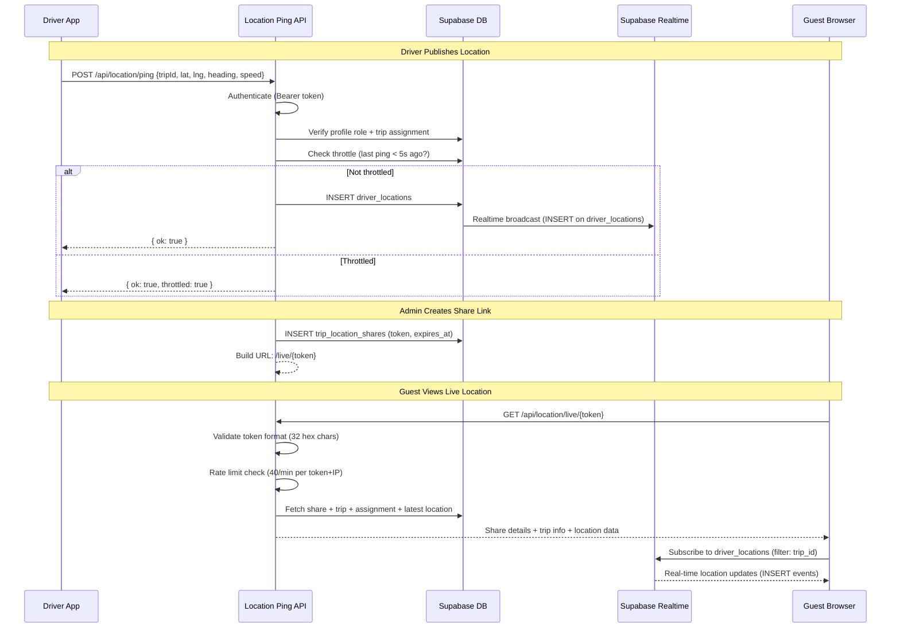
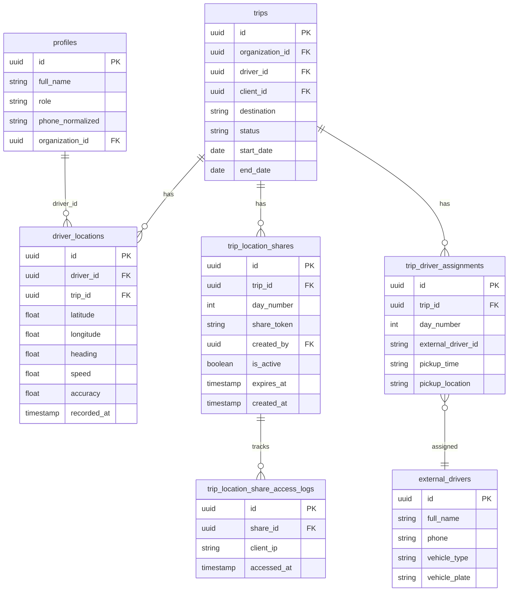

# Live Location Tracking

## Overview

TripBuilt provides real-time driver location sharing with trip guests. Drivers publish GPS coordinates during active trips, and admins or clients generate tokenized shareable links that allow unauthenticated guests to view the driver's live location on a map.

### Key Source Files

| File | Purpose |
|------|---------|
| `src/app/api/_handlers/location/ping/route.ts` | Driver GPS publishing endpoint |
| `src/app/api/_handlers/location/share/route.ts` | Admin: create/get/revoke share links |
| `src/app/api/_handlers/location/client-share/route.ts` | Client: create/get share links |
| `src/app/api/_handlers/location/live/[token]/route.ts` | Guest: access location data via token |
| `src/app/api/_handlers/location/cleanup-expired/route.ts` | Cron: deactivate expired shares |

---

## Driver GPS Publishing

### Endpoint: `POST /api/location/ping`

Authenticated drivers publish their GPS coordinates to the `driver_locations` table.

### Request Payload

| Field | Type | Required | Validation |
|-------|------|----------|------------|
| `tripId` | UUID | Yes | Must be a valid UUID |
| `latitude` | number | Yes | -90 to 90 |
| `longitude` | number | Yes | -180 to 180 |
| `heading` | number | No | Direction of travel |
| `speed` | number | No | Speed in m/s |
| `accuracy` | number | No | GPS accuracy in meters |
| `driverId` | UUID | No | Admin override for which driver to record |

### Authorization

1. Bearer token authentication required
2. User's profile and role are resolved
3. Trip must exist and belong to the same organization (unless super_admin)
4. The caller must be either:
   - The trip's primary driver (`trip.driver_id`)
   - An assigned driver via `trip_driver_assignments` + `driver_accounts`
   - An admin or super_admin (can also override `driverId`)

### Throttling

To prevent GPS spam, the handler checks the most recent `driver_locations` entry for the same trip + driver. If the last ping was less than **5 seconds** ago, the request returns `{ ok: true, throttled: true }` without inserting.

### Rate Limiting

120 requests per minute per authenticated user (`api:location:ping` prefix).

### `driver_locations` Table

| Column | Type | Description |
|--------|------|-------------|
| `driver_id` | UUID | Profile ID of the driver |
| `trip_id` | UUID | Associated trip (nullable for WhatsApp pings) |
| `latitude` | float | GPS latitude |
| `longitude` | float | GPS longitude |
| `heading` | float | Direction of travel (nullable) |
| `speed` | float | Speed (nullable) |
| `accuracy` | float | GPS accuracy in meters (nullable) |
| `recorded_at` | timestamp | When the location was recorded |

---

## Location Share Links

### Admin Share Management: `/api/location/share`

Admins create, retrieve, and revoke share links for trips.

#### GET -- Retrieve Active Share

Returns the most recent active, non-expired share for a trip (optionally filtered by `dayNumber`).

#### POST -- Create Share Link

1. Check for an existing active share (reuse if found)
2. Generate a share token: `crypto.randomUUID()` with dashes removed (32 hex chars)
3. Set expiry: configurable 1-168 hours (default 24 hours)
4. Insert into `trip_location_shares`
5. Return the share with `live_url`: `{APP_URL}/live/{token}`

#### DELETE -- Revoke Share Links

Deactivates shares by setting `is_active: false` and `expires_at` to now. Can target a specific `shareId` or all active shares for a trip/day. Logs a notification for audit.

### Client Share Management: `/api/location/client-share`

Clients (trip guests) can retrieve or create shares for trips where they are the `client_id`.

- Same create/reuse logic as admin shares
- Default expiry: **48 hours** (vs. admin's configurable 1-168 hours)
- Authorization: `trip.client_id === userId`

---

## Token Security

### Token Format

Share tokens are 32-character hex strings generated from `crypto.randomUUID()` with dashes removed. The live endpoint validates format with `/^[a-f0-9]{32}$/i`.

### Expiry

- Admin shares: configurable 1-168 hours (default 24 hours)
- Client shares: fixed 48 hours
- Expired shares are automatically deactivated by the cleanup cron

### Access Logging and Rate Limiting

The live token endpoint enforces rate limiting per token + client IP combination:

| Parameter | Value |
|-----------|-------|
| Window | 60 seconds |
| Max requests | 40 per window |
| Key | `{token}:{clientIp}` |
| Prefix | `api:location:live:get` |

### Cleanup Cron: `POST /api/location/cleanup-expired`

Deactivates all shares where `expires_at < now` and `is_active = true`. Authorized by:

- Cron secret (`NOTIFICATION_CRON_SECRET`)
- Signed cron request (HMAC-SHA256 with `NOTIFICATION_SIGNING_SECRET`)
- Service role Bearer token
- Admin user session

---

## Guest Access

### Endpoint: `GET /api/location/live/{token}`

No authentication required. Guests access location data using only the share token.

### Response

The endpoint returns a comprehensive payload:

```json
{
  "share": {
    "trip_id": "uuid",
    "day_number": 1,
    "expires_at": "2026-03-24T12:00:00Z"
  },
  "trip": {
    "destination": "Goa",
    "start_date": "2026-03-23",
    "end_date": "2026-03-28",
    "client_name": "John Doe"
  },
  "assignment": {
    "day_number": 1,
    "pickup_time": "08:00",
    "pickup_location": "Hotel Lobby",
    "external_drivers": {
      "full_name": "Driver Name",
      "phone": "+919876543210",
      "vehicle_type": "SUV",
      "vehicle_plate": "KA01AB1234"
    }
  },
  "location": {
    "latitude": 15.4989,
    "longitude": 73.8278,
    "heading": 180,
    "speed": 45.5,
    "accuracy": 10,
    "recorded_at": "2026-03-23T10:30:00Z",
    "driver_id": "uuid"
  }
}
```

### Data Joins

The endpoint performs multiple queries:

1. **Share validation**: `trip_location_shares` with `is_active = true` and token match
2. **Trip details**: Joined via `trips` relation, including client profile (`full_name`)
3. **Latest location**: Most recent `driver_locations` entry for the trip
4. **Driver assignment**: `trip_driver_assignments` with `external_drivers` details (name, phone, vehicle)

---

## Supabase Realtime

Location updates stream to clients using Supabase's realtime subscription capabilities. The `driver_locations` table supports realtime change notifications, allowing the guest-facing live tracking page to receive location updates as they are inserted without polling.

The guest page subscribes to changes on `driver_locations` filtered by `trip_id`, receiving `INSERT` events in real-time.

---

## `can_publish_driver_location()`

A Supabase database function (RPC) that provides authorization at the database level:

```sql
can_publish_driver_location(actor_user_id: string, target_trip_id: string) -> boolean
```

This function validates whether a given user is authorized to publish location data for a specific trip. It is complementary to the API-level authorization in the ping handler, providing defense-in-depth at the database layer.

---

## Access Logging

### `trip_location_share_access_logs`

Access to live tracking links is logged for security and analytics:

- Tracks who accessed which share token
- Used as input for rate limiting decisions
- Referenced in admin security diagnostics (`src/app/api/_handlers/admin/security/diagnostics/route.ts`)

---

## Driver Location Publishing Flow



## Location Sharing Data Model


