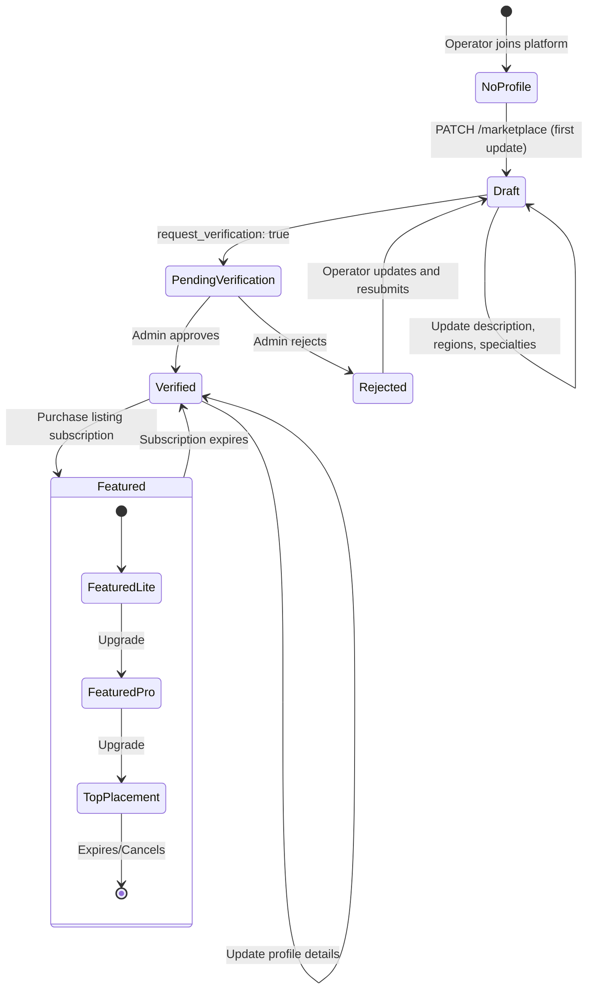
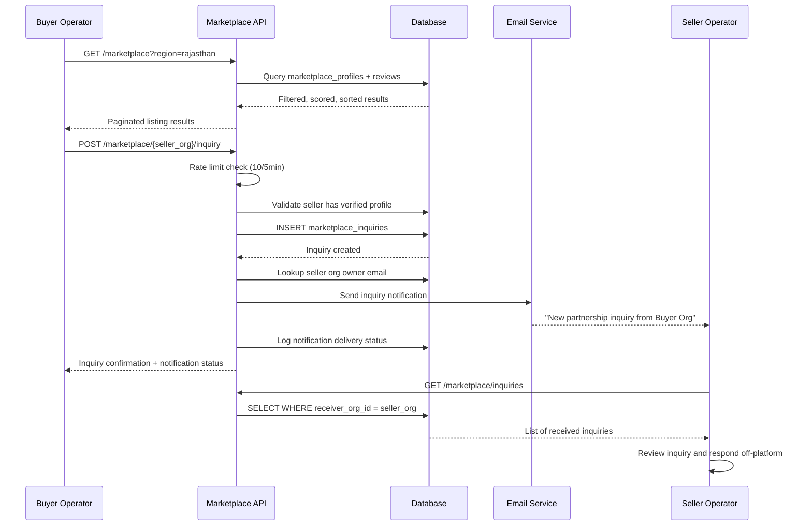

# B2B Marketplace

TripBuilt's marketplace enables travel operators to discover partner operators, list their services, send partnership inquiries, and purchase premium listing placements. The marketplace is organization-scoped and integrates with the Razorpay payment system for listing subscriptions.

## Overview

The B2B marketplace serves as a directory where travel operators can:
- **List their services** with regions, specialties, rate cards, and gallery images
- **Discover partners** through search, filtering, and quality-based ranking
- **Send inquiries** to potential partners for collaboration
- **Purchase premium placements** to increase visibility (featured listings, boost scores)
- **Get verified** to build trust with a verification badge

## Listings

Each organization has one `marketplace_profiles` row (keyed by `organization_id`). Profiles are created/updated via `PATCH /api/marketplace`:

### Profile Fields

| Field | Type | Description |
|-------|------|-------------|
| `description` | TEXT | Operator description (max 4000 chars) |
| `service_regions` | TEXT[] | Geographic coverage (max 80 items) |
| `specialties` | TEXT[] | Tour specialties (max 80 items) |
| `gallery_urls` | TEXT[] | Image gallery (max 40 URLs) |
| `rate_card` | JSONB | Array of `{id, service, margin}` entries (max 100) |
| `compliance_documents` | JSONB | Array of `{id, name, url, type, expiry_date}` |
| `margin_rate` | NUMERIC | Default margin percentage (0-100) |
| `verification_status` | TEXT | none, pending, verified, rejected |
| `is_verified` | BOOLEAN | Whether operator passed verification |
| `verification_level` | TEXT | standard, gold, platinum |
| `listing_tier` | TEXT | free, featured_lite, featured_pro, top_placement |
| `is_featured` | BOOLEAN | Active featured placement |
| `featured_until` | TIMESTAMPTZ | Featured placement expiry |
| `boost_score` | INTEGER | Ranking boost from paid placement |
| `listing_quality_score` | INTEGER | System-computed quality score |
| `search_vector` | TSVECTOR | Full-text search index |

All text inputs are sanitized: URLs are validated as HTTP/HTTPS, margins are bounded 0-100, and text is stripped of control characters.

### Upsert Pattern

Profile updates use Supabase's `upsert` with `onConflict: "organization_id"`, so the first PATCH creates the profile and subsequent PATCHes update it.

### Verification Request

When `request_verification: true` is included in the PATCH body, the profile's `verification_status` is set to `pending`. An admin reviews and approves via `POST /api/admin/marketplace/verify`.

## Tour Templates

Marketplace listings can include reusable tour package information through the `rate_card` field. Each rate card entry represents a service the operator offers:

```json
{
  "id": "rate-1",
  "service": "Rajasthan 7-Day Heritage Tour",
  "margin": 15.5
}
```

The rate card serves as a pricing guide for partner operators, showing available services and the margin percentage offered for B2B referrals.

## Inquiry Flow

### Sending an Inquiry

Inquiries are sent via `POST /api/marketplace/{target_org_id}/inquiry`:

1. **Authentication** -- Caller must be logged in with an organization
2. **Self-inquiry check** -- Cannot send inquiry to your own organization
3. **Rate limiting** -- 10 inquiries per 5 minutes per organization
4. **Target validation** -- Target must have a verified marketplace profile
5. **Input validation** -- Subject (max 160 chars) and message (max 5000 chars) via Zod schema
6. **Creation** -- Insert into `marketplace_inquiries` with status `pending`
7. **Notification** -- Email sent to the receiving organization's owner via `sendInquiryNotification()`
8. **Tracking** -- Notification delivery status logged in `notification_logs`

### Inquiry Data Model

`marketplace_inquiries` table:

| Column | Description |
|--------|-------------|
| `sender_org_id` | Organization sending the inquiry |
| `receiver_org_id` | Organization receiving the inquiry |
| `subject` | Inquiry subject line |
| `message` | Inquiry body text |
| `status` | pending, read, responded, archived |
| `read_at` | When the receiver opened the inquiry |

### Inquiry Management

Received inquiries are listed via `GET /api/marketplace/inquiries`.

## Subscription Access

Marketplace listing visibility and features are tied to listing subscription tiers:

### Listing Plans

| Plan | Price | Features |
|------|-------|----------|
| **Free** (default) | INR 0 | Basic listing, no boost |
| **Featured Lite** | Paid via Razorpay | Moderate boost score, featured badge |
| **Featured Pro** | Paid via Razorpay | Higher boost score, priority ranking |
| **Top Placement** | Paid via Razorpay | Maximum boost, top of results |

### Subscription Lifecycle

Managed via `/api/marketplace/listing-subscription`:

1. **GET** -- Returns current subscription, tier, boost score, available plans, and checkout status
2. **POST** -- Creates a Razorpay order for the selected plan, inserts a `pending` subscription
3. **Verify** -- `POST /api/marketplace/listing-subscription/verify` confirms Razorpay payment and activates the subscription
4. **PATCH** -- Downgrade to free tier (cancels active subscription, resets profile boost)

The `normalizeCurrentSubscription()` function automatically expires subscriptions past their `current_period_end` date and resets the marketplace profile to free tier.

### Subscription Data Model

`marketplace_listing_subscriptions` table:

| Column | Description |
|--------|-------------|
| `plan_id` | featured_lite, featured_pro, top_placement |
| `status` | pending, active, expired, cancelled |
| `amount_paise` | Price in Indian paise |
| `currency` | INR |
| `boost_score` | Ranking boost granted by this plan |
| `razorpay_order_id` | Razorpay order reference |
| `razorpay_payment_id` | Razorpay payment confirmation |
| `started_at` | Subscription activation time |
| `current_period_end` | When the subscription expires |

## Search and Discovery

The marketplace listing endpoint (`GET /api/marketplace`) supports rich filtering and sorting:

### Filters

| Parameter | Description |
|-----------|-------------|
| `q` | Full-text search across org name and description |
| `region` | Filter by service region (array contains) |
| `specialty` | Filter by specialty (array contains) |
| `verification` | Filter by verification status |
| `verified_only` | Show only verified operators |
| `min_rating` | Minimum average review rating |

### Sort Options

| Sort | Logic |
|------|-------|
| `verified_first` (default) | Verified operators first, then by freshness |
| `top_rated` | Highest average rating, then most reviewed |
| `most_reviewed` | Most reviews, then highest rated |
| `recent` | Most recently updated |
| `margin_high` | Highest margin rate first |
| `margin_low` | Lowest margin rate first |
| `discovery` | By marketplace rank score |

### Discovery Score

Each listing receives a computed `discovery_score` (0-100) based on:
- **Profile completeness** (up to 100 points): description (20), regions (20), specialties (20), gallery (15), rate card (15), compliance docs (10)
- **Rating score** (up to 25 points): `min(25, avgRating * 5)`
- **Review volume** (up to 10 points): `min(10, log10(reviewCount + 1) * 10)`
- **Verification** (up to 20 points): verified=20, pending=5, none=0

A **quality floor** determines if a listing is eligible for boost:
- Discovery score >= 55, OR
- Average rating >= 4 with >= 3 reviews, OR
- Verified with profile completeness >= 50

The final `marketplace_rank_score` = discovery_score + boost_score (only if quality floor is met and featured placement is active).

### Reviews

Marketplace reviews are stored in `marketplace_reviews` (separate from reputation reviews). Reviews use `target_org_id` as the join key. Average rating and review count are computed at query time and merged with profile data.

Reviews for a specific listing are available at `GET /api/marketplace/{id}/reviews`.

## Pricing

Marketplace pricing operates on two levels:

1. **Listing subscription fees** -- Paid by operators to TripBuilt for premium placement (Razorpay, INR currency)
2. **Rate cards** -- B2B pricing between operators. Each listing shows a `margin_rate` (default commission percentage) and detailed `rate_card` entries per service

The marketplace does not handle B2B payment settlement -- it facilitates discovery and inquiry. Actual transactions happen off-platform between operators.

## API Endpoints

Marketplace endpoints are served through the public catch-all at `/api/[...path]/route.ts`:

| Path | Methods | Description |
|------|---------|-------------|
| `/marketplace` | GET | List marketplace profiles (with search/filter/sort) |
| `/marketplace` | PATCH | Update own marketplace profile |
| `/marketplace/{id}/inquiry` | POST | Send inquiry to an operator |
| `/marketplace/{id}/reviews` | GET | Get reviews for an operator |
| `/marketplace/{id}/view` | POST | Track profile view |
| `/marketplace/inquiries` | GET | List received inquiries |
| `/marketplace/options` | GET | Available regions and specialties |
| `/marketplace/stats` | GET | Marketplace statistics |
| `/marketplace/listing-subscription` | GET | Current subscription and plans |
| `/marketplace/listing-subscription` | POST | Start listing upgrade checkout |
| `/marketplace/listing-subscription` | PATCH | Downgrade to free |
| `/marketplace/listing-subscription/verify` | POST | Verify Razorpay payment |
| `/settings/marketplace` | GET, PUT | Marketplace settings |

Admin: `/api/admin/marketplace/verify` -- Admin verification of operator profiles.




