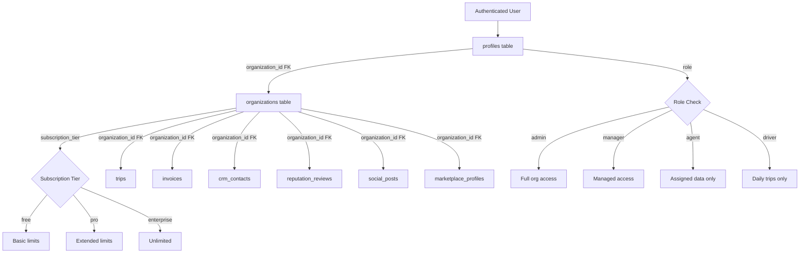
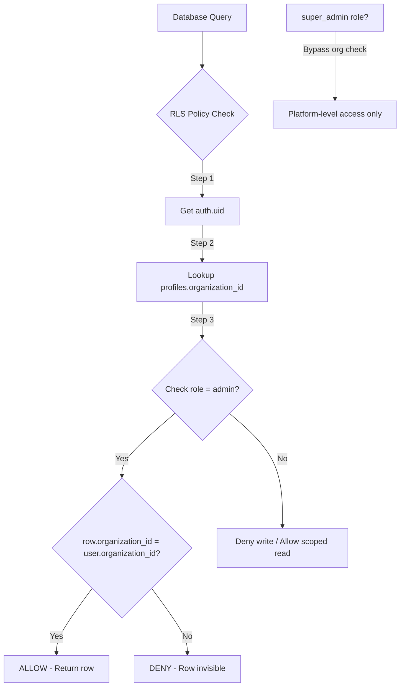

# Multi-Tenancy

TripBuilt uses organization-scoped multi-tenancy where each travel operator's data is isolated at the database level using PostgreSQL Row Level Security (RLS). The `organizations` table serves as the tenant boundary and every critical business table includes an `organization_id` foreign key.

## Organization Model

The `organizations` table is the root tenant entity:

| Column | Type | Description |
|--------|------|-------------|
| `id` | UUID (PK) | Tenant identifier |
| `name` | TEXT | Display name |
| `slug` | TEXT (UNIQUE) | URL-safe identifier |
| `logo_url` | TEXT | Brand logo |
| `primary_color` | TEXT | Brand color (default `#00d084`) |
| `itinerary_template` | TEXT | `safari_story` or `urban_brief` |
| `owner_id` | UUID (FK -> profiles) | Organization creator |
| `subscription_tier` | TEXT | `free`, `pro`, or `enterprise` |
| `ai_monthly_request_cap` | INTEGER | AI request limit (default 400) |
| `ai_monthly_spend_cap_usd` | NUMERIC | AI spend cap (default $25) |

RLS is enabled. Only the owner can SELECT and UPDATE their organization. Any authenticated user can INSERT (creating a new org with themselves as owner).

## User-Org Relationship

The `profiles` table links users to organizations via `profiles.organization_id`:

```
profiles.id             -> auth.users(id)    -- Supabase Auth identity
profiles.organization_id -> organizations(id) -- Tenant membership
profiles.role           -> 'admin' | 'super_admin' | 'manager' | 'driver' | 'staff'
```

A user belongs to exactly one organization. The `role` column determines their permissions within the org.

### Application-Level Roles

The `src/lib/team/roles.ts` module defines four team roles with granular permissions:

| Role | Key Permissions |
|------|----------------|
| **owner** | All permissions (billing, team management, all data) |
| **manager** | All trips, clients, revenue, proposals, drivers (no billing) |
| **agent** | Assigned trips/clients, proposals, WhatsApp |
| **driver** | Assigned trips only, daily view |

Role hierarchy for management: owner > manager > agent/driver. Managers can manage agents and drivers but not other managers.

## RLS Policy Patterns

### The `is_org_admin` Function

The core RLS primitive is a SQL function that checks whether the authenticated user is an admin within a specific organization:

```sql
CREATE OR REPLACE FUNCTION public.is_org_admin(target_org UUID)
RETURNS BOOLEAN
LANGUAGE sql STABLE SECURITY DEFINER
SET search_path = public
AS $$
    SELECT EXISTS (
        SELECT 1
        FROM public.profiles p
        WHERE p.id = auth.uid()
          AND p.role = 'admin'
          AND p.organization_id = target_org
    );
$$;
```

This function is `SECURITY DEFINER` (runs as the function owner, not the caller) and `STABLE` (can be cached within a transaction). It is used across all org-scoped RLS policies.

### SELECT Policies

Users can only read rows belonging to their organization:

```sql
CREATE POLICY "org_select" ON table_name
  FOR SELECT
  USING (organization_id = reputation_user_org_id());
  -- OR: USING (public.is_org_admin(organization_id))
```

Two patterns exist:
- **`reputation_user_org_id()`** -- Returns the caller's `organization_id` from profiles. Used on reputation tables to allow any org member to read.
- **`is_org_admin(organization_id)`** -- Restricts access to admin-role users within the org. Used on sensitive tables (social connections, invoices).

### INSERT / UPDATE Policies

Writes are scoped to the user's own org via `WITH CHECK`:

```sql
CREATE POLICY "org_insert" ON table_name
  FOR INSERT
  WITH CHECK (public.is_org_admin(organization_id));

CREATE POLICY "org_update" ON table_name
  FOR UPDATE
  USING (public.is_org_admin(organization_id))
  WITH CHECK (public.is_org_admin(organization_id));
```

### DELETE Policies

Deletions require admin role within the org:

```sql
CREATE POLICY "org_delete" ON table_name
  FOR DELETE
  USING (public.is_org_admin(organization_id));
```

## Subscription Tiers

| Tier | AI Cap | AI Spend | Marketplace | Social | Reputation |
|------|--------|----------|-------------|--------|------------|
| **free** | 400 req/mo | $25/mo | Basic listing | Limited | 50 reviews, 1 platform |
| **pro** | Higher | Higher | Verified listing | Full | Unlimited, 3 platforms |
| **enterprise** | Unlimited | Custom | Premium placement | Full + analytics | Unlimited, all platforms |

Tier limits are enforced at the application layer. The `organization_ai_usage` table tracks monthly consumption and the application checks caps before making AI API calls.

## Data Isolation

Every critical business table includes `organization_id` with a foreign key to `organizations(id) ON DELETE CASCADE`:

| Table Category | Tables |
|---------------|--------|
| **Core Business** | `trips`, `invoices`, `invoice_payments`, `clients` |
| **CRM** | `crm_contacts`, `workflow_stage_events`, `workflow_notification_rules` |
| **Proposals** | `proposals`, `proposal_tiers`, `proposal_add_ons` |
| **Drivers** | `external_drivers`, `trip_assignments` |
| **Reputation** | `reputation_reviews`, `reputation_snapshots`, `reputation_brand_voice`, `reputation_review_campaigns`, `reputation_campaign_sends`, `reputation_platform_connections`, `reputation_competitors`, `reputation_widgets` |
| **Social** | `social_posts`, `social_connections`, `social_post_queue`, `social_media_library`, `social_reviews` |
| **Marketplace** | `marketplace_profiles`, `marketplace_inquiries`, `marketplace_listing_subscriptions` |
| **Billing** | `subscriptions`, `payment_links` |
| **AI Usage** | `organization_ai_usage` |
| **Notifications** | `notification_queue`, `notification_logs` |
| **Settings** | `organization_settings` |

All these tables have RLS enabled and use `is_org_admin()` or `get_user_organization_id()` in their policies.

## Cross-Org Safety

Multiple layers prevent data leakage between organizations:

1. **RLS at the database level** -- Every query executed through the Supabase client (using the user's JWT) is filtered by RLS policies. Even if application code has a bug, the database will not return rows from another org.

2. **`FORCE ROW LEVEL SECURITY`** -- Critical tables use `FORCE` which ensures RLS applies even to table owners, preventing accidental bypass.

3. **API-layer validation** -- Server-side handlers extract `organization_id` from the authenticated user's profile and pass it to all queries, providing defense-in-depth.

4. **Self-inquiry prevention** -- The marketplace inquiry handler explicitly rejects `sender_org_id === target_org_id`.

5. **Service role client isolation** -- The admin client (`createAdminClient()`) bypasses RLS but is only used in server-side handlers that explicitly scope queries by `organization_id`.

## Super Admin Override

The `super_admin` role is a platform-level role (not org-scoped) that can access data across all organizations. It is used for platform operations (monitoring, support, compliance).

Super admin access is enforced via dedicated RLS policies:

```sql
CREATE POLICY "super_admin_all_platform_settings"
  ON platform_settings FOR ALL
  USING (
    EXISTS (
      SELECT 1 FROM profiles
      WHERE profiles.id = auth.uid()
        AND profiles.role = 'super_admin'
    )
  );
```

Platform-level tables accessible to super admins include `platform_settings`, `platform_announcements`, `platform_audit_log`, and `organization_ai_usage`.

The super admin role is assigned directly in the database (not through the application UI) to prevent privilege escalation.

## Team Management

Team management is handled through the `profiles` table and the role system:

1. **Adding members** -- An admin creates a Supabase Auth user and sets `profiles.organization_id` to their org. The new user's role is set based on their function (manager, agent, driver).

2. **Role assignment** -- The `canManageRole()` function enforces hierarchy: owners can assign any role, managers can only assign agent or driver roles.

3. **Removing members** -- Setting `profiles.organization_id` to `NULL` effectively removes a user from the org. RLS policies immediately prevent access to all org data.

4. **Permission checking** -- The `hasPermission(role, permission)` function checks whether a role has a specific permission (e.g., `view_all_trips`, `manage_billing`).




