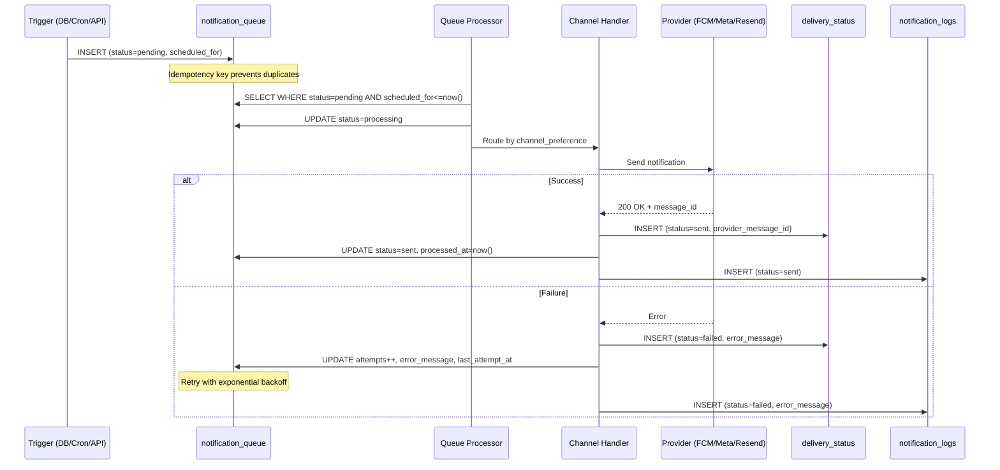
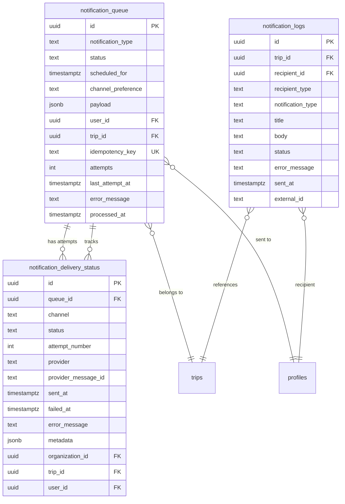

# Notification Pipeline

## Multi-Channel Architecture

TripBuilt delivers notifications across four channels, each with its own delivery mechanism:

| Channel | Provider | Implementation | Status |
|---------|----------|---------------|--------|
| **Push (FCM)** | Firebase Cloud Messaging V1 | Supabase Edge Function (`send-notification`) | Production |
| **WhatsApp** | Meta Cloud API (primary), WPPConnect (fallback) | `src/lib/whatsapp.server.ts` | Production |
| **Email** | Resend (React Email templates) | `src/lib/notifications.ts` via Supabase Edge Functions | Production |
| **SMS** | Channel preference in queue schema | Via `notification_queue.channel_preference` | Schema-ready |

The channel is selected based on the `channel_preference` field in the notification queue, the recipient's contact info (phone, email), and their notification preferences.

## Notification Queue

**Table:** `notification_queue`

The queue is the central scheduling table for all outbound notifications.

| Column | Type | Description |
|--------|------|-------------|
| `id` | uuid | Primary key |
| `notification_type` | text | Type identifier (e.g., `pickup_reminder`, `daily_briefing`) |
| `status` | text | `pending`, `processing`, `sent`, `failed` |
| `scheduled_for` | timestamptz | When to deliver (supports future scheduling) |
| `channel_preference` | text | Preferred channel (`whatsapp`, `email`, `push`, `sms`) |
| `payload` | jsonb | Notification content and template variables |
| `user_id` | uuid | FK to `profiles` -- the recipient |
| `trip_id` | uuid | FK to `trips` -- associated trip |
| `recipient_phone` | text | Phone number for WhatsApp/SMS |
| `recipient_email` | text | Email address |
| `recipient_type` | text | `client`, `driver`, `admin` |
| `idempotency_key` | text | Prevents duplicate sends |
| `attempts` | integer | Retry counter |
| `last_attempt_at` | timestamptz | Timestamp of last delivery attempt |
| `error_message` | text | Last error (for failed deliveries) |
| `processed_at` | timestamptz | When the notification was sent |

## Queue Processing

Notifications are processed by queue handler functions that:

1. Query `notification_queue` for rows with `status = 'pending'` and `scheduled_for <= now()`.
2. Set status to `processing` to prevent double-processing.
3. Route to the appropriate channel delivery function based on `channel_preference`.
4. On success: set `status = 'sent'`, record `processed_at`.
5. On failure: increment `attempts`, set `error_message`, potentially schedule retry.

## Channel Delivery

### Push Notifications (FCM)

**File:** `supabase/functions/send-notification/index.ts`

A Supabase Edge Function that sends push notifications via Firebase Cloud Messaging V1 API.

**Flow:**
1. Authenticates the caller via JWT (admin role required).
2. Looks up the user's active FCM tokens from `push_tokens` table.
3. Signs a JWT with the Firebase service account to get a Google OAuth2 access token.
4. Sends the notification to each active token via the FCM V1 HTTP API.
5. Deactivates invalid tokens (HTTP 404/400 from FCM).
6. Logs the result to `notification_logs`.

**Platform-specific config:**
- **Android:** `priority: "high"` for immediate delivery.
- **iOS (APNs):** `sound: "default"`, `badge: 1`.

### WhatsApp

**File:** `src/lib/whatsapp.server.ts`

Two implementations are supported (configured via environment variables):

| Mode | Detection | Env Vars |
|------|-----------|----------|
| Meta Cloud API (primary) | `WHATSAPP_API_TOKEN` is set | `WHATSAPP_API_TOKEN`, `WHATSAPP_PHONE_NUMBER_ID` |
| WPPConnect (fallback) | Only `WPPCONNECT_URL` is set | `WPPCONNECT_URL`, `WPPCONNECT_TOKEN` |

**Message formatting** is handled by shared helpers in `src/lib/notifications.shared.ts`:
- `formatDriverAssignmentMessage()` -- New trip assignment for drivers
- `formatDailyBriefingMessage()` -- Day-of briefing for clients
- `formatClientWhatsAppMessage()` -- General client updates

### Email (Resend)

Emails are sent via the Resend API with React Email templates for rich HTML formatting.

### Push (Server-side)

**File:** `src/lib/notifications.ts`

The `sendNotificationToUser()` function:
1. Invokes the `send-notification` Supabase Edge Function with FCM payload.
2. Logs the result to `notification_logs` table.

`sendNotificationToTripUsers()` wraps this to send to all users associated with a trip (currently sends to the trip's `client_id`).

## Delivery Tracking

**Table:** `notification_delivery_status`

Tracks individual delivery attempts per channel with granular status.

| Column | Type | Description |
|--------|------|-------------|
| `id` | uuid | Primary key |
| `queue_id` | uuid | FK to `notification_queue` |
| `channel` | text | Channel used (`whatsapp`, `email`, `push`, `sms`) |
| `status` | text | `sent`, `delivered`, `failed`, `bounced` |
| `attempt_number` | integer | Which attempt this was |
| `provider` | text | Provider name (e.g., `meta_cloud_api`, `resend`, `fcm`) |
| `provider_message_id` | text | External message ID from provider |
| `sent_at` | timestamptz | When the message was sent |
| `failed_at` | timestamptz | When the delivery failed |
| `error_message` | text | Error details |
| `metadata` | jsonb | Provider-specific metadata |
| `organization_id` | uuid | FK to `organizations` |
| `trip_id` | uuid | FK to `trips` |
| `user_id` | uuid | FK to `profiles` |
| `recipient_phone` | text | Recipient phone |
| `recipient_type` | text | `client`, `driver`, `admin` |
| `notification_type` | text | Mirrors the queue's notification type |

## Audit Log

**Table:** `notification_logs`

A simplified audit trail of all notification sends.

| Column | Type | Description |
|--------|------|-------------|
| `id` | uuid | Primary key |
| `trip_id` | uuid | FK to `trips` |
| `recipient_id` | uuid | FK to `profiles` |
| `recipient_type` | text | `client`, `driver` |
| `notification_type` | text | e.g., `trip_confirmed`, `pickup_reminder` |
| `title` | text | Notification title |
| `body` | text | Notification body |
| `status` | text | `sent`, `failed` |
| `error_message` | text | Error details (if failed) |
| `sent_at` | timestamptz | Delivery timestamp |
| `external_id` | text | Provider message ID |
| `recipient_phone` | text | Phone number |

## Trigger Types

| Notification Type | Trigger | Channel | Recipient |
|-------------------|---------|---------|-----------|
| `pickup_reminder` | Database trigger on `trip_driver_assignments` | WhatsApp | Driver |
| `daily_briefing` | Cron job (morning) | WhatsApp | Client |
| `trip_confirmed` | Trip status change | Push + Email | Client |
| `payment_reminder` | Invoice due date approaching | WhatsApp + Email | Client |
| `driver_assignment` | Driver assigned to trip day | WhatsApp | Driver |
| `trip_update` | Itinerary change | Push | Client |

## Auto-Triggers

### `queue_pickup_reminders_from_assignment()`

A PostgreSQL trigger function that fires on `INSERT` to the `trip_driver_assignments` table:

```sql
CREATE TRIGGER trg_queue_pickup_reminders
  AFTER INSERT ON public.trip_driver_assignments
  FOR EACH ROW
  EXECUTE FUNCTION public.queue_pickup_reminders_from_assignment();
```

When a driver is assigned to a trip day, this function automatically enqueues:
- A pickup reminder notification for the driver (with pickup time, location, client details).
- The notification is scheduled based on the trip day's pickup time.

## Retry Logic

Failed notifications follow an exponential backoff strategy:

1. **Attempt 1:** Immediate delivery.
2. **On failure:** Increment `attempts`, record `error_message` and `last_attempt_at`.
3. **Retry scheduling:** Back off exponentially (e.g., 1 min, 5 min, 30 min).
4. **Max retries:** After a configurable number of attempts, the notification is marked as permanently `failed`.
5. **Dead letter:** Failed notifications remain in the queue with `status = 'failed'` for manual review. The context engine surfaces them in the assistant's business snapshot.

## Template Variables

The `payload` JSONB column in `notification_queue` stores dynamic content:

```json
{
  "client_name": "Priya Sharma",
  "pickup_time": "09:00 AM",
  "pickup_location": "Taj Hotel, Mumbai",
  "driver_name": "Raju Singh",
  "driver_phone": "+919800000001",
  "activities": [
    { "title": "City Tour", "duration_minutes": 120 },
    { "title": "Gateway of India", "duration_minutes": 60 }
  ],
  "hotel_name": "Marriott Resort"
}
```

Template variables are interpolated by the channel-specific formatters (e.g., `formatDriverAssignmentMessage()`, `formatDailyBriefingMessage()`).

## Diagrams

### Notification Pipeline Sequence



### Notification Data Model


