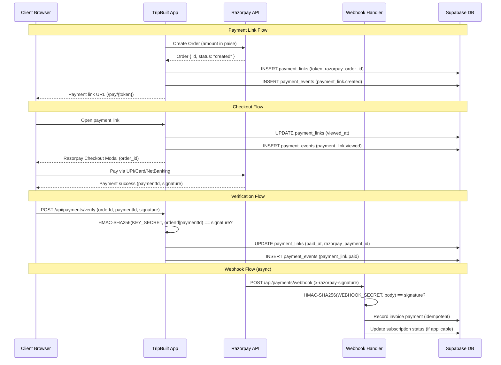
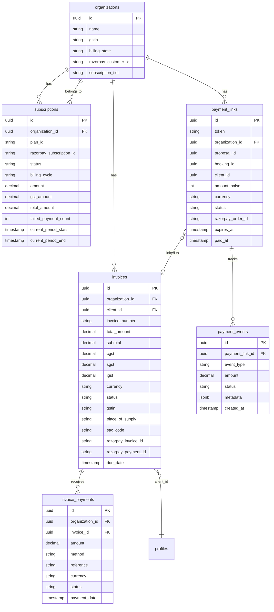

# Payment Flow

## Razorpay Integration Overview

TripBuilt uses Razorpay as the payment gateway, targeting the Indian market with INR as the primary currency. The integration supports:

- One-time payment orders (checkout modal)
- Payment links (shareable URLs with SMS/email notifications)
- Subscription management (monthly/annual billing)
- Invoice creation and payment recording
- Webhook-driven event processing

### Key Source Files

| File | Purpose |
|------|---------|
| `src/lib/payments/razorpay.ts` | Low-level Razorpay API client |
| `src/lib/payments/payment-service.ts` | Thin orchestrator composing all payment modules |
| `src/lib/payments/order-service.ts` | Order creation and webhook signature verification |
| `src/lib/payments/payment-links.server.ts` | Payment link CRUD, event tracking, Razorpay order integration |
| `src/lib/payments/payment-links.ts` | Shared types and URL builder |
| `src/lib/payments/webhook-handlers.ts` | Subscription charged and payment failed handlers |
| `src/lib/payments/invoice-service.ts` | Invoice creation with GST, payment recording |
| `src/lib/payments/subscription-service.ts` | Subscription lifecycle management |
| `src/lib/payments/customer-service.ts` | Razorpay customer creation/retrieval |

---

## Setup

### Environment Variables

| Variable | Purpose |
|----------|---------|
| `RAZORPAY_KEY_ID` | Razorpay API key ID (public) |
| `RAZORPAY_KEY_SECRET` | Razorpay API key secret (private) |
| `RAZORPAY_WEBHOOK_SECRET` | Webhook signature validation secret |

All Razorpay API calls use Basic Auth (`keyId:keySecret` base64-encoded). Credentials are accessed through `env.razorpay.*` from the centralized config module.

---

## Order Creation

Orders are created via `createOrder(amount, currency, organizationId, notes, receipt)`:

- **Amount**: In the main currency unit (e.g., rupees). Converted to paise internally (`amount * 100`).
- **Currency**: Defaults to `INR`, also supports `USD`.
- **Receipt**: Auto-generated as `rcpt_{timestamp}` if not provided.
- **Notes**: Attached to the Razorpay order for traceability (always includes `organization_id`).

The order creation uses `fetchWithRetry` with 2 retries, 9s timeout, and 300ms base delay.

### Order Statuses

| Status | Meaning |
|--------|---------|
| `created` | Order created, awaiting payment |
| `attempted` | Payment attempted but not completed |
| `paid` | Payment captured successfully |

---

## Payment Links

Payment links are shareable URLs that allow clients to pay without logging in.

### Creation Flow

1. A Razorpay order is created for the link amount
2. A `payment_links` record is inserted with a unique `token` (UUID without dashes)
3. A `payment_events` record is created with type `payment_link.created`
4. The link URL is built as `{APP_URL}/pay/{token}`

### Link Properties

| Field | Description |
|-------|-------------|
| `amount_paise` | Amount in paise (integer) |
| `currency` | `INR` or `USD` |
| `expires_at` | Default 7 days, configurable via `expiresInHours` |
| `status` | `pending` -> `viewed` -> `paid` / `expired` / `cancelled` |
| `razorpay_order_id` | Linked Razorpay order |
| `proposal_id`, `booking_id`, `client_id` | Optional entity associations |

### Event Tracking

Events are stored in the `payment_events` table with type prefix `payment_link.`:

| Event | Trigger |
|-------|---------|
| `created` | Link created |
| `sent` | Link sent to client |
| `viewed` | Client opens the link |
| `reminder_sent` | Reminder notification sent |
| `paid` | Payment captured (must come through verified webhook) |
| `expired` | Link expired (checked on access or by cleanup) |
| `cancelled` | Link manually cancelled |

**Security**: The `paid` and `cancelled` events require `_callerVerified: true`, enforcing that these transitions only come through signature-verified webhook handlers.

### Auto-Expiry

When a link is accessed, `expireIfNeeded()` checks if `expires_at` has passed and automatically transitions the status to `expired`.

---

## Client-Side Checkout

The Razorpay checkout modal is opened client-side with:

- `RAZORPAY_KEY_ID` (public key)
- `order_id` from the created Razorpay order
- Amount and currency
- UPI support (standard for Indian payments)

### Payment Verification

After client-side checkout completes, the payment signature is verified server-side via `verifyRazorpayPaymentSignature(orderId, paymentId, signature)`:

```
HMAC-SHA256(RAZORPAY_KEY_SECRET, "{orderId}|{paymentId}")
```

The signature comparison uses `crypto.timingSafeEqual()` with a length check.

---

## Webhook Processing

### Signature Validation

Incoming webhooks are validated via `verifyWebhookSignature(body, signature)`:

```
HMAC-SHA256(RAZORPAY_WEBHOOK_SECRET, raw_body)
```

Uses `crypto.timingSafeEqual()` for timing-safe comparison.

### Event Handlers

#### `subscription.charged`

When a subscription payment succeeds:

1. Look up the subscription by `razorpay_subscription_id`
2. Update subscription status to `active`, reset `failed_payment_count` to 0
3. Set `current_period_start` to now and `current_period_end` based on billing cycle (30 or 365 days)
4. Create an invoice for the payment amount
5. Log a `subscription.charged` payment event

#### `payment.failed`

When a payment fails:

1. If linked to a subscription, increment `failed_payment_count`
2. If `failed_payment_count >= 3`, pause the subscription and notify the organization
3. Log a `payment.failed` payment event with error code and description

### Idempotency

Payment recording checks for existing payments by `reference` (Razorpay payment ID) before inserting. If a payment with the same reference already exists, the operation is silently skipped.

---

## Invoice Integration

Invoices are created automatically during subscription charges and can also be created manually.

### Invoice Creation

`createInvoice(options)`:

1. Fetch organization details (name, GSTIN, billing state)
2. Calculate GST based on company state vs. place of supply
3. Create a Razorpay invoice with line items (amounts in paise)
4. Insert into `invoices` table with GST breakdown (CGST, SGST, IGST)
5. Attempt e-invoice generation if auto-generate is enabled and amount meets threshold
6. Log an `invoice.created` payment event

### Payment Recording

`recordPayment(options)`:

1. Check for duplicate payment by `reference` (Razorpay payment ID)
2. Fetch the Razorpay payment details
3. Insert into `invoice_payments` table
4. Update invoice status: `paid` if amount >= total, otherwise `partially_paid`
5. Log a `payment.success` event

---

## Subscription Management

### Create Subscription

`createSubscription(options)`:

1. Fetch organization billing state
2. Ensure Razorpay customer exists (create if needed)
3. Calculate GST on the subscription amount
4. Create Razorpay subscription with plan ID
5. Insert into `subscriptions` table with status `incomplete`
6. Log `subscription.created` event

### Cancel Subscription

`cancelSubscription(subscriptionId, cancelAtPeriodEnd)`:

- **cancelAtPeriodEnd = true**: Sets `cancel_at_period_end` flag, subscription remains active until period ends
- **cancelAtPeriodEnd = false**: Immediately cancels with `status: "cancelled"` and `cancelled_at` timestamp

Both paths also cancel the Razorpay subscription.

### Tier Limit Enforcement

`checkTierLimit(organizationId, feature, limit)` checks if an organization can use a feature based on their subscription tier. Supported features: `clients`, `trips`, `proposals`, `users`.

### Subscription Statuses

| Status | Meaning |
|--------|---------|
| `incomplete` | Created but first payment not received |
| `active` | Payment received, subscription running |
| `trialing` | In trial period |
| `paused` | Paused due to payment failures (>= 3) |
| `past_due` | Payment overdue |
| `cancelled` | Manually cancelled |

---

## GST Support

### Customer GSTIN

- Stored on the `organizations` table (`gstin` column)
- Passed to Razorpay when creating customers (`razorpay.customers.create({ gstin })`)
- Included in invoice records

### Tax Calculation

GST is calculated via `calculateGST(amount, companyState, customerState)`:

- **Intra-state** (company and customer in same state): Split into CGST + SGST (50/50)
- **Inter-state** (different states): Full IGST
- Company state defaults to a configured value when billing state is not set

### SAC Code

Invoices use SAC code `998314` (tour operator services) by default.

### E-Invoicing

When `e_invoice_settings.auto_generate_enabled` is true for an organization and the invoice amount meets the configured threshold, e-invoice generation is triggered via `registerEInvoice()`. Failures are logged but do not block invoice creation.

---

## Complete Payment Flow



## Invoice-Payment Relationship


