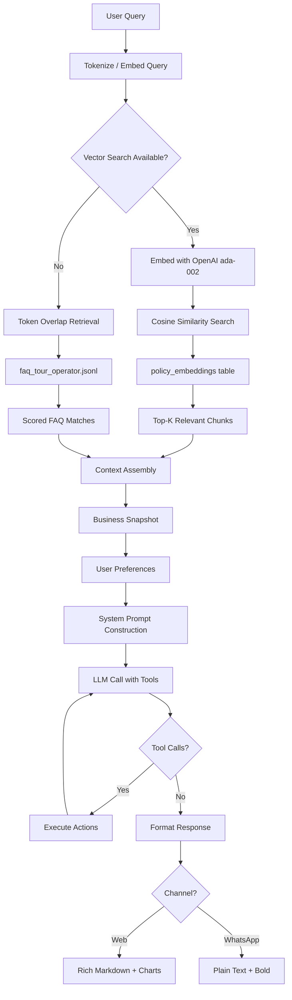
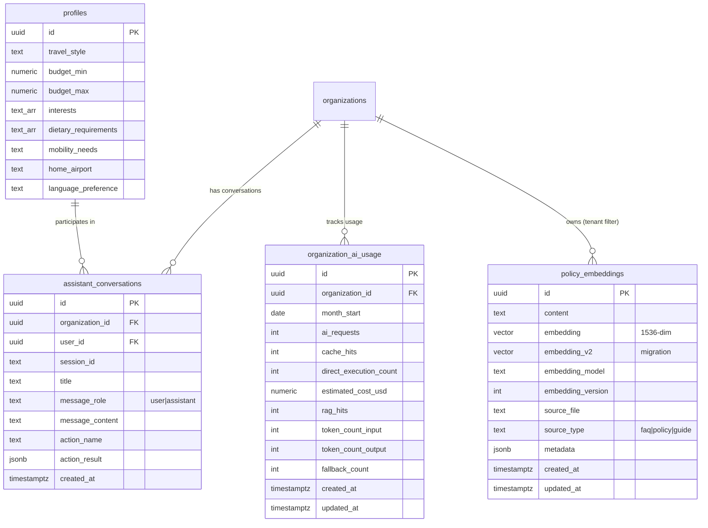

# RAG Assistant

## Architecture

The TripBuilt RAG assistant is a multi-tenant retrieval-augmented generation system designed for tour operators. It combines three layers of knowledge:

1. **Global product FAQs** -- Shared documentation about TripBuilt features and tour operator best practices.
2. **Tenant-specific policies** -- Per-operator documents stored as vector embeddings in `policy_embeddings`.
3. **Live business data** -- Real-time snapshots from the Context Engine (trips, invoices, clients, notifications).

The RAG system is implemented across two codebases:

| Component | Location | Purpose |
|-----------|----------|---------|
| Main orchestrator | `apps/web/src/lib/assistant/orchestrator.ts` | Production assistant with FAQ fallback and context engine |
| RAG starter kit | `apps/rag-assistant/` | Blueprint and reference implementation for the full RAG pipeline |
| Python agents | `apps/agents/` | FastAPI service with support bot using knowledge base retrieval |

## Vector Embeddings

**Table:** `policy_embeddings`

Stores document chunks as vector embeddings for semantic search.

| Column | Type | Description |
|--------|------|-------------|
| `id` | uuid | Primary key |
| `content` | text | The original text chunk |
| `embedding` | vector | OpenAI embedding (1536-dim, text-embedding-ada-002) |
| `embedding_v2` | vector | Updated embedding (migration path) |
| `embedding_model` | text | Model used to generate the embedding |
| `embedding_version` | integer | Version number for re-embedding tracking |
| `source_file` | text | Origin filename (e.g., `cancellation_policy.md`) |
| `source_type` | text | Document category (`faq`, `policy`, `guide`) |
| `metadata` | jsonb | Additional context (section, page, tags) |
| `created_at` | timestamptz | Ingestion timestamp |
| `updated_at` | timestamptz | Last update |

### Embedding Pipeline

1. Documents are chunked into segments suitable for embedding.
2. Each chunk is embedded using OpenAI's `text-embedding-ada-002` model (1536 dimensions).
3. Embeddings are stored in the `policy_embeddings` table with pgvector.
4. An IVFFlat index enables fast approximate nearest-neighbor search.

## Knowledge Base

### FAQ Ingestion

The primary knowledge base is a JSONL file at `apps/rag-assistant/faq/faq_tour_operator.jsonl`. Each line is a JSON object:

```json
{
  "id": "faq-001",
  "question": "How do I create a trip?",
  "answer": "Navigate to the Trips page and click 'New Trip'...",
  "category": "trips",
  "source": "TripBuilt Help Center"
}
```

The FAQ file covers tour operator workflows: trip creation, client management, invoicing, driver assignment, notifications, and platform features.

### FAQ Retrieval (Token Overlap)

The current production implementation uses a lightweight token-overlap approach (not vector search) for FAQ retrieval:

1. **Tokenize** the query into lowercase alphanumeric words.
2. **Score** each FAQ entry by counting overlapping tokens between the query and the FAQ's question + answer.
3. **Rank** by overlap score and return the top 3 matches.
4. **Inject** matched FAQ entries into the system prompt as context.

This approach is used as the **fallback** when the LLM produces an empty or weak response.

### Policy Documents

Operator-specific policies, terms, and guides are stored as embeddings in `policy_embeddings` for semantic search.

### Destination Guides

Travel-specific content (destination info, visa requirements, seasonal recommendations) can be ingested as policy embeddings with `source_type = 'guide'`.

## Semantic Search

### Query Flow

1. **Embed the query** -- Convert the user's question into a 1536-dim vector using OpenAI.
2. **Vector search** -- Query `policy_embeddings` using pgvector's cosine similarity operator (`<=>`) with an IVFFlat index.
3. **Rank results** -- Sort by similarity score, filter by threshold.
4. **Assemble context** -- Concatenate the top-K relevant chunks into the system prompt.
5. **Generate response** -- Send the enriched prompt to the LLM.

### Index Configuration

- **Type:** IVFFlat (Inverted File Index with Flat quantization)
- **Distance metric:** Cosine similarity
- **Dimensions:** 1536 (OpenAI ada-002)

## System Prompt

**File:** `apps/rag-assistant/prompts/system_prompt.md`

The system prompt defines the assistant's behavior:

### Core Rules

- Always answer using retrieved facts from approved sources.
- Never guess numbers, dates, prices, or client details.
- Never expose data from another organization.
- If source confidence is low, say so clearly.

### Channel-Specific Style

- **Web chat:** Concise with bullet points when useful.
- **WhatsApp:** Short messages, easy to scan, one action at a time.

### Action Safety

- For updates (price, stage, assignment), do not execute immediately.
- First summarize what will change.
- Ask explicit confirmation.
- Execute only after clear confirmation.
- After execution, confirm what changed.

### Tone

Friendly and direct, non-technical words, show next action in one line.

## Chat Action Schema

**File:** `apps/rag-assistant/schemas/chat_action.schema.json`

Defines the JSON structure for all chat-initiated actions:

```json
{
  "organization_id": "uuid",
  "channel": "web | whatsapp",
  "action": "get_pending_items | get_client_stage_summary | get_trip_status | update_itinerary_price | move_client_stage | assign_driver",
  "requested_by": { "user_id": "uuid", "display_name": "string" },
  "target": { "trip_id": "uuid", "client_id": "uuid", ... },
  "updates": { "price": 1800, "currency": "USD", ... },
  "confirmation": { "confirmed": true, "confirmation_text": "Yes, update it" }
}
```

Every action requires:
- `organization_id` -- Tenant boundary
- `channel` -- Where the request originated
- `confirmation` -- Explicit user confirmation before execution

## Channel Support

Both channels use the same orchestration flow:

| Feature | Web Chat | WhatsApp |
|---------|----------|----------|
| RAG retrieval | Full context + citations | Same retrieval, shorter response |
| Actions | Confirm/Cancel buttons | "Reply YES / NO" text prompt |
| Rich formatting | Markdown, charts, links | WhatsApp bold/italic only |
| Session persistence | In-memory + API | `assistant_sessions` table |

## Tenant Isolation

Multi-tenant isolation is enforced at every layer:

| Layer | Isolation Mechanism |
|-------|-------------------|
| **Vector retrieval** | `organization_id` filter on all embedding queries |
| **Business data** | Context Engine queries scoped by `organization_id` |
| **Conversation history** | Scoped by `organization_id` + `user_id` |
| **Action execution** | `ActionContext` contains `organizationId`, all DB queries filter by it |
| **Audit logging** | Every event includes `organization_id` and `user_id` |
| **Usage metering** | Per-org counters in `organization_ai_usage` |

## User Preference Learning

User preferences are tracked in the `profiles` table (not a separate `user_preferences` table):

| Field | Type | Description |
|-------|------|-------------|
| `travel_style` | text | luxury, budget, adventure, family, honeymoon, etc. |
| `budget_min` / `budget_max` | numeric | Budget range in local currency |
| `interests` | text[] | Array: beach, trekking, heritage, etc. |
| `dietary_requirements` | text[] | Dietary restrictions |
| `mobility_needs` | text | Accessibility requirements |
| `home_airport` | text | IATA code for preferred departure airport |
| `language_preference` | text | Preferred response language |

The assistant's preferences module (`src/lib/assistant/preferences.ts`) reads these fields to personalize responses. The `buildPreferencesBlock()` function appends user preferences to the system prompt so the LLM can tailor its recommendations.

## Usage Caps

**Table:** `organization_ai_usage`

| Column | Type | Description |
|--------|------|-------------|
| `organization_id` | uuid | FK to organizations |
| `month_start` | date | First day of billing month |
| `ai_requests` | integer | Total AI requests this month |
| `cache_hits` | integer | Requests served from cache |
| `direct_execution_count` | integer | Zero-cost pattern matches |
| `estimated_cost_usd` | numeric | Estimated LLM cost |
| `rag_hits` | integer | RAG-answered requests |
| `token_count_input` | integer | Total input tokens consumed |
| `token_count_output` | integer | Total output tokens consumed |
| `fallback_count` | integer | FAQ fallback triggers |

### Default Limits

Limits are defined per billing plan. The default (free) plan cap is approximately 400 requests/month with an estimated $25 USD cost ceiling. Enterprise plans have higher or unlimited caps.

### Enforcement

1. **Redis fast path** -- Usage counter checked in Redis before every LLM call.
2. **DB fallback** -- If Redis is unavailable, reads from `organization_ai_usage`.
3. **Fail open** -- If metering itself fails, the request is allowed (never block on metering errors).
4. **Periodic flush** -- Redis counters are flushed to the database every 10 increments.

## Diagrams

### RAG Pipeline



### AI/RAG Data Model


