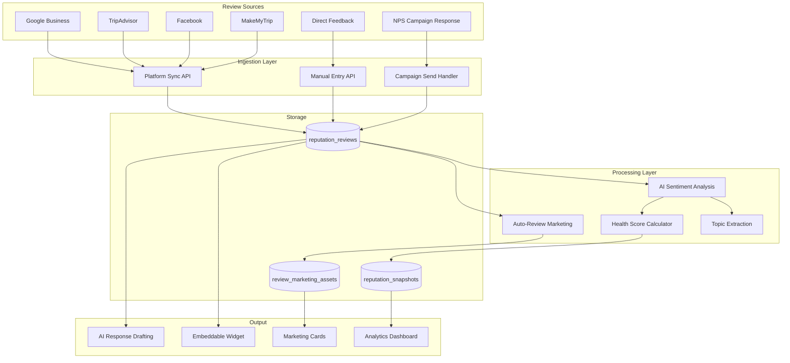
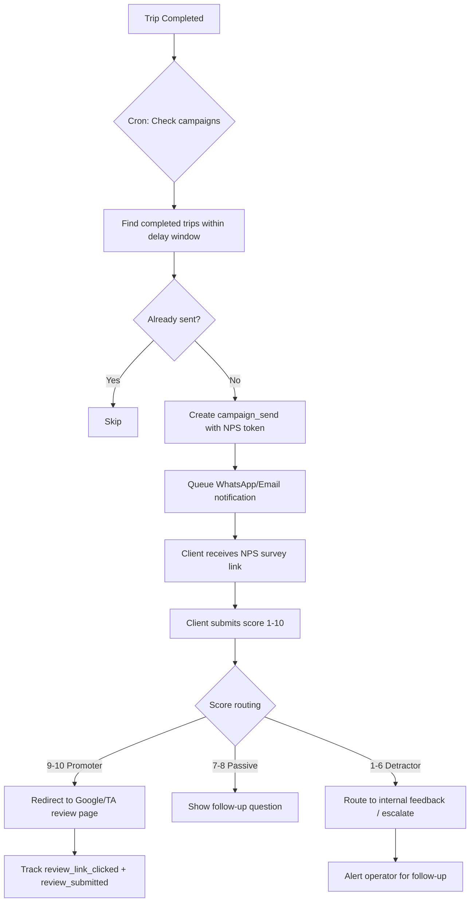

# Reputation Management

TripBuilt's reputation management system helps travel operators aggregate reviews from multiple platforms, analyze sentiment with AI, run NPS campaigns, and embed review widgets on their websites. The system is built across five phases with dedicated database tables, API endpoints, and a tiered feature set.

## Overview

The reputation module provides:
- **Review aggregation** from Google, TripAdvisor, Facebook, MakeMyTrip, and direct internal feedback
- **AI-powered sentiment analysis** that classifies reviews into topics and generates suggested responses
- **NPS campaigns** triggered automatically after trip completion or manually
- **Embeddable review widgets** for operator websites
- **Health score tracking** with daily snapshots for trend analysis
- **Competitor benchmarking** (enterprise tier)

## Review Collection

Reviews enter the system through three channels:

### Direct / Manual Entry
Operators manually add reviews via the dashboard API (`POST /api/reputation/reviews`). Each review includes platform, reviewer name, rating (1-5), optional comment, and can be linked to a trip or client.

### Platform Sync
Platform connections (`reputation_platform_connections` table) store encrypted OAuth tokens for Google Business, TripAdvisor, Facebook, and MakeMyTrip. The sync handler (`/api/reputation/sync`) pulls new reviews using platform-specific APIs with cursor-based pagination (`sync_cursor` column) to avoid re-fetching.

### Automated Campaign Collection
NPS campaigns send review requests to clients after trips. When a client responds with a high NPS score (promoter), they are routed to leave a public review on the operator's preferred platform.

### Review Data Model

Key fields on `reputation_reviews`:
- `platform` -- Source platform (google, tripadvisor, facebook, makemytrip, internal)
- `platform_review_id` -- Deduplication key (unique per org+platform+review_id)
- `rating` -- 1-5 integer rating
- `sentiment_score` -- AI-computed score from -1.0 to 1.0
- `sentiment_label` -- Derived classification: positive, neutral, negative
- `ai_topics` -- Array of detected topics (hotel_quality, transport, food, etc.)
- `response_status` -- Workflow state: pending, draft, responded, not_needed
- `requires_attention` -- Flag for reviews needing urgent operator action

## Sentiment Analysis

The AI analysis endpoint (`POST /api/reputation/ai/analyze`) processes reviews and returns:

```typescript
interface AIAnalysisResult {
  sentiment_score: number;      // -1.0 to 1.0
  sentiment_label: SentimentLabel; // positive | neutral | negative
  topics: AIReviewTopic[];      // Up to 15 topic categories
  summary: string;              // Brief AI summary
  requires_attention: boolean;  // Escalation flag
  attention_reason: string | null;
}
```

**Sentiment thresholds** (from `constants.ts`):
- Score >= 0.2 = positive
- Score <= -0.2 = negative
- Between = neutral

**15 tracked topics**: hotel_quality, transport, driver_behavior, food, itinerary_planning, value_for_money, guide_quality, safety, communication, booking_process, weather, cleanliness, punctuality, flexibility, local_experience.

Batch analysis is available via `POST /api/reputation/ai/batch-analyze` for processing multiple reviews at once.

## NPS Campaigns

Campaigns are configured in `reputation_review_campaigns` and operate on a trigger-based model:

### Campaign Types
| Type | Description |
|------|-------------|
| `post_trip` | Sent after trip completion |
| `mid_trip_checkin` | Sent during the trip (day 2) |
| `manual_blast` | Manually triggered by operator |
| `nps_survey` | Standalone NPS survey |

### Campaign Flow

1. **Trigger** -- The cron handler (`/api/cron/reputation-campaigns`) runs `triggerCampaignSendsForOrg()` which finds completed trips within the trigger delay window.
2. **Send Creation** -- A `reputation_campaign_sends` row is created for each eligible trip-client pair with a unique `nps_token` (valid for 7 days).
3. **Notification** -- Messages are queued in `notification_queue` via WhatsApp and/or email (based on `channel_sequence`).
4. **NPS Submission** -- Client visits `/reputation/nps/{token}` and submits a score (1-10) with optional feedback via `POST /api/reputation/nps/submit`.
5. **Routing** -- Based on the score:
   - **Promoters (score >= 9)**: Redirected to leave a public review (`promoter_action` config: google_review_link, tripadvisor_link, etc.)
   - **Passives (7-8)**: Follow-up question
   - **Detractors (1-6)**: Routed to internal feedback or escalated to owner (`detractor_action` config)

### Deduplication
The campaign trigger checks `reputation_campaign_sends` for existing sends matching the same campaign+trip pair before creating new ones.

### Stats Tracking
Each campaign tracks: `stats_sent`, `stats_opened`, `stats_completed`, `stats_reviews_generated`. The funnel conversion rate is calculated as `stats_reviews_generated / stats_sent`.

## Review Widget

Operators can create embeddable review widgets via the widget API (`/api/reputation/widget/config`). Each widget has:

| Property | Options |
|----------|---------|
| `widget_type` | carousel, grid, badge, floating, wall |
| `theme` | light, dark, auto |
| `accent_color` | Custom hex color |
| `min_rating_to_show` | Filter reviews below threshold |
| `max_reviews` | Limit displayed reviews |
| `platforms_filter` | Show only specific platforms |
| `destinations_filter` | Show only specific destinations |
| `show_branding` | TripBuilt attribution toggle |

Widgets are accessed publicly via `GET /api/reputation/widget/{embed_token}` using the unique `embed_token`. RLS allows anonymous access to active widgets and featured reviews.

## Analytics Dashboard

The dashboard endpoint (`GET /api/reputation/dashboard`) returns a comprehensive `ReputationDashboardData` object:

- **Overall metrics**: average rating, total reviews, response rate, NPS score
- **Health score** (0-100): Weighted composite of 5 factors:
  - Average rating (40%)
  - Response rate (20%)
  - Average response time (15%)
  - Review velocity (15%)
  - Sentiment ratio (10%)
- **Platform breakdown**: Per-platform rating and count
- **Rating distribution**: Count per star level (1-5)
- **Sentiment breakdown**: positive/neutral/negative counts
- **Trend data**: Daily snapshots for charting over time
- **Attention count**: Reviews flagged for urgent response

Health score labels: Excellent (80+), Good (60-79), Average (40-59), Needs Work (20-39), Critical (0-19).

Analytics snapshots are stored daily in `reputation_snapshots` for historical trend analysis (`/api/reputation/analytics/trends`).

Topic analysis is available via `/api/reputation/analytics/topics`.

## Review Response

AI-assisted response drafting is available via `POST /api/reputation/ai/respond`:

```typescript
interface AIResponseResult {
  suggested_response: string;
  tone_used: BrandVoiceTone; // professional_warm | casual_friendly | formal | luxury
  language: string;          // en | hi | mixed
}
```

The response is generated using the operator's **brand voice** configuration (`reputation_brand_voice` table):
- Tone preference
- Language preference (English, Hindi, or mixed)
- Owner name and sign-off
- Key phrases to include / phrases to avoid
- Sample responses for tone calibration
- Auto-respond settings (automatic response for reviews above a minimum rating)
- Escalation threshold (reviews below this rating trigger operator alerts)

### Auto-Review Marketing

The `auto-review-processor.server.ts` module automatically generates marketing assets from 5-star reviews with comments. When a new eligible review arrives:
1. Check eligibility (5-star rating, has comment, no existing asset)
2. Generate a visual marketing card via `ensureReviewMarketingAsset()`
3. Notify the operator that a marketing card is ready to publish

This is accessible per-review at `POST /api/reputation/reviews/{id}/marketing-asset`.

## Campaign Management

Campaigns are managed through the campaign API endpoints:

| Endpoint | Method | Description |
|----------|--------|-------------|
| `/api/reputation/campaigns` | GET | List all campaigns |
| `/api/reputation/campaigns` | POST | Create new campaign |
| `/api/reputation/campaigns/{id}` | GET | Get campaign details |
| `/api/reputation/campaigns/{id}` | PATCH | Update campaign |
| `/api/reputation/campaigns/{id}` | DELETE | Archive campaign |
| `/api/reputation/campaigns/trigger` | POST | Manually trigger campaign sends |

## Tier Limits

Feature access is gated by the organization's subscription tier:

| Feature | Free | Pro | Enterprise |
|---------|------|-----|------------|
| Max reviews | 50 | Unlimited | Unlimited |
| Platform connections | 1 | 3 | Unlimited |
| AI responses/month | 5 | 100 | Unlimited |
| Active campaigns | 1 | 5 | Unlimited |
| Widgets | 1 | 3 | Unlimited |
| Sentiment analysis | No | Yes | Yes |
| Mid-trip check-in | No | Yes | Yes |
| Auto-responses | No | Yes | Yes |
| Competitor tracking | No | No | Yes |
| White-label widget | No | No | Yes |

## API Endpoints

All reputation endpoints are served through the catch-all dispatcher at `/api/reputation/[...path]/route.ts`:

| Path | Methods | Description |
|------|---------|-------------|
| `/reputation/dashboard` | GET | Dashboard metrics |
| `/reputation/reviews` | GET, POST | List and create reviews |
| `/reputation/reviews/{id}` | GET, PATCH, DELETE | Manage single review |
| `/reputation/reviews/{id}/marketing-asset` | POST | Generate marketing card |
| `/reputation/ai/analyze` | POST | AI sentiment analysis |
| `/reputation/ai/batch-analyze` | POST | Batch AI analysis |
| `/reputation/ai/respond` | POST | AI response drafting |
| `/reputation/brand-voice` | GET, PUT | Brand voice settings |
| `/reputation/campaigns` | GET, POST | Campaign management |
| `/reputation/campaigns/{id}` | GET, PATCH, DELETE | Single campaign |
| `/reputation/campaigns/trigger` | POST | Manual campaign trigger |
| `/reputation/connections` | GET, POST, DELETE | Platform connections |
| `/reputation/nps/{token}` | GET | NPS survey page data |
| `/reputation/nps/submit` | POST | NPS score submission |
| `/reputation/widget/{token}` | GET | Public widget data |
| `/reputation/widget/config` | GET, POST, PUT | Widget configuration |
| `/reputation/analytics/snapshot` | POST | Generate daily snapshot |
| `/reputation/analytics/trends` | GET | Historical trend data |
| `/reputation/analytics/topics` | GET | Topic analysis |
| `/reputation/sync` | POST | Sync reviews from platforms |
| `/reputation/process-auto-reviews` | POST | Process eligible reviews for marketing |

Cron: `/api/cron/reputation-campaigns` runs campaign triggers on a schedule.




