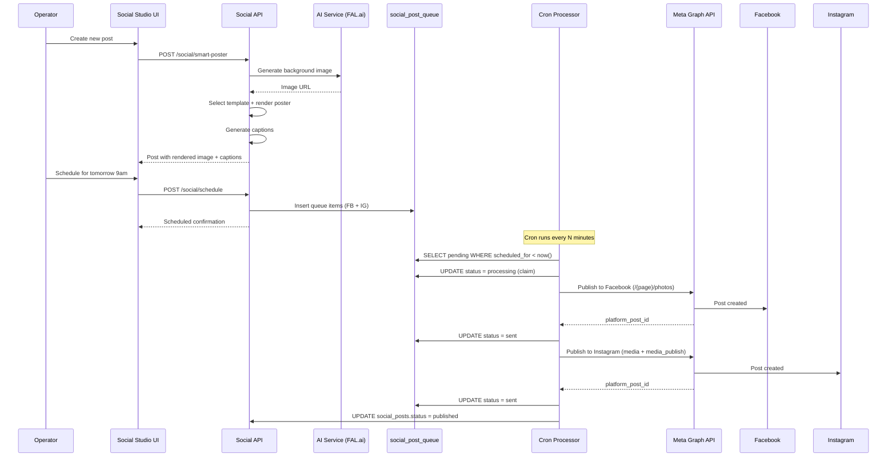
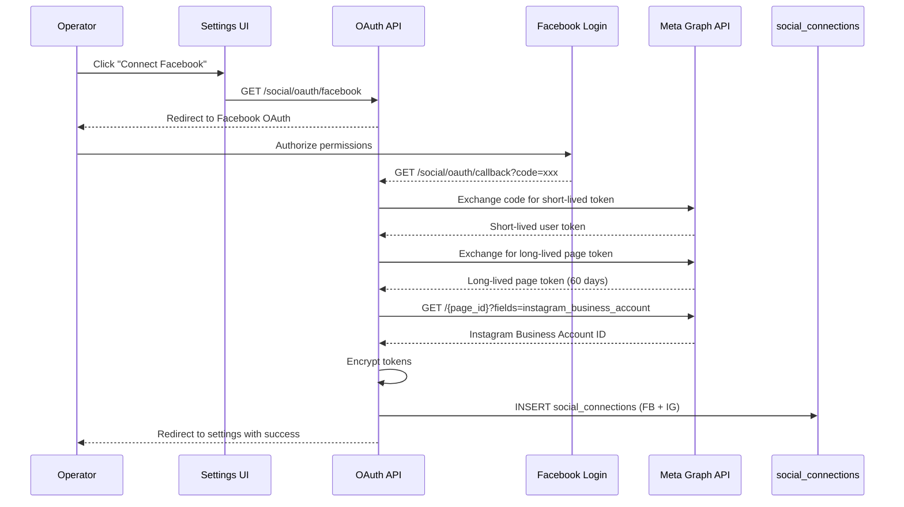

# Social Media Management

TripBuilt's Social Studio enables travel operators to create, schedule, and publish social media posts to Facebook and Instagram through the Meta Graph API. The system includes AI-powered poster generation, a template engine with 25+ layout types, and a queue-based publishing pipeline with retry logic.

## Overview

The social media module provides:
- **Platform connections** via Facebook/Instagram OAuth (Meta Graph API v20.0)
- **AI-powered poster creation** using FAL.ai Flux models for travel-specific backgrounds
- **Template-based design** with 25+ layout types across 8 categories
- **Queue-based publishing** with automatic retry and exponential backoff
- **Engagement analytics** via Meta Insights API (impressions, reach, engagement)
- **Media library** for reusable images and assets
- **Content calendar** for scheduling posts

## Platform Connections

Social accounts are stored in the `social_connections` table:

| Column | Description |
|--------|-------------|
| `platform` | Platform identifier (facebook, instagram) |
| `platform_page_id` | Facebook Page ID or Instagram Business Account ID |
| `access_token_encrypted` | AES-encrypted long-lived page token |
| `token_expires_at` | Token expiry timestamp |
| `refresh_token_encrypted` | Encrypted refresh token |

RLS ensures connections are scoped to the user's organization via `is_org_admin(organization_id)`.

### OAuth Flow

Connection is established through Facebook Login for Business:

1. **Initiate** -- Operator clicks "Connect Facebook" in the Social Studio dashboard
2. **Redirect** -- `GET /api/social/oauth/facebook` redirects to Facebook OAuth with required permissions (`pages_show_list`, `pages_read_engagement`, `pages_manage_posts`, `instagram_basic`, `instagram_content_publish`)
3. **Callback** -- `GET /api/social/oauth/callback` receives the authorization code, exchanges it for a short-lived user token
4. **Token Exchange** -- The short-lived token is exchanged for a long-lived page access token (60-day validity)
5. **Instagram Discovery** -- If the Facebook Page has a linked Instagram Business Account, `getInstagramBusinessAccount()` fetches the IG user ID
6. **Storage** -- Tokens are encrypted via `encryptSocialToken()` and stored in `social_connections`

Google Business and LinkedIn OAuth endpoints also exist at `/api/social/oauth/google` and `/api/social/oauth/linkedin`.

Token refresh is handled by `/api/social/refresh-tokens`.

### Error Detection

The Meta Graph API client (`meta-graph-api.server.ts`) classifies errors:
- **Token expired** (code 190, subcode 463/467) -- prompts reconnection
- **Rate limit** (code 4/17/32) -- triggers backoff
- **Permission denied** (code 200/10) -- prompts re-authorization

## Post Creation

Posts are stored in the `social_posts` table:

| Column | Description |
|--------|-------------|
| `template_id` | Reference to the template used |
| `template_data` | JSONB with template field values |
| `caption_instagram` | Platform-specific caption (max 2200 chars) |
| `caption_facebook` | Platform-specific caption (max 5000 chars) |
| `hashtags` | Generated hashtags |
| `rendered_image_url` | Primary rendered poster URL |
| `rendered_image_urls` | Array of URLs for carousel posts |
| `status` | draft, ready, scheduled, publishing, published, failed |
| `source` | manual, ai_generated, auto_review, auto_festival, itinerary |

Posts are created via `POST /api/social/posts` and rendered via `POST /api/social/posts/{id}/render`.

## Smart Poster

The Smart Poster feature (`POST /api/social/smart-poster`) uses AI to generate complete social media posts:

1. **Template Selection** -- `selectBestTemplate()` matches content (destination, season, offer type) to the best template from the registry using keyword-to-category mapping and style-to-layout preferences.

2. **AI Background Generation** -- FAL.ai Flux models generate destination-specific backgrounds using engineered prompts from `ai-prompts.ts`. The system includes visual hints for 15+ destinations (Maldives, Dubai, Bali, Paris, etc.) and 8 photographic styles:
   - cinematic, editorial, vibrant, luxury, tropical, dramatic, heritage, minimal

3. **Caption Generation** -- AI generates platform-specific captions via `POST /api/social/captions`.

4. **Poster Rendering** -- The server-side renderer (`poster-renderer.ts`) composites the background image with template overlays, text, and branding.

### Template System

Templates are defined in `template-registry.ts` with these properties:

| Property | Description |
|----------|-------------|
| `category` | Festival, Season, Destination, Package Type, Promotion, Review, Informational, Carousel |
| `layout` | 25+ layout types (CenterLayout, SplitLayout, WaveDividerLayout, etc.) |
| `tier` | Starter, Pro, Business, Enterprise |
| `aspectRatio` | square (1080x1080), portrait (1080x1350), story (1080x1920) |
| `colorScheme` | brand, light, dark, custom |
| `palette` | Per-template colors (bg, text, accent, overlay) |

Premium layouts (WaveDividerLayout, CircleAccentLayout, FloatingCardLayout, PremiumCollageLayout, BannerRibbonLayout, SplitWaveLayout) use a multi-layer compositor instead of simple photo overlay.

Multi-image layouts support 3-5 image slots for collage/grid designs.

## Scheduling

Posts are scheduled via `POST /api/social/schedule`:

1. Post status changes from `draft`/`ready` to `scheduled`
2. A `social_post_queue` row is created per platform (one per connected platform) with `scheduled_for` timestamp
3. The queue item references both the `social_posts` row and the `social_connections` row

The content calendar endpoint (`GET /api/social/calendar`) returns scheduled posts grouped by date for the calendar view.

## Publishing

The publishing pipeline processes the `social_post_queue` table:

### Queue Processor

`processSocialPublishQueue()` in `process-publish-queue.server.ts` is called by:
- Cron job: `POST /api/cron/social-publish-queue` (scheduled)
- Manual trigger: `POST /api/social/process-queue`

Processing steps:
1. **Fetch** -- Select up to 10 pending items where `scheduled_for < now()` and `attempts < max_attempts` (default 3)
2. **Claim** -- Batch-update status to `processing` (optimistic lock)
3. **Publish** -- Route to platform-specific publisher:
   - **Facebook**: `publishToFacebook()` handles text-only, single image, multi-image (up to 10), and link posts via `/{page_id}/feed` and `/{page_id}/photos`
   - **Instagram**: `publishToInstagram()` handles single image and carousel (2-10 images) via the Container + Publish two-step flow (`/{ig_user_id}/media` then `/{ig_user_id}/media_publish`)
4. **Update** -- On success, mark queue item as `sent` with `platform_post_id` and `platform_post_url`. When all queue items for a post are sent, update `social_posts.status` to `published`.

### Retry Logic

Failed publishes use exponential backoff:
- Base delay: 5 minutes (configurable via `SOCIAL_QUEUE_RETRY_BASE_MINUTES`)
- Formula: `base * 2^(attempt-1)`
- Max backoff: 180 minutes (configurable via `SOCIAL_QUEUE_RETRY_MAX_MINUTES`)
- Max attempts: 3 (configurable via `SOCIAL_QUEUE_MAX_ATTEMPTS`)
- After exhausting retries, status becomes `failed`

Queue status is available at `GET /api/social/queue-status` and manual retry at `POST /api/social/queue-retry`.

## Analytics

Engagement metrics are fetched from Meta Insights API via `fetch-insights.server.ts`:

**Instagram insights** per post:
- `engagement` -- Total interactions
- `impressions` -- Number of times shown
- `reach` -- Unique accounts reached

**Facebook insights** per post:
- `likes` -- Reaction count
- `comments` -- Comment count
- `shares` -- Share count

Metrics sync runs via cron (`/api/cron/social-sync-metrics`) and are stored for dashboard display. Batch fetching is supported for processing multiple posts efficiently.

Post-level metrics are available at `GET /api/social/posts/metrics`.

## Content Calendar

The calendar view is populated by `GET /api/social/calendar` which returns posts grouped by scheduled date. Posts display:
- Rendered image thumbnail
- Platform targets (Facebook/Instagram icons)
- Status indicator (draft/scheduled/published/failed)
- Scheduled time

## API Endpoints

All social endpoints are served through `/api/social/[...path]/route.ts`:

| Path | Methods | Description |
|------|---------|-------------|
| `/social/posts` | GET, POST | List and create posts |
| `/social/posts/{id}/render` | POST | Render poster image |
| `/social/posts/metrics` | GET | Post engagement metrics |
| `/social/smart-poster` | POST | AI-generated complete poster |
| `/social/captions` | POST | AI caption generation |
| `/social/ai-image` | POST | AI background generation |
| `/social/render-poster` | POST | Server-side poster rendering |
| `/social/schedule` | POST | Schedule post for publishing |
| `/social/publish` | POST | Immediate publish |
| `/social/process-queue` | POST | Process publish queue |
| `/social/queue-status` | GET | Check queue status |
| `/social/queue-retry` | POST | Retry failed queue items |
| `/social/calendar` | GET | Content calendar data |
| `/social/connections` | GET, POST | List/create connections |
| `/social/connections/{id}` | DELETE | Remove connection |
| `/social/oauth/facebook` | GET | Facebook OAuth initiation |
| `/social/oauth/google` | GET | Google OAuth initiation |
| `/social/oauth/linkedin` | GET | LinkedIn OAuth initiation |
| `/social/oauth/callback` | GET | OAuth callback handler |
| `/social/refresh-tokens` | POST | Refresh expired tokens |
| `/social/reviews` | GET, POST | Social review management |
| `/social/reviews/import` | POST | Import reviews |
| `/social/reviews/public` | GET | Public reviews for widgets |
| `/social/extract` | POST | Extract content from URLs |

Cron jobs:
- `/api/cron/social-publish-queue` -- Process scheduled posts
- `/api/cron/social-sync-metrics` -- Sync engagement metrics

Admin: `/api/admin/social/generate` -- Admin-triggered post generation.

