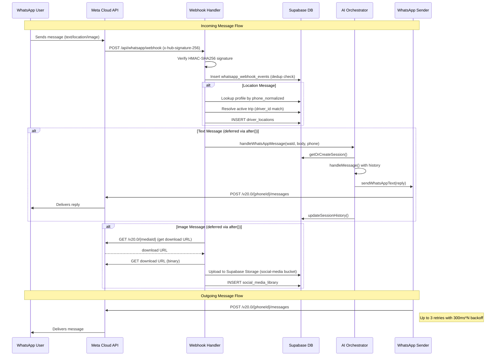
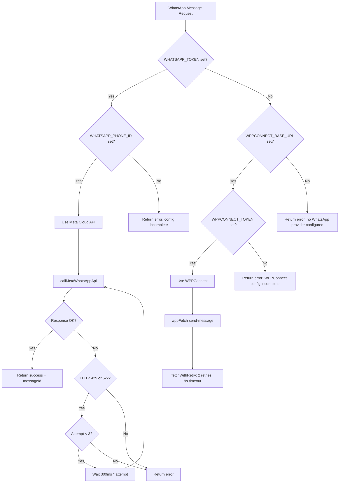

# WhatsApp Integration

## Architecture Overview

TripBuilt supports two WhatsApp implementations:

| Mode | Status | Use Case |
|------|--------|----------|
| **Meta Cloud API** (primary) | Production | All production messaging |
| **WPPConnect** (secondary) | Self-hosted fallback | Operators who self-host WhatsApp Business |

The Meta Cloud API takes precedence when `WHATSAPP_TOKEN` is set. WPPConnect is retained for on-premise operators and will be removed once 100% of customers migrate to Meta Cloud.

### Key Source Files

| File | Purpose |
|------|---------|
| `src/lib/whatsapp.server.ts` | Meta Cloud API: sending, parsing, media download |
| `src/lib/whatsapp-waha.server.ts` | WPPConnect: session management, QR, sending |
| `src/app/api/_handlers/whatsapp/webhook/route.ts` | Webhook handler (GET verification + POST messages) |
| `src/lib/assistant/channel-adapters/whatsapp.ts` | AI assistant channel adapter |

---

## Meta Cloud API Setup

### Required Environment Variables

| Variable | Purpose |
|----------|---------|
| `WHATSAPP_TOKEN` | Meta Cloud API Bearer token |
| `WHATSAPP_PHONE_ID` | Phone Number ID from Meta Business |
| `WHATSAPP_APP_SECRET` | App secret for HMAC-SHA256 webhook signature validation |
| `WHATSAPP_WEBHOOK_VERIFY_TOKEN` | Verification token for webhook subscription challenge (also accepted as `WHATSAPP_VERIFY_TOKEN`) |

The API base URL is `https://graph.facebook.com/v20.0/{WHATSAPP_PHONE_ID}/messages`.

---

## Sending Messages

### Text Messages

`sendWhatsAppText(phone, message)` sends a plain-text message. The phone number is normalized by stripping non-digit characters (except `+`) and converting leading `00` to `+`. The `+` prefix is then removed before sending to the API.

```typescript
// Payload shape
{
  messaging_product: "whatsapp",
  to: "919876543210",
  type: "text",
  text: { preview_url: false, body: "Hello from TripBuilt" }
}
```

### Template Messages

`sendWhatsAppTemplate(phone, templateName, bodyParams, languageCode)` sends a pre-approved template with dynamic parameters. Each body parameter is mapped to a `{ type: "text", text: value }` component.

```typescript
// Payload shape
{
  messaging_product: "whatsapp",
  to: "919876543210",
  type: "template",
  template: {
    name: "booking_confirmation",
    language: { code: "en" },
    components: [{
      type: "body",
      parameters: [{ type: "text", text: "John" }, { type: "text", text: "Goa Trip" }]
    }]
  }
}
```

### Media Download

`downloadWhatsAppMedia(mediaId)` is a two-step process:
1. GET `https://graph.facebook.com/v20.0/{mediaId}` to retrieve the download URL
2. GET the download URL to retrieve the binary data as a `Buffer`

---

## Receiving Messages

### Webhook Verification (GET)

Meta Cloud API sends a verification challenge when the webhook is first configured:

- Checks `hub.mode === "subscribe"`
- Validates `hub.verify_token` against `WHATSAPP_WEBHOOK_VERIFY_TOKEN` using timing-safe comparison
- Returns the `hub.challenge` value with HTTP 200 on success, or 403 on failure

### Webhook Processing (POST)

The POST handler processes three message types from the Meta Cloud API envelope:

| Message Type | Parser Function | Processing |
|-------------|----------------|------------|
| `location` | `parseWhatsAppLocationMessages()` | Synchronous -- inserts into `driver_locations` table |
| `text` | `parseWhatsAppTextMessages()` | Deferred via `after()` -- routes through AI assistant |
| `image` | `parseWhatsAppImageMessages()` | Deferred via `after()` -- downloads media, uploads to Supabase Storage |

**Webhook Envelope Structure** (Zod-validated):

```
entry[] -> changes[] -> value.messages[]
```

Each message contains: `from` (sender WA ID), `id` (message ID), `type`, `timestamp`.

**Location messages** resolve the sender's profile by `phone_normalized`, verify they are a `driver`, find their active trip, and insert coordinates into `driver_locations`.

**Text messages** are routed through `handleWhatsAppMessage()` in the AI channel adapter (see below).

**Image messages** download media via the Meta API, upload to the `social-media` Supabase Storage bucket, and create a `social_media_library` record.

**Deduplication**: All messages are inserted into `whatsapp_webhook_events` with a unique `provider_message_id`. Duplicates (Postgres error code `23505`) are silently skipped.

---

## AI Channel Adapter

The WhatsApp channel adapter (`src/lib/assistant/channel-adapters/whatsapp.ts`) bridges incoming text messages to the TripBuilt AI orchestrator.

### Flow

1. **Resolve sender** -- looks up the user by `phone_normalized` in the `profiles` table
2. **Rate limit** -- 40 messages per 5 minutes per WhatsApp user (`wa-{userId}`)
3. **Sanitize input** -- max 2000 characters, preserves newlines
4. **Check pending actions** -- if the user has a pending write action (e.g., "create trip"), check for confirmation phrases (`yes`, `y`, `confirm`, `ok`, `go ahead`, `proceed`) or cancellation phrases (`no`, `n`, `cancel`, `stop`, `nevermind`)
5. **Call orchestrator** -- `handleMessage()` with the conversation history and `channel: "whatsapp"`
6. **Handle action proposals** -- if the orchestrator proposes a write action, store it as pending and append "_Reply *YES* to confirm or *NO* to cancel._"
7. **Format reply** -- strip heavy markdown (convert `**bold**` to `*bold*`, headers to bold, links to `text: url`), truncate to 3800 characters
8. **Send reply** -- via `sendWhatsAppText()`
9. **Persist history** -- update `assistant_sessions` table with the new conversation turns

### Key Differences from Web Channel

- Confirmation is text-based (not UI buttons)
- Responses are shorter, avoid heavy markdown
- Max reply length: 3800 characters (API limit is 4096)
- Session persistence uses `assistant_sessions` table

---

## WPPConnect Fallback

WPPConnect (`wppconnect-server`) is a self-hosted WhatsApp Business API alternative for operators who cannot use the Meta Cloud API.

### When It's Used

WPPConnect is active when `WPPCONNECT_BASE_URL` is set and the operator has not configured Meta Cloud API credentials. It is used for per-organization WhatsApp sessions (each org gets its own QR-authenticated session).

### Environment Variables

| Variable | Purpose |
|----------|---------|
| `WPPCONNECT_BASE_URL` | Base URL of the WPPConnect server |
| `WPPCONNECT_TOKEN` | Secret key for token generation |

### Session Management

- **Session naming**: `org_` + first 8 hex chars of org UUID (e.g., `org_a1b2c3d4`)
- **Session creation** (`createWahaSession`): generates a token, checks session status, starts if `CLOSED` or nonexistent
- **QR code** (`getWahaQR`): handles both raw PNG binary and JSON data-URL responses
- **Status** (`getWahaStatus`): maps WPPConnect status to `CONNECTED` / `DISCONNECTED` / `FAILED`
- **Send text** (`sendWahaText`): sends to `{digits}@c.us` format
- **Disconnect** (`disconnectWahaSession`): calls `close-session`, errors swallowed

### API Retry Configuration

All WPPConnect API calls use `fetchWithRetry` with: 2 retries, 9s timeout, 300ms base delay.

---

## Webhook Security

### HMAC-SHA256 Signature Validation

POST requests are validated using the `WHATSAPP_APP_SECRET`:

1. Extract the `x-hub-signature-256` header (format: `sha256={hex_digest}`)
2. Compute `HMAC-SHA256(WHATSAPP_APP_SECRET, raw_body)`
3. Compare using `crypto.timingSafeEqual()` with length check to prevent timing attacks

### Production Safety

- In production, unsigned webhooks are never allowed -- the handler returns HTTP 500 if `isUnsignedWebhookAllowed()` returns true in production
- Invalid signature attempts are rate-limited (10 per minute per IP) before logging to `whatsapp_webhook_events` to prevent DB spam
- Rejected events are stored with `processing_status: "rejected"` and a `reject_reason`

### Non-Production

A permissive mode (`isUnsignedWebhookAllowed()`) can allow unsigned webhooks in development/staging environments.

---

## Retry Logic

All Meta Cloud API send operations use the same retry pattern in `callMetaWhatsAppApi()`:

| Parameter | Value |
|-----------|-------|
| Max attempts | 3 (`WHATSAPP_MAX_ATTEMPTS`) |
| Base delay | 300ms |
| Backoff | Linear (`300ms * attempt`) -- 300ms, 600ms, 900ms |
| Retryable conditions | HTTP 429 (rate limit) or HTTP 5xx (server error) |
| Non-retryable | HTTP 4xx (except 429) -- fails immediately |

The function returns a `WhatsAppSendResult` with `{ success, provider: "meta_cloud_api", messageId?, error? }`.

---

## Message Flow



## Implementation Decision Flow


