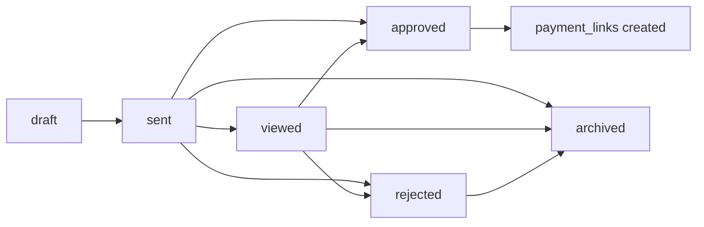

# Critical System Runbooks

Last updated: 2026-03-08  
Scope: `projects/travel-suite/apps/web` and supporting Supabase objects

This document closes the 12 highest-impact documentation gaps still missing after the growth/platform implementation sprint. Each section is written as an operator/developer runbook instead of a product brief.

## 1. Public Token Model and Data Exposure Matrix

### Tokenized surfaces
- Shared itinerary page: `src/app/share/[token]/page.tsx`
- Proposal portal: `src/app/portal/[token]/page.tsx`
- Public proposal page: `src/app/p/[token]/page.tsx`
- Public payment page: `src/app/pay/[token]/page.tsx`
- Review/NPS public routes: `src/app/reputation/nps/[token]/*`

### Rule
Bearer tokens are equivalent to possession-based access. Any field exposed through a token route must be treated as public-to-holder and therefore must exclude PII unless it is strictly required for the flow.

### Safe fields by surface

| Surface | Allowed | Forbidden |
|---|---|---|
| `/share/[token]` | itinerary title, destination, duration, summary, organization branding | traveler name, email, phone, internal notes |
| `/portal/[token]` | proposal title, destination, dates, itinerary items, payment status, operator contact | internal margin, internal comments, raw supplier rates |
| `/p/[token]` | proposal content, package choices, add-ons, approval actions | other-client data, internal notes, hidden operator-only pricing metadata |
| `/pay/[token]` | payment amount, currency, payment status, expiry | other payment links, traveler email if not needed to render |

### Implementation rules
1. Keep the select projection in a constant, not inline.
2. Unit-test the projection for banned fields.
3. Do not rely on “UI doesn’t render it”; forbid selecting it.
4. If service-role lookup is required, sanitize at query time and at response-build time.

### Current guardrails
- Safe share projection constant: `src/lib/share/public-trip.ts`
- Regression test: `tests/unit/security/share-page-select.test.ts`
- API public-share sanitizer: `src/app/api/_handlers/share/[token]/public-share.ts`

### Deployment check
Run before every release:
```sql
select share_code, viewed_at
from shared_itineraries
order by created_at desc
limit 20;
```
Then manually inspect `/share/{token}` responses and confirm email/phone/full_name are absent.

## 2. WhatsApp Architecture Runbook

### Components
- Health/status: `src/lib/whatsapp/session-health.ts`
- Inbound webhook: `src/app/api/_handlers/webhooks/waha/route.ts`
- Outbound send: `src/app/api/_handlers/whatsapp/send/route.ts`
- Chatbot state machine: `src/lib/whatsapp/chatbot-flow.ts`
- Proposal draft bridge: `src/lib/whatsapp/proposal-drafts.server.ts`
- Inbox UI: `src/components/whatsapp/UnifiedInbox.tsx`

### Runtime flow
1. WAHA/WPPConnect posts inbound events to the webhook route.
2. Webhook validates the shared secret and stores the inbound event/message.
3. If chatbot auto-reply is enabled, the inbound text is routed into `processChatbotMessage`.
4. Chatbot session state advances through:
   - `new`
   - `qualifying`
   - `proposal_ready`
   - `handed_off`
5. When `proposal_ready` is reached, the proposal draft service creates a draft proposal.
6. Inbox shows an AI banner until a human takes over or the AI auto-hands-off after the cap.

### Operational rules
- Never auto-reply to non-text payloads.
- Hard cap AI auto replies at 5.
- A human reply within 10 minutes disables further auto replies for that thread.
- Missing WPPConnect health must surface as a visible reconnect banner in the inbox.

### Failure handling
- If webhook secret missing: fail closed.
- If send fails: persist the inbound record, log the outbound failure, and show send error in thread UI.
- If chatbot parse fails: hand off to human immediately with an inbox banner.

### Manual recovery
1. Visit inbox.
2. Confirm reconnect banner status.
3. Use “Take Over” to force `state='handed_off'`.
4. Verify session row:
```sql
select phone, state, ai_reply_count, context
from whatsapp_chatbot_sessions
order by updated_at desc
limit 20;
```

## 3. Proposal Lifecycle State Diagram

### Canonical states
- `draft`
- `sent`
- `viewed`
- `approved`
- `rejected`
- `archived`

### State sources
- Create flow: `src/app/api/_handlers/proposals/create/route.ts`
- Public actions: `src/app/api/_handlers/proposals/public/[token]/route.ts`
- Send flow: `src/app/api/_handlers/proposals/[id]/send/route.ts`
- Bulk ops: `src/app/api/_handlers/proposals/bulk/route.ts`

### Transition rules


### Business rule
Approval is not terminal. Approval must create or attach a `payment_links` row so the lifecycle becomes sales-to-cash, not sales-to-notification.

### Verification
```sql
select id, status, sent_at, updated_at, portal_token
from proposals
order by updated_at desc
limit 20;
```

## 4. Payment Architecture and Reconciliation Runbook

### Components
- Link issuance: `src/app/api/payments/links/route.ts`
- Public link lookup: `src/app/api/payments/links/[token]/route.ts`
- Order creation: `src/app/api/_handlers/payments/create-order/route.ts`
- Verification: `src/app/api/_handlers/payments/verify/route.ts`
- Webhook: `src/app/api/webhooks/razorpay/route.ts`
- Link storage: `payment_links`
- UI: `src/components/payments/PaymentLinkButton.tsx`, `src/components/payments/RazorpayModal.tsx`

### Canonical sequence
1. Operator creates payment link.
2. Backend creates Razorpay order and inserts `payment_links`.
3. Traveler opens `/pay/[token]`.
4. Razorpay Checkout completes.
5. Backend verifies HMAC or receives webhook.
6. `payment_links.status` updates to `paid`.
7. Receipt email fires.
8. Revenue widgets revalidate.

### Reconciliation fields
- `payment_links.token`
- `payment_links.razorpay_order_id`
- `payment_links.razorpay_payment_id`
- `payment_links.status`
- `payment_links.paid_at`

### Daily reconciliation query
```sql
select token, proposal_id, status, amount_paise, razorpay_order_id, razorpay_payment_id, paid_at
from payment_links
order by created_at desc
limit 100;
```

### Rules
- Never mark paid from client-side callback alone.
- Only webhook/HMAC-verification can finalize a payment.
- Email failures never fail payment finalization.

## 5. Marketplace Monetization Spec

### Pricing tiers
- Free
- Featured Lite
- Featured Pro
- Top Placement

### Tables
- `marketplace_profiles`
- `marketplace_listing_subscriptions`
- `marketplace_listing_events`

### Ranking policy
Rank = quality score + review score + recency + paid boost  
Paid boost can improve placement, but not bypass a minimum quality threshold.

### Required events
- listing viewed
- listing clicked
- inquiry generated
- proposal generated from listing
- subscription created
- subscription lapsed

### Downgrade behavior
If recurring payment or renewal fails:
1. grace period begins
2. `status='past_due'`
3. featured boost removed after grace expiry

### Core metric
Marketplace paid listing should only be surfaced as an upgrade if the operator can see attributable impressions and inquiries.

## 6. Shared Itinerary Cache Architecture

### Layers
1. Exact org cache
2. Shared canonical cache
3. Semantic itinerary cache
4. RAG template retrieval
5. Fresh AI generation

### Current files
- `src/lib/shared-itinerary-cache.ts`
- `src/lib/semantic-cache.ts`
- `src/lib/rag-itinerary.ts`
- `src/app/api/_handlers/itinerary/generate/route.ts`

### Canonical fingerprint inputs
- destination key
- month/season
- duration bucket
- group size bucket
- budget tier
- trip style / interests

### Promotion rules
Promote an itinerary into shared cache only if:
- generated or edited successfully
- no rejection signal
- quality score clears threshold

### Success metrics
- shared cache hit rate
- semantic hit rate
- miss rate
- average latency saved
- generation cost avoided

### Admin check
Use admin cache metrics route plus:
```sql
select event_type, cache_source, destination_key, count(*)
from shared_itinerary_cache_events
group by 1,2,3
order by count(*) desc;
```

## 7. Embedding Migration Design Doc

### Goal
Keep pgvector as storage/search but replace OpenAI-generated embeddings with Gemini-generated embeddings.

### Current v2 implementation
- helper: `src/lib/embeddings-v2.ts`
- template update path: `src/lib/embeddings.ts`
- semantic cache lookup/storage: `src/lib/semantic-cache.ts`
- assistant semantic cache: `src/lib/assistant/semantic-response-cache.ts`
- migration: `supabase/migrations/20260322070000_embedding_v2_pgvector.sql`

### Schema strategy
- Add `embedding_v2`
- Add `embedding_model`
- Add `embedding_version`
- Keep legacy columns during rollout

### Retrieval strategy
- Prefer `*_v2` RPCs
- Treat missing v2 vectors as cache miss
- Regenerate via admin endpoint

### Rollout steps
1. Apply v2 migration.
2. Run admin embedding generation.
3. Confirm `embedding_v2` coverage.
4. Verify template search and semantic itinerary hits.
5. Update docs/runbooks.
6. Remove old OpenAI embedding generation dependencies only after stable burn-in.

### Coverage query
```sql
select
  count(*) filter (where embedding_v2 is not null) as with_v2,
  count(*) filter (where embedding_v2 is null) as without_v2
from tour_templates;
```

## 8. Monthly Operator Scorecard Metric Definitions

### Source files
- payload builder: `src/lib/admin/operator-scorecard.ts`
- delivery: `src/lib/admin/operator-scorecard-delivery.ts`
- PDF: `src/components/pdf/OperatorScorecardDocument.tsx`
- email template: `src/emails/OperatorScorecard.tsx`
- cron route: `src/app/api/_handlers/cron/operator-scorecards/route.ts`

### Metrics
- proposals created
- approved proposals
- approval rate
- payment conversion rate
- revenue
- average proposal value
- review response rate
- WhatsApp response activity proxy
- cache hit rate

### Score weighting
- revenue and conversion weighted most heavily
- operational responsiveness weighted second
- efficiency/quality metrics weighted third

### Persistence
Archive in `operator_scorecards` by `organization_id + month_key`.

### Monthly verification
```sql
select organization_id, month_key, score, status, emailed_at
from operator_scorecards
order by created_at desc
limit 50;
```

## 9. Review-to-Marketing Asset Pipeline Spec

### Files
- asset service: `src/lib/reputation/review-marketing.server.ts`
- renderer: `src/lib/reputation/review-marketing-renderer.server.ts`
- route: `src/app/api/_handlers/reputation/reviews/[id]/marketing-asset/route.ts`
- inbox UI: `src/app/reputation/_components/ReviewCard.tsx`

### Eligibility rules
- rating >= 4
- content present
- not flagged for sensitive or operational complaints

### States
- `draft`
- `pending_review`
- `approved`
- `scheduled`
- `published`

### Flow
1. review synced
2. operator clicks generate asset
3. system creates branded card payload and rendered image
4. asset enters review queue
5. operator sends it to Social Studio scheduling flow

### Moderation rule
Never auto-publish without operator review.

## 10. Calendar Availability and Conflict Rules

### Files
- migration/API/UI delivered in sprint 4
- page: `src/app/calendar/page.tsx`
- API: `src/app/api/availability/route.ts`
- proposal create guard: `src/app/proposals/create/page.tsx`

### Rules
- blocked periods are operator-level availability overrides
- overlap with a trip proposal must show a warning
- operator may continue intentionally, but the proposal should carry a visible availability warning
- blocked ranges must render distinctly from booking/event color

### Overlap rule
Two ranges overlap when:
`selected_start <= blocked_end AND selected_end >= blocked_start`

### Verification query
```sql
select organization_id, start_date, end_date, reason
from operator_unavailability
order by created_at desc
limit 20;
```

## 11. QA Certification Checklist

### Pre-release gates
- tokenized routes expose no PII
- proposal approval creates payment link
- payment completion updates `payment_links`
- receipt email fires
- WhatsApp inbound reaches inbox
- AI handoff path works
- reviews dashboard reads real rows
- admin charts query real tables
- scorecard cron route works

### Release sign-off
1. run web gauntlet
2. run the SQL verification scenarios
3. manually inspect token routes
4. verify env vars are present
5. confirm pending migrations are applied

## 12. Environment and Secret Ownership Map

### Required env groups

| Group | Variables | Owner | Failure symptom |
|---|---|---|---|
| Supabase | `NEXT_PUBLIC_SUPABASE_URL`, `NEXT_PUBLIC_SUPABASE_ANON_KEY`, `SUPABASE_SERVICE_ROLE_KEY` | platform owner | auth/db/public token flows fail |
| Razorpay | `RAZORPAY_KEY_ID`, `RAZORPAY_KEY_SECRET`, `RAZORPAY_WEBHOOK_SECRET`, `NEXT_PUBLIC_RAZORPAY_KEY_ID` | finance/platform | payment links and webhook verification fail |
| WhatsApp | `WPPCONNECT_BASE_URL`, `WPPCONNECT_TOKEN`, `WPPCONNECT_SESSION` | operations | inbox send/receive/reconnect breaks |
| Google | `GOOGLE_GEMINI_API_KEY`, `GOOGLE_PLACES_API_KEY` | AI/growth | embeddings, review sync, AI helpers degrade |
| Email | `RESEND_API_KEY`, `RESEND_FROM_EMAIL`, `RESEND_FROM_NAME` | growth/ops | lifecycle emails and scorecards stop sending |
| Analytics | `NEXT_PUBLIC_POSTHOG_KEY`, `NEXT_PUBLIC_SENTRY_DSN`, `SENTRY_DSN` | product/platform | telemetry blind spots |
| App URL | `NEXT_PUBLIC_APP_URL` | platform | broken public links in email/WA |

### Rotation rule
- service-role and webhook secrets are rotation-required credentials
- public keys are not secrets, but still need environment ownership

### Documentation rule
Every new integration must add:
1. env var names
2. owner
3. rotation procedure
4. failure symptoms
5. verification command
